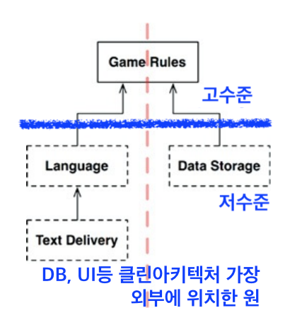

## 25장. 계층과 경계

- 이 장을 읽다보니 내가 "경계"에 대해 아직 잘 모르는구나! 라는 생각이 들었다.    
>[17장. 경계: 선 긋기](./17-boundary.md)   
• 경계는 소프트웨어 컴포넌트를 서로 분리하고, 경계 한편에 있는 요소가 반대편에 있는 요소를 알지 못하도록 막는다.   
• 경계의 한쪽에 위치한 컴포넌트는 경계 반대편의 컴포넌트와는 다른 속도로, 다른 이유로 변경된다.

- 클린아키텍처에서는 컴포넌트를 엔티티, 유즈케이스, UI 등으로 나누었지만 경계가 딱 이렇게만 나뉘어지는 것은 아니다.
- 여기서는 경계를 `변경의 축`으로 묘사하고 있다 

### 흐름 횡단하기와 흐름 분리하기
- 여기서 "흐름"이란 데이터 흐름(데이터의 입출력 흐름)을 의미한다.
- 그림 25.4의 이미지에 가로로 선을 하나 그어보면 아래와 같이 고수준, 저수준으로 나눌 수 있다.   
    
- 고수준으로 향하는 저수준을 데이터 흐름으로 나누는 라인이 빨간색 점선라인임.
- [클린 아키텍처의 구조를 설명하는 다이어그램](https://blog.cleancoder.com/uncle-bob/images/2012-08-13-the-clean-architecture/CleanArchitecture.jpg)에서 가장 바깥쪽 원을 보면 [UI, Devices, DB, WEB] 등의 키워드가 써있는데 이것들이 분리된 흐름의 한 종류이지 않을까한다.

