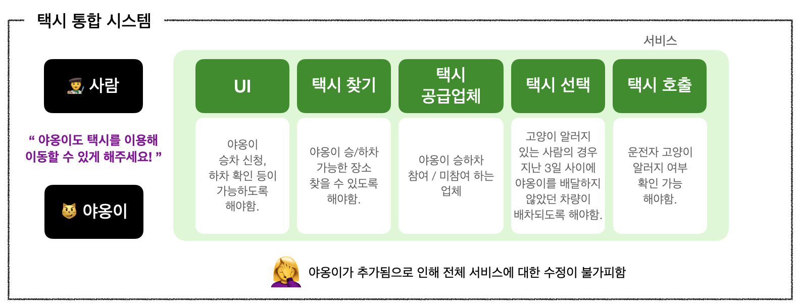

## 27장. '크고 작은 모든' 서비스들

### 서비스 아키텍처?
- 서비스를 사용한다는 것이 본질적으로 아키텍처에 해당하는가? ❌
- 시스템의 아키텍처는 <u>의존성 규칙을 준수하며 고수준 정책을 저수준의 세부사항으로부터 분리하는 경계에 의해 정의된다.</u>
- 따라서 단순히 애플리케이션의 행위를 분리할뿐인 서비스라면 값비싼 함수 호출에 불과하며, 아키텍처 관점에서 꼭 중요하다고 볼 수는 없다.
- 즉, 코드를 분리하는 것이 아키텍처라고 볼 수 없는 것이다.   

>🤔 "디자인 패턴(MVVM, MVC 등)은 아키텍처라고 부를 수 있는가?"   
면접을 볼 때 프로젝트 아키텍처 뭘 사용했나 라는 질문을 받으면 저런 패턴들을 대답하곤 했는데 밥 아저씨의 아키텍처에 대한 관점으로 비추어봤을 때 내가 한 대답은 적절한 대답이었나?라는 생각이 든다.

- 일단 MVVM, MVC 등은 디자인 패턴이 아닌 아키텍처 패턴이다.
- 오늘 스터디를 하며 나왔던 얘기 중 하나는 "관심사의 분리"였다. 아키텍처 패턴은 UI를 표현하는 관심사를 View와 데이터, view와 데이터 사이를 중개하는 Controller(혹은 Presenter나 ViewModel 등)로 나누었기 때문에 아키텍처라고 볼 수 있다.

>🤔 "디자인 패턴(MVVM, MVC 등)의 각 요소들은 경계로 나뉘어지는가?"  
- 위에서 언급했던 것처럼 데이터를 사용자에게 보여주거나 사용자와 인터렉션할 수 있는 View, View에서 사용될 데이터 구조와 이를 가공하는 로직이 포함된 Model, View와 Model 사이를 중개하는 Object

>🤔 아키텍처에 대한 밥 아저씨의 관점이 과연 다른 아키텍처에도 적용될 수 있는가?

### 서비스의 이점?
1. 시스템을 서비스들로 분리함으로써 서비스 사이의 결합이 "확실히" 분리된다는 점   
`반박`   
프로세서 내의 또는 네트워크 상의 공유자원 때문에 결합될 가능성은 여전히 존재한다. 즉, "확실히" 분리되는건 아니라는 것이다.

2. 서비스 전담팀이 서비스를 소유하고 운영할 수 있고 따라서 독립적으로 개발, 배포될 수 있다는 점 & 확장 가능하다는 점   
`반박`   
서비스는 확장 가능한 시스템을 구축하는 유일한 선택지가 아니다.   
또한 첫번째 이점의 반박 내용에서 볼 수 있다시피 서비스라고 해서 항상 독립적으로 개발/배포/운영할 수 있는 것은 아니다.

### 야옹이 문제와 횡단 관심사
- 택시 통합 시스템 예시로 이 시스템의 개발자들은 서비스 단위로 분리되어 개발을 진행한다.  
- 택시는 원래 사람의 이동수단이잖음? 근데 어느 날 회사에서 야옹이를 택시로 이동시켜주는 비즈니스를 시작하겠다!라고 하는거야. 이렇게 되면 전체 서비스에 대한 수정이 불가피해지게 된다. 왜냐하면 아래와 같은 기능들과 고려사항들이 발생하기 때문이다.   
    - 야옹이 승차 가능 지점
    - 참여하는 업체 / 참여 거부 업체
    - 운전자의 고양이 알러지 여부
    - 택시 승객의 고양이 알러지 여부
        - 고양이 알러지가 있다면 지난 3일 사이에 야옹이를 배달했던 차량은 배차되지 않아야 함.
    - 기타 여러가지 조건들이 따라붙을것임.
- 이렇게 되면 어디를 수정해야하느냐? 프로그램 전체를  수정해야한다. 즉, 서비스들이 서로 긴밀히 결합되어 있는 것이다.   

- 이게 바로 횡단 관심사(cross-cutting concern)가 지닌 문제다.
- [cross-cutting concern](https://en.wikipedia.org/wiki/Cross-cutting_concern)   
Cross-cutting concerns are parts of a program that rely on or must affect many other parts of the system.   
횡단 관심사는 시스템의 다른 여러 부분에 의존하거나 영향을 미치는 프로그램의 일부이다.

- 아키텍처 경계는 서비스 사이에 있는 것이 아니다. 오히려 서비스를 관통하며 서비스를 컴포넌트 단위로 분할한다.