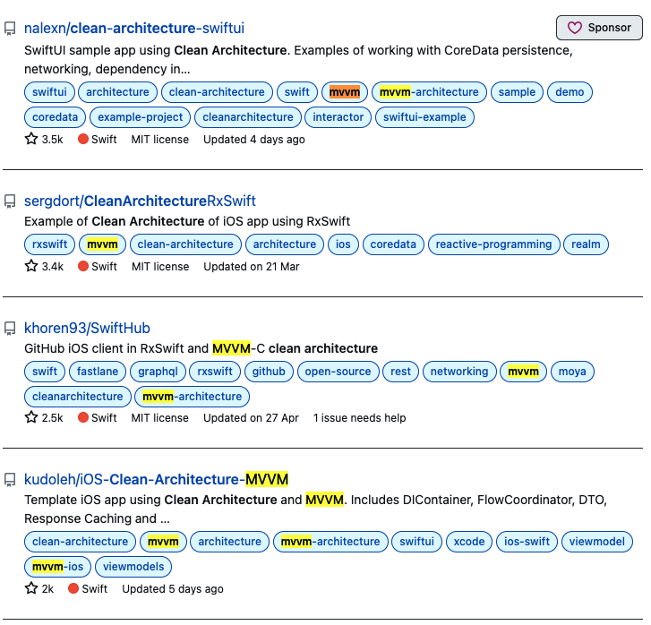

### 클린 아키텍처 by Robert C. Martin를 읽고
---
🔗  도움이 됐던 링크
- [메이트러너 클린아키텍처 + RxSwfit + MVVM 도입기](https://jeonyeohun.tistory.com/305)
- [클린 아키텍처 저자 블로그](https://blog.cleancoder.com/uncle-bob/2012/08/13/the-clean-architecture.html)
- [클린 아키텍처 예제](https://github.com/sergdort/CleanArchitectureRxSwift)
---
### 회고
#### Fact

#### Feeling

#### Feedback

#### Finding

#### Future action
---
- 기회가 되어 스터디에서 클린아키텍처와 관련된 발표를 하게됐다.
- 여기에 목차와 내용을 작성하고 추후 블로그에 옮길 예정이다.
---
- 목차
    - 아키텍처란 무엇인가?   
    - 🤔 클린 아키텍처와 아키텍처 패턴의 관계   
    - 클린 아키텍처란
        - "클린"의 의미와 "클린"한 아키텍처
        - 클린 아키텍처 다이어그램 설명 & 제어흐름과 의존성 방향에 대해 & 경계에 대해
        
    - 클린 아키텍처: 어떻게 분할하고, 배치하고, 의사소통 하도록 만들것인가?
        - 경계를 만드는 방법과 경계를 건너는 방법
        183p 소프트웨어 아키텍처에서 경계선을 그리려면 먼저 시스템을 컴포넌트 단위로 분할해야 한다. 그런 다음 컴포넌트 사이의 화살표가 특정 방향, 즉 핵심 업무를 향하도록 이들 컴포넌트의 소스를 배치한다. (DIP, SAP원칙)
        176p 어떻게 선을 그을까? 관련이 있는 것과 없는 것 사이에 선을 긋는다.
        - SOLID 원칙(설계원칙)
        - 컴포넌트 원칙

#### 아키텍처란 무엇인가?
>클린 아키텍처, 142p   
✓ 시스템을 구축했던 사람들이 만들어낸 시스템의 형태   
✓ 시스템을 컴포넌트로 분할하는 방법, 분할된 컴포넌트를 배치하는 방법, 컴포넌트가 서로 의사소통하는 방식에 따라 정해진다. -> 예시를 들어 설명해야함.

- 위 2번째 항목에 대한 적절한 예시가 있으면 좋을 것 같다.
- 이 책에서 말하는 컴포넌트는 <u>런타임에 플러그인 형태로 결합할 수 있는 동적 링크 파일</u>(106p)을 의미한다.

#### 🤔 클린 아키텍처와 아키텍처 패턴의 관계
처음 클린 아키텍처를 접했을 때는 MVVM이나 MVP와 매우 헷갈렸다. 그 이유 중 하나는 MVVM이나 MVP도 보통 아키텍처라고 부르는데 github에서 예제를 찾아보면 MVVM이나 MVP와 더불어 clean architecture를 함께 적용한 것들이 많았기 때문이다.   

둘다 아키텍처인데 두개를 다 적용한다고? 라는 의문.   
예제 프로젝트들을 보면 presentation layer를 구성할 때 MVVM이나 MVP 등의 패턴을 사용한다.   
결론적으로 MVC, MVP 등의 아키텍처 패턴은 UI와 UI에 표시될 데이터 및 비즈니스 로직에 한정된 패턴이라고 한다면, 
클린 아키텍처는 더 범용적인? -> 무슨 차이가 있을까 다시한번 생각해보자. 

#### 클린 아키텍처란
- "클린"의 의미와 "클린"한 아키텍처
    - "클린"의 의미   
    어떤 변경이 핵심적인 부분까지 영향을 미치지 않도록 혹은 최소한으로 영향을 미치도록 설계되어 변경에 시간과 비용이 적게 소요되는 것을 의미한다.   
    - "클린"한 아키텍처   
    핵심업무 규칙과 데이터를 제외한 나머지 부분들은 언제든지 손쉽게 교체할 수 있도록 만든 아키텍처. Flexible한 아키텍처. 좀 조심스럽긴 하지만, 하드웨어를 움직이는 소프트웨어를 진정으로 말랑말랑(soft)하게 만들어주는 아키텍처가 아닐까한다.   
    (조심스럽다고 한 이유는 일단 이 책을 1번 밖에 안읽어봤고, 다른 아키텍처에 대해 공부해보지 않았기 때문이다.)

- 그렇다면 "클린"을 어떤 방식으로 달성하는 걸까?

1. 관심사를 계층으로 분리   
- Presentation, Domain, Data layer로 나뉜다.  -> 예시를 들어 설명해야함.
2. 의존성 정책     
- 여기서 말하는 의존성은 아래와 같다.
    ```Swift
    class Pixar { ..생략.. }

    // ToyStory는 Pixar를 의존한다.
    // 어떤 객체에서 직접적으로 다른 객체를 참조할 때 의존관계가 성립됨.
    class ToyStory { 
        private let company = Pixar()

        func getCompany() -> Pixar {
            return company
        }
    }
    ```
- 의존성 화살표는 반드시 안쪽으로 향해야 한다. 즉, 빈번하게 변경될 수 있는 계층이 잘 변경되지 않는(핵심) 계층을 의존하도록 만들어야 한다. 
- 만약 의존성 화살표의 방향이 반대일 경우 무슨일이 발생할까?   
    예시 생각해보기!!    -> 예시를 들어 설명해야함.
    - 지금 회사를 예로 들면 돌봄이 필요한 부모님과 돌봄을 제공할 수 있는 선생님을 매칭시켜줘야 하는게 핵심 업무 규칙이고 이에 필요한 여러 데이터들이 있을거임. 이게 entity임. 선생님 클래스, 부모님 클래스, Matching 클래스.
    - 유즈케이스는 엔티티가 자신의 핵심업무규칙을 사용해서 유스케이스의 목적을 달성하도록 이끄는 것이니까.. 

- 만약 반대로 의존관계가 만들어져야 한다면 인터페이스를 사용해 제어흐름과는 반대로 의존성을 역전시켜야 한다.
