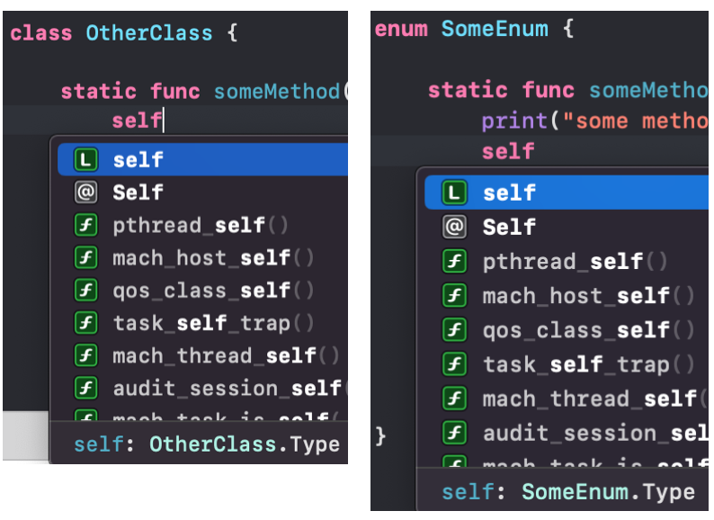

### topic: self / Self의 차이, String(utf16), UI 이벤트 전달(delegate vs. combine)

### self / Self에 대해
🤔 enum 안에 있는 static 메소드를 호출할 때 `self`가 아닌 `Self`를 이용하고 있는 코드를 보게 됐다. 왜 `Self`를 사용하고 있는지 스스로 설명하지 못해 찾아보게 됐다.

<br>

처음 보게된 글은 "[Self와 self의 차이](https://wodyios.tistory.com/2)"였다. 내용을 요약하면 아래와 같다.

<br>

- self : 모든 인스턴스들이 암시적으로 생성하는 프로퍼티(인스턴스가 자기 자신을 가리킬 때 사용)
- Self : 타입의 이름을 알아야하거나 이를 반복할  필요 없이 현재 타입을 사용할 수 있도록 도와줌.

<br>

위 내용을 보고 "아, enum 안에 있는 static 메소드의 경우 (인스턴스화 할 수 없기 때문에, enum은 인스턴스화 할 수 없음) type으로 접근해야 하기 때문에 내부에서 참조할 때는 Self를 사용해야 하는구나 !" 라고 이해했다.

<br>

근데 예제 코드를 만들어보니 `self`, `Self` 둘 다 사용해도 똑같은 결과(제대로 호출됨)가 나왔다. (읭?) 내가 잘못 이해하고 있는 것 같아 다시 찾아봄.

<br>

클래스나 enum을 만들고 내부에서 `self`를 사용하면, 요 `self`는 아래 이미지와 같이 해당 타입의 타입, 즉 MetaType임을 알 수 있다.



즉 Something.self는 Something.Type이라는 의미다.    
다만, Int와 실제 숫자 3이 동일하지 않듯, 위 관계에도 이와 유사하다.
```Swift
class SuperClass {
    func make(type: SubClass.Type) {  /* do something.. */ }
}

let superClass = SuperClass()
superClass.maek(type: SubClass.Type) // compile error 발생 : Cannot convert value of type 'SubClass.Type.Type' to expected argument type 'SubClass.Type'
```

Type은 Int, String 등의 타입을 나타내는 것이고, self가 3, "hello world!"와 같은 값을 가리키는 것이라고 보면 됨.

`Self`는 구체적인 값을 가리키는 것이 아님. [Self Type](https://docs.swift.org/swift-book/ReferenceManual/Types.html#ID610)
> The `Self` type isn't a specific type, but rather lets you conveniently refer to the current type without repeating or knowing that type's name.

즉 syntax sugar 느낌이라고 해야되나. 실제 타입을 가리키는 것은 아니고 사용의 편의성을 위해 제공하는 것이다. 이걸 이용하면 클래스 메소드가 아닌 곳에서 클래스 메소드를 호출할 수도 있음. type(of: )라는 함수도 동일한 역할을 한다.

`self` : static metatype. 컴파일 타임 시 object type을 가리킴

`Self` : dynamic metatype.


<br>
참고 사이트
- [Self와 self의 차이](https://wodyios.tistory.com/2)
- [Metatype - self, Self, Type](https://dongminyoon.tistory.com/53)


### enum은 정말 인스턴스화 할 수 없는게 맞나?
그렇다고 듣긴 했는데, 실제로 내가 테스트해본 것은 아니라서 직접 확인해봐야할듯.


### 아래 코드의 차이는 무엇일까?
```swift
let text = "hello world👋"
String.Index(utf16Offset: 0, in: text)
text.utf16.index(text.startIndex, offsetBy: .zero)
```

### UI 이벤트 전달: delegate vs. combine
