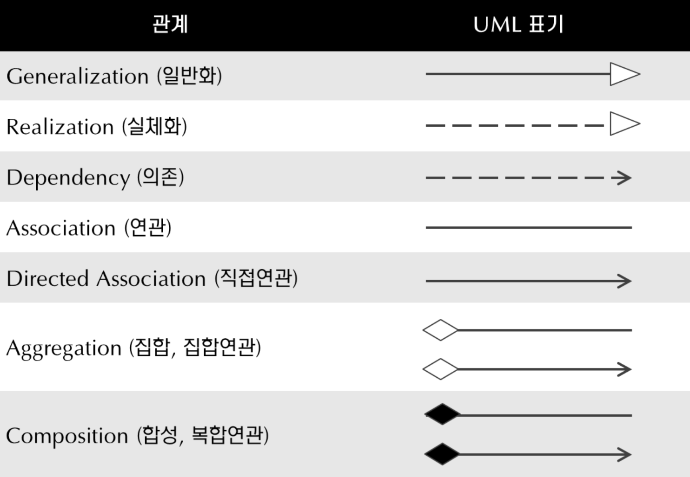

## UML(Unified Modeling Language)
#### <b>UML이란?</b>
> — [https://ko-de-dev-green.tistory.com/26](https://ko-de-dev-green.tistory.com/26)   
소프트웨어 개발과정에서 산출되는 산출물들을 명세화, 시각화, 문서화하기 위한 표준 모델링 언어

> — [[Wikipedia] UML](https://en.wikipedia.org/wiki/Unified_Modeling_Language)   
The UML is a general-purpose, developmental, modeling language in the field of software engineering that is intended to provide a standard way to visualize the design of a system.   
UML은 시스템 설계를 시각화하는 표준 방법을 제공하기 위한 SW 엔지니어링 분야의 범용 개발 모델링 언어.

> — ✅ [[Visual Paradigm] What is UML](https://www.visual-paradigm.com/guide/uml-unified-modeling-language/what-is-uml/)   
UML is a standardized modeling language consisting of an integrated set of diagrams.   
<u>UML은 통합된 다이어그램 세트로 구성된 표준 모델링 언어다.</u>

- 가장 마지막 정의가 가장 쉽고 이해가 되는 정의였다.
- Ojbect Management Group(OMG)에서 관리하고 계속 업데이트하고 있으며, “표준"이다.


- UML은 크게 3가지로 나뉘어지는데 이를 통해 UML이 <u>객체를 중심으로 분석하고 디자인하고 프로그래밍하는 과정</u>이라는 것을 알 수 있었다.
    - **OOA**(Object Oriented Aanlysis) - 객체지향 분석, 서비스가 무엇을 작업해야 하는지 정의
    - **OOD**(Object Oriented Design) - 객체지향 디자인, 어떻게 이런 작업을 수행할건지
    - **OOP**(Object Oriented Programming) - 객체지향 프로그래밍, 어떻게 구현할 건지

#### <b>UML의 구성요소</b>
- **Things(사물)**
    - 추상적 개념, 모델 구성의 기본요소
    - 시스템의 구조, 행위를 표현하고 개념들을 그룹화 하는 것, 부가적인 설명을 위한 것 등이 포함됨.
- **Relation(관계)**
    - 사물들 간의 연결 관계를 추상화 한 요소
    - relation은 크게 두가지로 나뉨. 연관관계(Association)와 방향성을 가진(Directed Relationship) 관계
- **Diagram(다이어그램)**
    - 관련성이 있는 Things들 간의 Relation을 도형 형태로 표현한 요소
    - 구조, 행위, 인터랙션 관계를 포함하는 다이어그램
    - 다이어그램은 여러 종류가 있는데 그 이유는 SW에 참여하는 여러 이해관계자(기획자, 분석가, 디자이너, 개발자, QA, 고객 등)들이 다양한 viewpoint(관점)를 가지고 SW를 보기 때문이다.

#### <b>UML의 Things 표현</b>
- Things에는 아래와 같은 것들이 들어간다.
    - 클래스명
    - property들
    - function들
- `-`는 private member에 대한 것, `+`는 public member에 대한 것, `#`은 클래스 & 상속 받은 곳에서 접근할 수 있는 member에 대한 것을 표현한다.
- Stereotype으로 UML에 부가적인 설명을 추가할 수 있다.   
    - `<<view>>` 혹은 `<<service>>`, `<<interface>>` 등. 
    - 혹은 note 형태로 추가적인 정보를 넣을 수 있음.

#### <b>UML의 Relation 표현</b>
   

강의 볼 당시에는 일반화, 의존 등에 대해 세세하게 찾아보지 않았는데 디자인패턴 책을 보면서 단어들을 조금 더 명확히 구분해야할 필요가 있음을 느끼게 됐다.       
그래서 조금 더 찾아봤고 아래에 도움이 됐던 링크를 걸어둠.

- **Generalization(일반화)** 
    - 상속 관계를 표현
    - 예를 들어 `Student`가 `Person`이라는 클래스를 상속받고 있다면 화살표는 `Student ⎯⎯▷ Person` 으로 만들어져야 함.
- **Realization(실체화)**
    - 구현 관계를 표현한 것으로 어떤 인터페이스를 채택하여 실제 기능을 구현하는 것을 말한다.   
    - 예를 들어 `Person`이 `TODO`라는 인터페이스를 채택해서 구현하고 있다면 화살표는 `Person ----▷ TODO` 형태로 그려져야 함.
- **Dependency(의존)**
    - 의존 관계는 어떤 클래스가 다른 클래스를 "참조"하는 것을 말한다.
    - 처음에는 클래스의 멤버변수 타입으로 다른 클래스를 사용하고 있을 경우 "의존"이구나! 라고 이해를 했다.  
     근데 링크의 내용을 보니 참조의 형태에 여러 종류가 있다는 것을 알게 됐다.
        - 참조의 형태 : 객체 생성, 객체 사용, 메소드 호출, 객체 리턴, 매개변수로 해당 객체를 받음 등등
    - 의존에서 말하는 참조는 계속 유지되는 것이 아니고, 메소드 호출이 끝나면 사용한 클래스와의 관계가 끝나는 것을 말한다.(메소드 내에서만 해당 객체를 사용)
    - 아래 코드의 Person과 Car의 관계가 Dependency인 것이다. 화살표는 `Person ----> Car` 형태로 그려져야 함.
        ```Swift
        class Car {
            private var number: String
            private var model: String

            init() { ..생략.. }

            public func move() {
                print("자동차가 움직입니다.")
            }
        }

        class Person {
            // 멤버변수로 Car 타입을 가지고 있지 않아야 함.

            public func drive(car: Car) {
                // 메소드 내에서만 사용되고 메소드 호출이 종료되면 Car도 더이상 사용되지 않음.
                print("\(car.model)을(를) 운전합니다.")
                car.move()
            }
        }
        ```

- **Association(연관)과 Directed Association(방향성 있는 연관)**
    - 클래스가 가지고 있는 멤버변수의 타입으로 다른 클래스가 사용되는 경우 "연관" 관계에 있는 것이다.
    - 만약 위 예시에서 `Person`이 `Car`타입의 멤버변수를 가지고 있었다면 연관 관계가 되는 것이며, `Person ⎯⎯ Car` 형태로 그릴 수 있다.
    - 서로 몇개의 인스턴스를 가질 수 있는지도 나타낼 수 있는데 실선 위에 Multiplicity를 표현하면 된다.
        - `1..*`, `12..18`, `12,24`(이건 or을 표현한 것) 혹은 `*` 을 이용
    - 방향성 있는 연관은 실선과 열려있는 화살표(>)로 표현할 수 있다. 화살표는 방향성(Navigability)를 의미하는데 이를 통해 참조 하는 쪽과 참조 당하는 쪽을 표현할 수 있다.
        - 그렇다면 위에 Person과 Car는 `Person ⎯⎯> Car` 이렇게 그리는게 훨씬 더 정확하네 !
        - 방향성이 명시되지 않았다면 이는 Person이 Car를 참조할 수도, Car가 Person을 참조할 수도, 혹은 둘다 서로를 참조할 수도 있다는 것을 의미한다.

- **Aggregation(집합)**
    - 연관관계의 특수한 경우이며, 전체와 부분을 명확하게 명시하고자 할 때 사용한다.
    - Aggregation 관계는 한 객체가 다른 객체를 포함하는 관계이다. 아래 예시를 보면 이해가 훨씬 잘 된다.
    - Car 클래스의 생성자로 외부에서 이미 만들어진 Engine, Radio 인스턴스를 받아서 할당하고 있다. 이미 만들어진 인스턴스들을 모아서(집합시켜서) Car 클래스를 만드는 것이다.
        ```Swift
        class Car {
            private var number: String
            private var model: String
            private let engine: Engine
            private let radio: Radio

            init(engine: Engine, radio: Radio) { 
                // ..number, model 초기화 생략..
                self.engine = engine
                self.radio = radio
            }
        }
        ````
    - `Car ◇⎯⎯ Engine`, `Car ◇⎯⎯ Radio` 형태로 Relation이 표현되야 한다.
    - 의존 관계와 달리 Engine, Radio 클래스(부분)의 라이프타임이 Car 클래스(전체)의 라이프타임과는 별개다.  
    즉, Car 클래스가 메모리에서 해제되어도 Engine, Radio 클래스는 메모리에 남아있을 수 있다는 말이다.

- **Composition(합성)**
    - 연관관계의 특수한 경우이며, 전체와 부분을 명확하게 명시하고자 할 때 사용한다.
    - 집합관계와 달리 전체와 부분의 메모리 라이프타임이 동일하다.
    - Car 클래스의 이니셜라이저에서 Engine, Radio 클래스도 생성되는 것을 말한다. Car 클래스가 메모리에서 해제되면 Engine, Radio 클래스들도 메모리에서 해제된다.
        ```Swift
        class Car {
            private var number: String
            private var model: String
            private let engine: Engine
            private let radio: Radio

            init() { 
                // ..number, model 초기화 생략..
                self.engine = Engine()
                self.radio = Radio()
            }
        }
        ```
    - `Car ◆⎯⎯ Engine`, `Car ◆⎯⎯ Radio` 형태로 Relation이 표현되야 한다.
    - 전체 객체가 부분 객체의 라이프타임을 관리할 수 있다.


#### <b>UML Diagram의 종류</b>
- 다이어그램은 크게 Structure diagram과 Behavior diagram으로 나뉜다.
](https://cdn-images.visual-paradigm.com/guide/what-is-uml/02-uml-diagram-types.png)
- Structure Diagram(구조 다이어그램)
    - 시스템의 정적인 구조를 보여준다.
    - 다양한 추상화 및 구현 수준에서 해당 부분(시스템의 정적인 구조)를 보여준다.
    - 정적인 구조가 서로 어떤 관계를 맺고 있는지를 보여준다.
- Behavior Diagram(동작 다이어그램)
    - 시스템에서 object의 동적인 동작을 나타낸다.
    - 시간의 흐름에 따른 일련의 변경으로 설명될 수 있다.

---
📚 참고 사이트 및 강의
- CTO님 강의(일부 공개라 링크 공유는 X, 감사합니다 CTO님🙇‍♀️)
- [클래스 다이어그램](https://velog.io/@zooneon/%ED%81%B4%EB%9E%98%EC%8A%A4-%EB%8B%A4%EC%9D%B4%EC%96%B4%EA%B7%B8%EB%9E%A8)