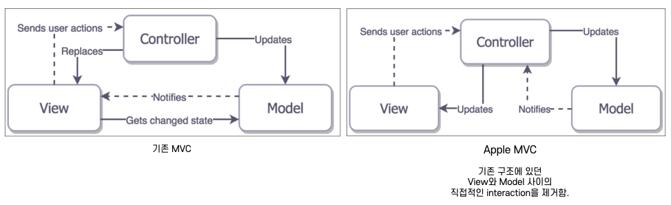
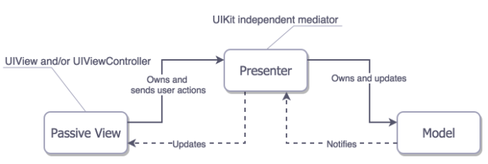
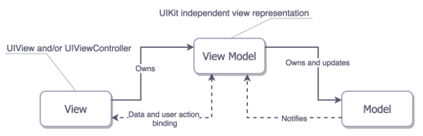

각 구성요소의 특징과 own 관계, 장단점에 대해 보겠음.

# MVC : Model-View-Controller

## 구성요소의 역할
__Model__
- 데이터 구조를 정의한 structure나 class 등이 여기에 해당된다.
- 네트워크 통신 코드 및 통신 후 받아온 데이터를 parsing하는 작업도 포함됨.

__View__
- 데이터를 사용자에게 보여주는 UI요소들이 여기에 해당된다.
- 또한 사용자로부터 이벤트를 받아 이를 Controller에게 전달해주는 역할도 한다.

__Controller__
- Model과 View 사이를 중개하는 역할. controller의 가장 중요한 역할 중 하나는 model과 view가 서로의 존재를 모르도록 하는 것이다.
- model로부터 받은 데이터를 view에게 전달하여 데이터가 업데이트될 수 있도록 함.
- view로부터 이벤트를 받으면 model을 업데이트함.
- model과 view를 소유하고 있다.

## 장단점
__장점__   
- 가장 기본이 되는 디자인패턴이며 쉽다. 작은 서비스일 경우 적합함.
- 비즈니스 로직과 룰이 model layer에 캡슐화되어 있다.

__단점__
- 비즈니스 로직은 캡슐화되어있지만 controller에는 UI와 관련된 로직이 여전히 포함되어 있다.
    - 비즈니스 로직을 호출하고 그 결과를 view에 바인드
    - view 요소 관리
    - model layer로부터 온 데이터를 UI에 맞는 형태로 변형
    - 화면 이동 로직
    - UI 상태 관리
- iOS에서는 View와 Controller간 결합도가 높다. 그래서 unit test가 어렵다.
    - Controller의 역할을 하는 UIViewController가 IBOutlet, IBAction으로 View를 관리
    - Controller가 view의 라이프사이클도 관리
- Controller가 너무 많은 역할을 한다. 
    - view의 라이프사이클 관리
    - model이나 view에 들어가기 애매한 로직들이 모두 Controller에 구현되어 있다.   
    ex. delegate 메소드, datasource, date formatter, 네트워크 및 DB 요청 등  
    → 그래서 Massive View Controller가 된다.
- view와 model의 의존성이 높다.
    - 기본 MVC 구조는 Model과 View 사이의 직접적인 interaction이 가능하기 때문이다.
    - Apple MVC의 경우 구조적으로는 Model과 View가 서로를 모르는게 맞다. 하지만 Controller가 너무 많은 역할을 하기 때문에 기능을 분배
    
    apple MVC의 경우 구조적으로는 서로를 모르는게 맞다. 하지만 Controller가 너무 많은 역할을 하는 걸 막기위해 개발하다보면 view로 model을 전달하게 된다.(

    

# MVP : Model-View-Presenter

## 구성요소의 역할
__Model__
- MVC의 Model과 동일한 역할

__View__
- MVC와 달리 UIViewController도 View layer로 취급
- MVP에서 View는 수동적인 존재다. 즉, 이벤트가 들어오면 Presenter로 이를 라우팅하고 Presenter가 처리 후 리턴하면 이를 그저 보여주기만 할 뿐이다.
- View가 Presenter를 소유하고 User Action을 Presenter에 전달함.

__Presenter__
- Model과 View 사이를 중개하는 역할.
- UIKit에 의존하지 않는다.
- View로부터 모든 input을 받아서 적절히 포맷팅 혹은 Model과의 interaction으로 데이터 가져와서 가공 후 이를 View에 넘긴다.
- 구조상으로 보면 View와 Model은 서로의 존재를 모르는 상태이지만, Presenter가 View에 데이터를 넘길 때 Model에 의존하는게 아닌가 의문이 들었다. 근데 예제를 확인해보니 
__Model을 이용해 가져온 데이터를 `가공`해서 View로 전달할 때 Presenter에 정의된 새로운 데이터 구조를 사용__
하고 있었다. 
- Presenter와 View는 1:1 관계다.
    - 왜 1:1 관계인지는 사실 아직도 이해 안됨. 왜냐면 delegate 패턴을 이용하면 하나의 presenter가 여러 개의 view를 가질 수 있지 않나?
    - 🤔 서로가 서로를 참조하고 있어서? MVP의 목적 자체가 view와 presenter를 decoupling하는 것이라? prsenter가 해당 view를 참조하기 때문에? presenter가 view와 Model을 둘다 소유하고 있기 때문에?

## 장단점
__장점__
- Presenter에는 UI와 관련된 코드가 없다. 따라서 테스트하기 쉬워짐.

__단점__
- View와 Presenter가 1:1의 관계이기 때문에 Presenter의 재사용성이 떨어진다.   

# MVVM : Model-View-ViewModel

## 구성요소의 역할과 관계

__Model__
- MVC의 Model과 동일

__View__
- ViewModel을 소유한다.
- MVC와 달리 UIViewController도 view로 취급. (MVP와 동일함)
- MVP와 달리 **능동적으로 데이터의 변화를 관찰하는 관찰자**다. 데이터의 변화를 중개자가 알려주는 것이 아니라 `데이터 바인딩`을 통해 view가 직접 가져간다.
    > 데이터 바인딩 : Model과 View의 싱크를 맞춘다. Model과 View가 분리되어 있어도 한쪽이 바뀌면 다른 쪽도 업데이트가 이루어진다.  
    데이터 바인딩을 가능케 해주는 것들 : KVO, Delegation, Functional Reactive Programming(RxSwift 등), 프로퍼티 옵저버
  
  
__ViewModel__
- Model을 소유한다.
- Model과 통신하며 데이터에 대한 처리를 진행한다.
- View로부터 input을 받아 처리만 하고 이를 보여주라는 얘기는 안함. 그냥 데이터 가공만 해서 저장해둠. View가 옵저빙하고 있다가 알아서 가져가서 처리함.

## 장단점
__장점__
- ViewModel 재사용 가능(ViewModel 하나로 여러 View에서 사용가능)
- 중개자의 기능이 줄어듬(MVP의 경우 데이터 가공 후 업데이트까지 해야했다면, MVVM의 경우 데이터 가공만 해두면 됨)

__단점__
- viewModel 설계가 어려움. 그래서 간단한 앱에 맞지 않을 수 있다.
- 데이터 바인딩이 필수적

---
🔗 참고 사이트   
- [디자인패턴 구조도](https://tianpan.co/notes/123-ios-architecture-patterns-revisited)  
- [MVC Design Pattern](https://jryoun1.github.io/design%20pattern/MVCDesignPattern/)
- [iOS Swfit : MVP Architecture](https://saad-eloulladi.medium.com/ios-swift-mvp-architecture-pattern-a2b0c2d310a3)
- [iOS MVVM tutorial: Refactoring from MVC from raywenderlich](https://www.raywenderlich.com/6733535-ios-mvvm-tutorial-refactoring-from-mvc)
- [ios-architecture example](https://github.com/tailec/ios-architecture)
- [A dubm UI is a good UI: Using MVP in iOS with Swift](http://iyadagha.com/using-mvp-ios-swift/)