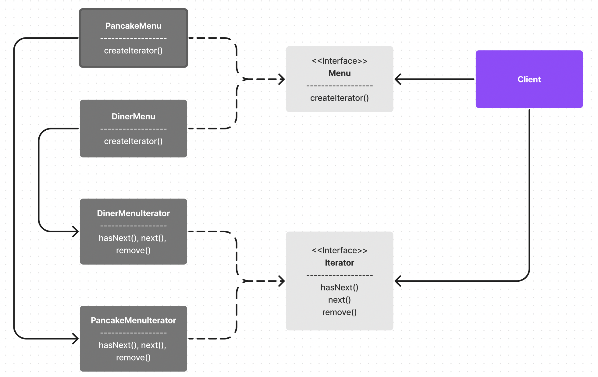

## 9. 컬렉션 잘 관리하기
반복자 패턴과 컴포지트 패턴

 

### 들어가며
- 이 장의 목표 : 객체 저장 방식을 보여주지 않으면서도 클라이언트가 객체에 일일이 접근할 수 있게 해 주는 방법을 알아본다.
    - 여기서 객체 저장 방식은 "컬렉션"을 말함.

 

### 문제상황
- 객체마을의 두 식당이 서로 합병을 했다 ! 각 식당에서 사용하는 메뉴 모델은 동일하지만 이를 담은 컬렉션의 타입은 다른 상태이다.(하나는 ArrayList, 다른 하나는 Array) 이미 이 타입을 기준으로 많은 양의 코드를 작성한 상황! 어떻게 해야할까?

- 만약 이 문제를 해결하지 않고 사용하게 될 경우
    - <b>코드 중복이 발생한다.</b> 
    왜냐하면 ArrayList에서 데이터의 사이즈를 구하거나 값을 가져오는 메소드와 Array에서 이를 가져오는 메소드는 다르기 때문이다.(인터페이스가 일치하지 않음.)
    - <b>새로운 유형의 컬렉션이 추가됐을 때 이를 사용하는 클라이언트단 코드의 수정이 불가피하다.</b>  
    만약 HashMap이 추가된다면? 이 역시 ArrayList나 Array와는 인터페이스가 다르기 때문에 코드 수정이 불가피하다.

- 이렇게 문제를 적어보니 눈에 들어오는 원인이 하나 있는데 바로 "인터페이스가 일치하지 않음"이다.

- 오 그럼 인터페이스를 일치시켜준다면(인터페이스를 통합시킨다면) 각 식당 메뉴의 코드 수정 없이 클라이언트가 바로 가져다가 사용할 수 있겠네 ! 지금부터 이와 관련된 방법 중 하나인 반복자 패턴에 대한 내용이 나온다.

 

### 반복자 패턴(Iterator pattern)
- 이 책에서 많이 언급되는 원칙 중 하나, `바뀌는 부분은 캡슐화하라`가 이번 패턴에서도 가장 먼저 적용된다. 콜렉션과 관련해서 가장 많이 이루어지는 작업 중 하나가 각 element에 접근해서 어떤 처리를 하는 것인데 이를 위해서는 element의 순회를 도는 작업이 필수적이다. 

- 위에서 언급했다시피 순회를 돌때 사용하는 메소드 인터페이스가 컬렉션의 종류에 따라 바뀌어져야 하니 이를 별도 객체에 캡슐화 해야한다.

- 

 

### 단일 역할 원칙(SRP)
이 장에서는 SRP에 대한 내용도 나온다. 간단히 정리하고 넘어간다.
- 클래스가 변경되는 원인은 딱 한가지 이유에서 나와야 한다.
- 클래스 A에서 원래 그 클래스의 역할(컬렉션 관리) 외에 다른 역할(반복작업)을 처리하게 되면 클래스 A는 2가지 이유로 변경이될 가능성이 있다는 사실을 인지해야 한다.
    - 하나는 컬렉션의 변경으로 인해
    - 다른 하나는 반복자 관련 기능의 변경으로 인해
- 클래스를 고치는 것은 최대한 지양해야 하는데 이렇게 두가지 이유로 인해 클래스가 변경되야한다면 나중에 클래스를 고쳐야할 가능성이 높아진다.
- 따라서 클래스가 가지는 역할을 한개로 제한하여 클래스를 변경해야할 이유를 한개로 축소시켜야 한다.

 

### 궁금한 것들
<b>ArrayList와 Array의 차이는 뭘까?</b> 
스터디를 하면서 알게된 건데 ArrayList와 Array의 차이를 비교하는 것은 옳지 않은(?) 질문이고, Array와 List의 차이를 찾아보는게 맞다고 한다 😲

 

### 느낀점 / 배운점
- 항상 패턴과 관련된 내용을 보면서 느끼는 건데, 지금 당장에는 생각나는 방법이 프로토콜을 정의하고 이를 채택하는 것밖에 없었다. 근데 이번 장(반복자 패턴)을 보면서 결국에는 어떤 역할을 분리시키는 방법들의 모음이 아닐까 하는 생각이 조금 들었다.
- 또한 객체 자체에 프로토콜을 적용하는 것뿐만 아니라 객체가 가져야할 역할 자체를 분리시켜서 프로토콜을 적용하는 방식으로도 인터페이스를 통합시킬 수 있구나 ! 라는 것을 배울 수 있었다.
- 이 책의 374p에 보면 "응집도"에 대한 내용이 나온다.
    >응집도(cohesion)란 한 클래스 또는 모듈이 특정 목적이나 역할을 얼마나 일관되게 지원하는지를 나타내는 척도이다. 응집도가 높다는 것은 서로 연관된 기능이 묶여있다는 것을 의미한다.
    
    어떤 글을 읽을 때 cohesion 또는 응집도라는 단어가 나오면 읽는데 조금 어려움이 있었는데 이번 기회에 이 의미에 대해 배울 수 있었다.

