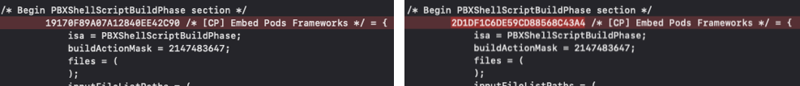

다른 분과 각자 로컬에서 작업 후 merge하는데 conflict가 발생했다.   
오류가 발생한 파일은 총 3개로 `project.pbxproj`, `Podfile`, `Podfile.lock`이다.   
진행한 작업은 아래와 같다.
- 각자의 로컬에서 서로 다른 라이브러리를 Cocoapod을 통해 추가
- 서로 다른 폴더에 새로운 파일들을 추가   

문제가 발생한 파일들은 어떤 역할을 하는지, 왜 충돌이 발생했는지 알아보고 conflict를 처리했던 과정을 기록하고자 한다.

---

### `project.pbxproj`
- [여기](https://github.com/HaejungAhn/TIL/blob/main/Xcode/pbxproj.md)에서 정리한 것처럼 프로젝트에 추가된 파일들과 그 파일들이 어떤 폴더에 그룹핑되어 있는지, 사용하는 라이브러리는 무엇이고 빌드 설정은 어떻게 되는지에 대한 정보를 담고 있다.
- 문제가 발생한 이유는 두 가지이다. 
    - 폴더와 파일들을 추가하거나 삭제하면 그 정보가 project.pbxproj에도 변경이 발생함.   
    -> 내가 추가한 파일과 다른 분이 추가한 파일 모두 필요했기 때문에 두 변경사항 모두 선택해서 merge 진행
    - "[CP] Embed Pods Frameworks"의 참조ID가 서로 다름.   
    🤔 근데 참조 ID가 왜 다를까 생각해보면,, 테스트해보긴 해야겠지만 develop 브랜치에서 각자 feature 따서 각자 pod install을 최초로 실행했기 때문이지 않을까 싶다. 테스트 필요함!!
       
    -> pbxproj 안에서 참조할 때 사용하는 값이라고 이해했음. 그래서 둘 중 하나를 선택하고 해당 참조 ID가 사용되는 부분을 모두 수정 후 merge 진행


### `Podfile`
>🔗 [The Podfile](https://guides.cocoapods.org/using/the-podfile.html)   
The Podfile is a specification that describes the dependencies of the targets of one or more Xcode projects.   
Podfile은 한개 이상의 Xcode project target의 dependency를 설명한 명세서다.
```Swift
target 'MyApp' do
  use_frameworks!
  pod 'Alamofire', '~> 3.0'
end
```
- 서로 다른 라이브러리를 추가했기 때문에 충돌이 발생함.
- 두 commit을 모두 사용할 수 있도록 함으로써 충돌 해결

### `Podfile.lock`
>🔗  [What is `Podfile.lock`](https://guides.cocoapods.org/using/using-cocoapods.html#what-is-podfilelock)   
`pod install`을 처음 실행하고 난 후 생성되는 파일로, 설치된 각각의 pod에 대한 버전을 추적한다. `Podfile.lock`이 처음 실행됐을 당시 해당 pod에 대한 버전을 기록해놓고 있기 때문에 추후 서로 다른 기기에서 `pod install`을 하더라도 동일한 버전을 다운 받을 수 있다.
- `Podfile`과 마찬가지로 다른 라이브러리를 추가했기 때문에 발생하는 충돌이다. 두 commit을 모두 사용할 수 있도록 처리함으로써 충돌을 해결했다.
- 추가적으로 `PODFILE CHECKSUM`이라는 값도 서로 달랐다.   
`PODFILE CHECKSUM`은 hash값으로, 사용하는 라이브러리 및 라이브러리의 버전 정보를 이용해서 일정한 사이즈의 string 값을 만들어낸 것이다.
- Podfile.lock에서 충돌이 발생했다는 것은 곧 라이브러리 혹은 라이브러리 버전에 대한 변경이 발생했다는 것이기 때문에 어차피 checksum의 변화가 발생하게 된다. 따라서 둘 중 하나를 선택해서 일단 merge한 후 다시 pod install 해주면 됨.   
참고 : [How to deal with conflicts in Pod folders](https://medium.com/@amlcurran/how-to-deal-with-conflicts-in-pod-folders-2eb9fa20f465)


### conflict 해결하기
1. develop 브랜치 pull
2. `feature/{내 브랜치}` 체크아웃
3. `git merge develop`
4. ⚠️ merge conflict발생   
    `CONFLICT (content): Merge conflict in {프로젝트명}.xcodeproj/project.pbxproj`
    
5. vi 편집기로 충돌 발생한 파일들(project.pbxproj, Podfile, Podfile.lock) 수정 진행
6. Unmerged 파일 add진행   
    `git add {프로젝트명}.xcodeproj/project.pbxproj Podfile Podfile.lock`
    
7. `git commit -m “resolving merge conflict”`   
    → 메세지는 반드시 쌍따옴표를 붙이자.. 안붙였더니 “fatal: cannot do a partial commit during a merge.” 오류 뜸.
    
8. conflict 처리 후 merge 성공.
