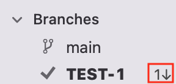
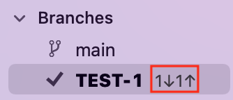
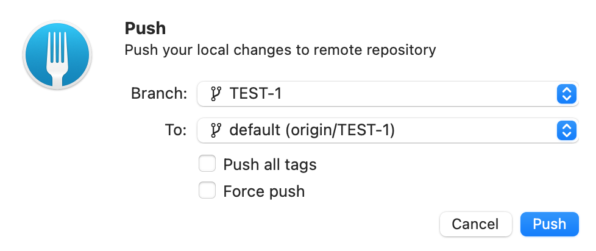
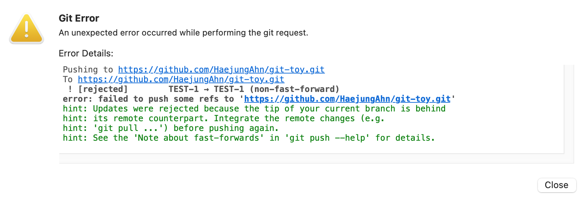
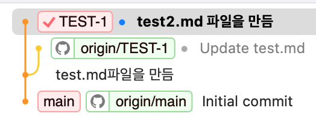
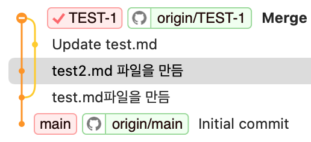

오늘은 오랜만에 git conflict를 만났다.   

### 문제상황
- 작업하던 브랜치에 커밋을 하는데 오류가 발생했다.
- 오류 원인은 ~~역시나~~ `project.pbxproj` 파일에서 발생했고, 특정 폴더에 서로 다른 개발자가 파일을 추가하면서 발생한 문제다.
- 한가지 기억나는 특이(?)사항이 있다면, 내가 작업하던 브랜치 옆에 `↓6` 이런 표시가 있었다는 것이다. (리모트 브랜치에 변경사항이 발생했다는 의미임. 근데 이거 커밋개수인가??)    
이걸 봤지만.. '아무리 생각해도 나 이외에는 누구도 내가 작업하던 브랜치에 push를 하지 않았을텐데..? 이상하다🤔' 라고 생각하고 pull을 하지 않은 상태에서 commit을 진행함.
- 그리고 push를 하려했더니 conflict가 발생했고 이후에는 pull도 진행되지 않는 상태였다.

### 재현하기
일단 이게 왜 발생했는지 너무 궁금해서~~ 재현 먼저 해보도록 하겠음!!   

**[STEP 1]** 테스트할 git repo를 만들고 로컬로 clone해온다.   
**[STEP 2]** 브랜치를 새로 만든다.(브랜치 명: `TEST-1`)   
**[STEP 3]** 로컬에서 파일을 만들고(test.md) 커밋한 이후 리모트에 push한다.   
**[STEP 4]** github 사이트에서 test.md 파일을 수정하고 commit 한다.   
**[STEP 5]** 여기까지 오면 아래와 같이 `↓1` 표시가 생긴 것을 볼 수 있다.   
   
이말인 즉, 리모트에서 변경이 일어났으니 pull을 하라는 의미다.  

**[STEP 6]** 여기서 pull을 하지 않고 로컬의 변경사항을 커밋해보겠음!   
이를 위해 로컬에 test2.md라는 파일을 만들고 commit을 진행했다.   
Git-fork의 브랜치에 아래와 같이 표시가 된다.   
   

push를 해보면
   

오류가 발생한다.   
   

이 시점의 git graph는 아래와 같다.   
   

오류 내용 중 주요 키워드나 문구를 뽑아보자면.   
- `fast-forward`   
- `tip of current branch is behind its remote counterpart.`

### 원인 - `fast-forward`
- fast-forward 관계란   
https://minemanemo.tistory.com/157

### 해결하기
해결은 비교적 간단한데 pull을 먼저 하고 이후 push를 진행하면 된다.   
이 시점의 git graph는 아래와 같다.   
   

---

>다른 얘기이긴 한데 오늘 회사에서 Git-fork 얘기가 나왔다. 기존에 소스트리를 사용하고 있었는데 간헐적으로 발생하는 오류로 인해 Git-fork 사용을 고려하고 있다는 얘기였음. 그때는 "둘 중 하나 결정되면 공부해볼게요~"라고 얘기했는데 들으니 궁금해져서 집 오자마자 바로 설치해봄. 소스트리를 써보진 않아서 비교하긴 어려우나 UI는 깔끔하다.

>Xcode에서도 git을 지원하는데 왜 소스트리나 Git-fork 같은 별도의 GUI 툴을 사용하는지 항상 의문이었는데 오늘 다른 팀원분이 "Xcode는 git을 위해 만들어진게 아니기 때문에" 별도로 GUI 툴을 사용한다고 했던 말이 기억난다. 듣자마자 납득이 가서 Git-fork 바로 시도해봄! [여기](https://eboong.tistory.com/67)를 참고해서 처음 스타뜨를 끊었다.