# 2. Git의 기초

🖍 2장의 목표

- 저장소를 만들고 설정하는 방법
- 파일을 추적(Track)하거나 추적을 그만두는 방법
- 변경 내용을 Stage하고 커밋하는 방법
- 파일, 파일패턴을 무시하도록 Git을 설정하는 방법
- 실수를 쉽고 빠르게 만회하는 방법
- 프로젝트 히스토리를 조회하고 커밋을 비교하는 방법
- 리모트 저장소에 Push하고 Pull하는 방법


## [2.1 Git 저장소 만들기](https://git-scm.com/book/ko/v2/%EC%8B%9C%EC%9E%91%ED%95%98%EA%B8%B0-%EB%B2%84%EC%A0%84-%EA%B4%80%EB%A6%AC%EB%9E%80%3F)

다음 두가지 중 하나의 방법으로 Git 저장소를 쓰기 시작한다.

**`$ git init`** 
- 아직 버전관리를 하지 않는 로컬 디렉토리로 이동 후 위 명령어를 실행하면 새로운 Git 저장소가 만들어짐.
- 이 방법을 사용하면 `.git`이라는 하위 디렉토리가 만들어진다.   
🤭 만약 `.git` 디렉토리가 보이지 않는다면 위 명령어를 실행한 디렉토리를 Finder로 열고 `⌘ + Shift + .`을 이용해 숨겨진 파일 보기를 설정한다.
- 아래와 같은 폴더와 파일을 확인할 수 있다. 해당 폴더 및 파일들에 대한 설명은 [Git의 내부](https://git-scm.com/book/ko/v2/Git%EC%9D%98-%EB%82%B4%EB%B6%80-Plumbing-%EB%AA%85%EB%A0%B9%EA%B3%BC-Porcelain-%EB%AA%85%EB%A0%B9#ch10-git-internals)에서 확인할 수 있다.   
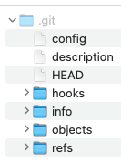
- 이 명령으로는 아직 어떤 파일도 관리하지 않은 상태이다. git add와 commit 명령어를 이용해 파일을 Staging area에 올리고 스냅샷을 커밋할 수 있다.

**`$ git clone <url>`**
- 다른 어딘가로부터 Git 저장소를 복제하는 방법이다.
- 프로젝트의 히스토리를 모두 가져온 후 자동으로 가장 최신버전을 checkout해둔다.
- 만약 Alamofire라는 디렉토리를 새롭게 만들고 그 안에 Alamofire의 소스코드를 clone하고 싶다면 아래와 같이 해주면됨!   
`$ git clone https://github.com/Alamofire/Alamofire`
- 생성되는 디렉토리 이름을 'Alamofire-test'로 바꾸고 싶다면...   
`$ git clone https://github.com/Alamofire/Alamofire Alamofire-test`


## [2.2 수정하고 저장소에 저장하기](https://git-scm.com/book/ko/v2/Git%EC%9D%98-%EA%B8%B0%EC%B4%88-%EC%88%98%EC%A0%95%ED%95%98%EA%B3%A0-%EC%A0%80%EC%9E%A5%EC%86%8C%EC%97%90-%EC%A0%80%EC%9E%A5%ED%95%98%EA%B8%B0)
### 파일의 라이프사이클
- 워킹 디렉토리(내가 작업하고 있는, Xcode 좌측에 보여지는 그 디렉토리임!)의 모든 파일은 크게 Tracked(관리대상임)와 Untracked(관리대상이 아님)으로 나뉜다.
- 📒  Tracked : 추적   
    - Tracked 파일은 <u>이미 스냅샷에 포함되어 있던</u> 파일이다. 즉, **Git이 이미 알고 있는 파일**이라는 의미다.
    - Tracked 파일은 또 Unmodified, Modified, Staged(커밋으로 저장소에 기록할 예정인) 상태 중 하나의 상태를 가진다.
- 그 외 나머지 파일들은 Untracked 파일이다. 워킹 디렉토리에 있는 파일 중 스냅샷에도, Staging Area(Git Index라고도 함)에도 포함되지 않은 파일이다. (git이 이미 알고 있는 파일도 아니고, 커밋으로 기록할 파일도 아님을 의미)


### 파일의 상태 확인하기
- 파일의 상태를 확인하기 위해서 `$ git status` 명령어를 사용한다. 아래 그림과 같은 내용을 확인할 수 있다.   
여기서 "Changes to be committed"가 Staged 상태에 있는 것이고, Untracked에 있는 "README.md"는 방금 추가한 파일임.   
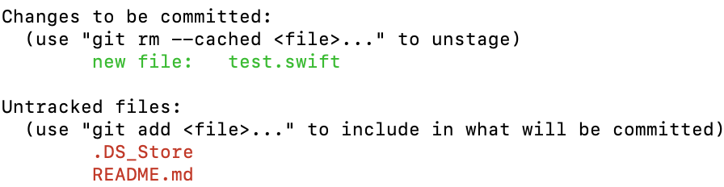
- 파일 상태를 짤막하게 확인할 수도 있는데 이때는 -s 혹은 --short를 함께 붙여준다. `$ git status -s` 혹은 `$ git status --short`   
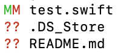   
-`??`는 아직 추적하지 않는 파일 앞에 붙는다.   
-`A`는 새롭게 추가해서 staged 상태로 추가된 파일 앞에 붙는다.   
-`M`은 커밋된 파일 중 수정된 파일 앞에 붙는다. test.swift의 경우 수정 후 staged에 올라간 상태에서 다시 수정을 진행해서 두개가 붙은거임.

### 파일을 새로 추적하기
- Modified 상태의 파일을 Stage하기   
"test.swift"파일은 이미 git에 의해 추적되고 있는 파일이다. 해당 파일을 수정하고 `$ git status`를 통해 확인해보면 "Changes not staged for commit"에 파일이 나오는 것을 알 수 있다.   
*(직역하면, 변경사항이 commit을 위해 준비되지 않음! 정도임.)*
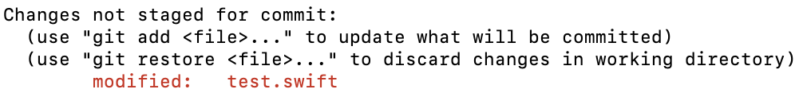

- `$ git add`를 통해 수정한 파일을 Staged 상태로 만들 수 있다.   
`$ git add`는 파일을 새로 추적할 때, 수정한 파일을 Staged 상태로 만들때, Merge할 때 충돌난 상태의 파일을 Resolve 상태로 만들때도 사용한다.   
- `add`의 의미는 프로젝트에 파일을 추가한다기보다는 **다음 커밋에 파일을 추가한다**고 받아들이는게 좋다.

- `$ git add ./test.swift` 명령어를 통해 수정한 test.swift 파일을 staged 상태로 만들었다. 여기서 다시 한번 test.swift 파일을 수정하면 어떻게 될까?   
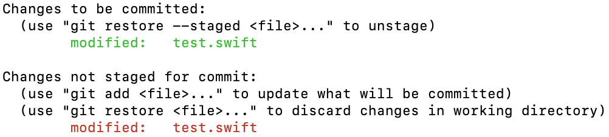
🤭 *Staged이면서 동시에 Unstaged하다 !*   
이 상태에서 commit을 하게 되면 현재 워킹 디렉토리에 수정된 최신 버전이 commit되는게 아니라 staged에 올라가있는 버전이 commit되게 된다.   
따라서 staged 이후 다시 수정됐다면 가장 최신 버전을 add해줘야 한다.


### 파일 무시하기
- 어떤 파일은 Git이 관리할 필요가 없다. 그런 파일을 무시하고 싶다면 `.gitignore`파일을 만들고 그 안에 무시할 파일의 패턴을 적으면 된다.
- 위 캡처 이미지들을 보면 `.DS_Store`가 Untracked 상태로 남아있는 걸 볼 수 있음. [이 파일은 Desktop Service Store의 약자로 macOS에서 아이콘 위치나 배경이미지 선택과 같은 폴더의 사용자 지정 속성을 저장하는 파일](https://iteastory.com/201)인데 이건 프로젝트와 직접적으로 연관 없기 때문에 굳이 git이 관리할 필요가 없다. 이런 파일들이 무시해도 되는 파일들임.
```Bash
$ cd {git파일경로}
$ vi .gitignore   # gitignore파일에 데이터 입력하고 새롭게 생성함.
#---- 아래와 같이 입력 후 저장함.
#.DS_Store
$ git status      # 상태 확인해보면 더이상 DS_Store가 untracked에도 나오지 않는 것을 볼 수 있음.
```
- .gitignore 작성 규칙은 아래와 같다.
    - 아무것도 없는 라인, `#`으로 시작하는 라인은 무시한다.
    - 표준 Glob 패턴을 사용한다. 이는 프로젝트 전체에 적용된다.
    - 슬래시(`/`)로 **시작**하면 하위 디렉토리에 적용되지 않는다.
    - 디렉토리는 슬래시(`/`)를 끝에 사용하는 것으로 표현한다.
    - 느낌표(`!`)로 시작하는 패턴의 파일은 **무시하지 않는다.**

아래 내용은 다시 읽어봐야함~~   
*Resolve 상태?*    
*표준 Glob패턴? .gitignore작성 규칙 테스트해보기*   
*Glob 패턴은 정규표현식을 단순하게 만든 것으로 생각하면 되고 보통 쉘에서 많이 사용한다. 애스터리스크(*)는 문자가 하나도 없거나 하나 이상을 의미하고, [abc] 는 중괄호 안에 있는 문자 중 하나를 의미한다(그러니까 이 경우에는 a, b, c). 물음표(?)는 문자 하나를 말하고, [0-9] 처럼 중괄호 안의 캐릭터 사이에 하이픈(-)을 사용하면 그 캐릭터 사이에 있는 문자 하나를 말한다. 애스터리스크 2개를 사용하여 디렉토리 안의 디렉토리 까지 지정할 수 있다. a/**/z 패턴은 a/z, a/b/z, a/b/c/z 디렉토리에 사용할 수 있다.*

### Staged와 Unstaged 상태의 변경 내용을 보기
- 파일의 어떤 라인이 추가됐고 삭제됐는지를 보고 싶다면 `$ git diff`명령을 사용한다.
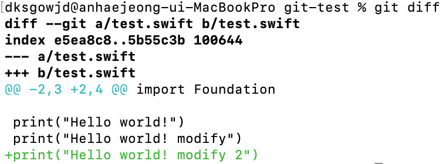
- **워킹 디렉토리에 있는 것(Unstaged 상태)과 Staging Area(Git Index)에 있는 것을 비교**한다. 그래서 수정하고 아직 stage하지 않은 것을 보여준다.
- 만약 Staging Area(Git Index)에 올린 파일의 변경 부분을 보고 싶다면 `$ git diff --staged` 혹은 `$ git diff --cached`옵션을 사용한다. **저장소에 커밋한 것과 Staging Area에 있는 것을 비교**한다.
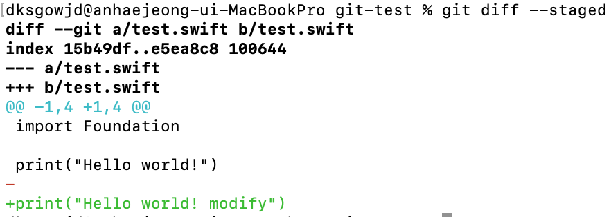
*첫번째 이미지와 비교했을 때 index 및 수정된 내용이 다른 걸 볼 수 있다.*
- `$ git diff`명령은 수정 내용 전체를 보여주는게 아니라 Unstaged 상태인 것들만 보여준다!
- `$ git difftool --tool-help` 명령을 통해 diff 비교에 도움을 주는 툴을 볼 수 있다.

### 변경사항 커밋하기
- `$ git commit`을 통해 Staged 상태에 있는 파일들을 커밋한다. (단, Unstaged 상태의 파일은 커밋되지 않음)
- Staging area(Git Index)를 거치지 않고 다이렉트로 Tracked 상태의 파일을 커밋할 수 있는 방법으로는 `$ git commit -a`를 사용하는 것이다.(git이 자동으로 Staging area(Git Index)에 파일들을 넣어줌)    
🖐 필요하지 않은 파일도 commit될 수 있으므로 주의해서 사용해야 함.

### 파일 삭제하기
- **git에서 파일을 제거하려면** `$ git rm` 명령으로 <u>Tracked 상태의 파일을 삭제한 후(정확하게는 Staging Area(Git Index)에서 삭제하는 것) 커밋</u>해야 한다. 이 명령은 워킹 디렉토리에 있는 파일도 삭제하기 때문에 실제로 파일도 지워진다.
- git 명령을 사용하지 않고 단순히 워킹 디렉토리에서 파일을 삭제 후 `$ git status` 명령으로 상태를 확인하면 Git은 현재 "Changes not staged for commit" (즉, Unstaged 상태)라고 표시해준다.
    ```Bash
    $ vi test2.swift                # test2.swift 파일 생성
    $ git add .                     # 현재 디렉토리에서 발생한 변경사항을 staging에 올림
    $ git status        
    On branch master
    Changes to be committed:
    (use "git restore --staged <file>..." to unstage)
        modified:   test2.swift

    $ rm test2.swift                # test2.swift 파일 삭제
    $ git status
    On branch master
    Changes to be committed:        # 변경사항이 Staging area에 올라간 상태
    (use "git restore --staged <file>..." to unstage)
        modified:   test2.swift

    Changes not staged for commit:  # Tracked되고 있는 파일이지만, 변경사항이 staging area에 올라가지는 않음. 만약 Untracked되고 있는 파일이었다면 "Untracked files" 항목에 있어야 함.
    (use "git add/rm <file>..." to update what will be committed)
    (use "git restore <file>..." to discard changes in working directory)
        deleted:    test2.swift

    $ git rm test2.swift
    rm 'test2.swift'

    $ git status
    On branch master
    Changes to be committed:
    (use "git restore --staged <file>..." to unstage)
        deleted:    test2.swift

    ```
- 커밋하면 파일은 삭제되고 Git은 이 파일을 더는 추적하지 않는다.
- 이미 파일을 수정했거나 Staging Area에 추가했다면...

    - `$ git rm`만으로는 삭제할 수 없다. 삭제하려 할 경우 아래와 같은 오류가 발생한다.
        ```
        error: the following file has changes staged in the index:
        ```
    - `-f` 옵션을 주어 강제로 삭제해야 한다: `$ git rm -f test4.swift`

- Staging area에서만 지우고 워킹 디렉토리에는 파일을 그대로 남겨둘 수도 있다. 즉, 하드디스크에는 파일이 존재하지만 Git은 파일을 더이상 추적하지 않는 것이다.

    - `.gitignore`파일에 추가하는 것을 까먹었거나 대용량 로그 파일이나 컴파일된 파일 등 실제 프로젝트에서는 필요치 않은 파일들을 실수로 추가했을 때 쓴다.
        ```Bash
        $ vi test5.swift
        $ git add .
        $ git status
        On branch master
        Changes to be committed:
        (use "git restore --staged <file>..." to unstage)
            new file:   test5.swift
        
        $ git rm --cached test5.swift
        rm 'test5.swift'
        $ git status
        On branch master
        Untracked files: # cached 옵션을 통해 삭제한 파일이 Git 추적에서 제외됨.
        (use "git add <file>..." to include in what will be committed)
            test5.swift

        nothing added to commit but untracked files present (use "git add" to track)

        $ ls
        README.md	test5.swift # cached 옵션을 통해 삭제한 파일이 하드디스크에 그대로 남아있음.
        ```
- 여러개의 파일이나 디렉토리 삭제하기: `$ git rm log/\*.log` 혹은 `$ git rm \*~`

### 파일 이름 변경하기
- Git은 다른 VCS 시스템과는 달리 <u>파일 이름의 변경이나 파일의 이동을 명시적으로 관리하지 않는다.</u> 다시말해 파일 이름이 변경됐다는 별도의 정보를 저장하지 않는 것이다. Git은 똑똑해서 굳이 파일 이름이 변경되었단느 것을 추적하지 않아도 아는 방법이 있다. 😲
- 파일 이름 변경을 Git은 어떻게 아는걸까?   
    ```Bash
    $ vi test66.swift
    $ git add .
    $ git commit -m "make new file"
    $ git mv test66.swift test666.swift
    $ ls
    README.md	test5.swift	test666.swift

    $ git status
    On branch master
    Changes to be committed:
    (use "git restore --staged <file>..." to unstage)
        renamed:    test66.swift -> test666.swift  # renamed라고 표시됨!
    ```
    사실 mv는 일종의 단축 명령어이다. mv를 풀어쓰면 아래와 같다.
    ```Bash
    $ mv test66.swift test666.swift
    $ git rm test66.swift
    $ git add test666.swift
    ```

## [2.3 커밋 히스토리 조회하기](https://git-scm.com/book/ko/v2/Git%EC%9D%98-%EA%B8%B0%EC%B4%88-%EC%BB%A4%EB%B0%8B-%ED%9E%88%EC%8A%A4%ED%86%A0%EB%A6%AC-%EC%A1%B0%ED%9A%8C%ED%95%98%EA%B8%B0)
- 저장소 히스토리는 `$ git log`를 이용하면 된다. 시간순으로(가장 최신순으로) 커밋 히스토리가 나온다.
    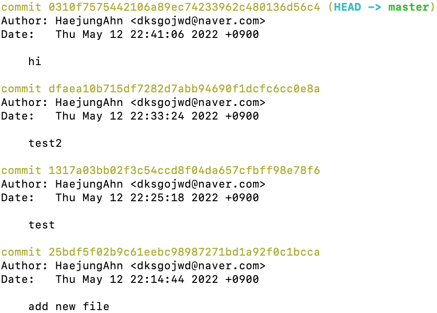   
    각 커밋의 SHA-1 체크섬, 저자이름 및 이메일, 커밋한 날짜와 메세지를 볼 수 있다.

- 여러 유용한 옵션들

    - `$ git log -p` 혹은 `$ git log --patch`   
    각 커밋의 diff 결과를 보여준다.    
    - `$ git log -<n>`   
    최신 n개의 결과만 보여준다.
    - `$ git log --stat`   
    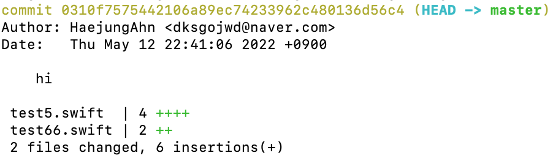      
    어떤 파일이 얼마나 많이 변경됐는지, 얼마나 많은 라인이 추가/삭제됐는지 보여준다.   
    - `$ git log --pretty=oneline`   
    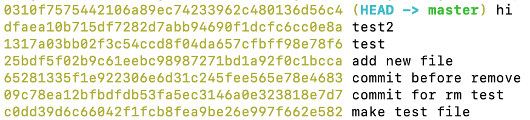      
    pretty의 값으로 oneline 대신 다른걸 사용할 수 있으며, [여기](https://git-scm.com/book/ko/v2/Git%EC%9D%98-%EA%B8%B0%EC%B4%88-%EC%BB%A4%EB%B0%8B-%ED%9E%88%EC%8A%A4%ED%86%A0%EB%A6%AC-%EC%A1%B0%ED%9A%8C%ED%95%98%EA%B8%B0#pretty_format)에서 포맷들을 볼 수 있다.
    - `$ git log --pretty=format:"%h %s" --graph`
    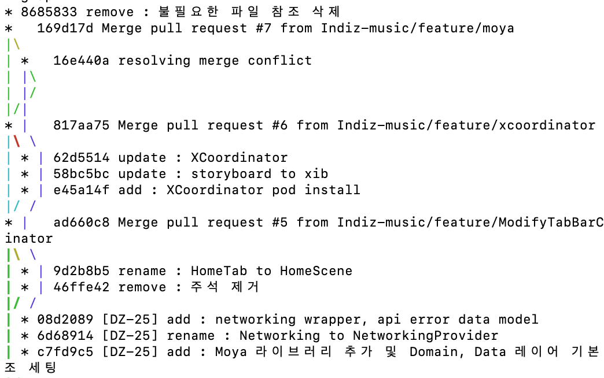      
    오😲
    - `--since`, `--until` 같은 시간을 기준으로 조회하는 옵셔도 있다.
    - `--author`옵션으로 저자를 지정하여 검색할 수도 있고 `--grep`옵션으로 커밋 메시지에서 키워드를 검색할 수도 있다. 
    - `-S`를 이용하면 코드에서 추가/제거된 내용 중 특정 텍스트가 포함되어 있는지를 검색할 수 있다.

    ```Bash
    # 해석해보자!
    $ git log --pretty="%h - %s" --author=gitster --since="2008-10-01" \
   --before="2008-11-01" --no-merges -- t/
   ```

- 저자(Author)와 커미터(Committer)는 서로 다른 것이므로 구분해야한다.

## [2.4 되돌리기](https://git-scm.com/book/ko/v2/Git%EC%9D%98-%EA%B8%B0%EC%B4%88-%EB%90%98%EB%8F%8C%EB%A6%AC%EA%B8%B0)
📍 한번 되돌리면 복구할 수 없다. 주의해야 함!

### `--amend` 옵션
- 완료한 커밋을 수정해야 할 경우가 있다. 아래와 같은 예시가 이에 해당된다.
    - 너무 일찍 커밋함
    - 어떤 파일을 빼먹음
    - 커밋 메세지 잘못 적음
    - 코드 리뷰를 받고 작고 사소한 수정사항이 생김  
    😲 바로 어제 내가 경험한 케이스였다! 어제는 [Git - 이미 올린 Pull request 수정하기](https://kimtaehyun98.tistory.com/119)를 참고함.
- 다시 수정하고 싶다면 파일 수정 작업을 진행하고, 해당 파일을 Staging Area에 추가한다. 그리고 `$ git commit --amend` 옵션을 이용해 **커밋을 다시 작성**할 수 있다. (amend는 고치다, 수정하다의 뜻을 가지고 있음.)
- 해당 명령어를 이용하면 편집기가 실행되며, 이전 커밋 메세지가 자동으로 포함된다. 메세지를 수정하지 않고 그대로 커밋해도 기존의 커밋을 덮어쓴다.
- 이렇게 `--amend` 옵션으로 커밋을 고치는 작업은 <u>추가로 작업한 일이 작다 하더라도 이전의 커밋을 완전히 새로 고쳐서 새 커밋으로 변경하는 것</u>을 의미한다. 이전의 커밋은 일어나지 않은 일이 되는 것이고 당연히 히스토리에도 남지 않는다. 
- 따라서 협업할 때는 매우 주의해서 사용해야 한다. 충돌날 가능성이 있기 때문에 이미 develop 브랜치에 반영된 상태라면 새롭게 PR을 등록하는게 맞으나, 아직 develop 브랜치에 머지되지 않은 상태이기 때문에, 그리고 내가 작업한 브랜치를 다른 개발자가 pull 한 이후 사용하는 것이 아니었기 때문에 해당 옵션을 사용했다.
- `--amend` 옵션으로 커밋을 고치는 작업의 장점: 마지막 커밋 작업에서 아주 작고 사소한 것이 변경되야 할 경우 새로운 커밋으로 분리하지 않고, 하나의 커밋에서 처리할 수 있다. 즉, "앗차, 빠진 파일 넣었음", "이전 커밋에서 오타 살짝 고침" 등의 커밋을 만들지 않겠다는 의미임!!


### 파일 상태를 Unstage로 변경하기
- staging area와 워킹 디렉토리 사이를 넘나들어보자!
- 폴더 F에 A와 B 파일이 있음. 각각 따로따로 커밋을 하려고 했는데 `$ git add .` 명령어로 전체 파일을 Staging area에 넣어버렸다!😢 어떻게 해야할까?
- `$ git status` 명령어를 실행하면 (use "git reset HEAD <file>..." to unstage)라는 메세지를 볼 수 있다. 이걸 이용하면 됨!
- `$ git reset HEAD <파일>` 명령어를 사용하면 해당 파일을 unstaged 상태로 되돌릴 수 있다.
- **`git reset` 명령어는 매우 위험하다.** `--hard` 옵션을 이용하면 더 위험하다. 하지만 위에서처럼 옵션 없이 사용하면 워킹 디렉토리의 파일은 건드리지 않는다.
- `$ git status` 명령어를 실행하면 (use "git restore --staged <file>..." to unstage) 라는 메세지도 볼 수 있다. (지금은 reset 말고 restore가 보임) 이 역시 staging area에 있는 파일을 unstaged 상태로 변경하는 명령어다.

### Modified 파일 되돌리기
- 특정 파일을 수정하고 나서 다시 되돌릴 수 있는 방법은 무엇일까? 즉, 최근 커밋된 버전 혹은 처음 clone 했을 때와 동일한 파일로 되돌리는 방법은 무엇일까? 
- `$ git status` 명령어를 실행하면 방법을 알 수 있다.   
(use "git checkout -- <file>..." to discard changes in working directory)  
- staging area에 올라가있지 않은 상태여야지만 수정사항을 되돌릴 수 있다.


## [2.5 리모트 저장소]()


## [2.6 태그](https://git-scm.com/book/ko/v2/Git%EC%9D%98-%EA%B8%B0%EC%B4%88-%ED%83%9C%EA%B7%B8)
- 다른 VCS처럼 git도 태그를 지원하며 보통 릴리즈할 때 자주 사용한다.(v1.0 등등)
- 이미 만들어진 태그 조회하기: `$ git tag`   
알파벳 순서대로 태그를 보여준다.   

- 검색 패턴을 이용해 태그 검색이 가능하다: `$ git tag -l "v1.8.5*"`   
v1.8.5로 시작하는 태그 목록 전체 가져올 수 있음. 와일드카드(*)를 이용하여 태그 리스트 조회 시 반드시 `-l` 혹은 `--list`를 붙여줘야 한다.

### 태그 붙이기
- git의 태그는 `Lightweight`와 `Annotated` 태그 두종류로 나뉜다.
- `Lightweight` 태그는 단순히 특정 커밋에 대한 포인터일 뿐이다.
- `Annotated`('주석이 달린'이라는 뜻) 태그는 git에 태그를 만든 사람의 이름, 이메일과 태그를 만든 날짜, 태그 메시지도 저장한다. GPG(GNU Privarcy Guard?)로 서명할 수도 있다.

### 태그 붙이기: Annotated
- `Annotated` 태그 만들기: `$ git tag -a <태그명> -m "<메세지>"`   
`-a` 옵션을 통해 `Annotated` 태그를 만들 수 있다.   
`-m` 옵션을 통해 tag 저장하면서 메세지도 저장할 수 있다. -m 옵션을 추가하지 않을 경우 git tag 명령어를 실행했을 때 편집기가 실행된다.
- `$ git show <태그명>` 명령어를 통해 태그 정보와 커밋 정보를 모두 확인할 수 있다. 커밋정보를 보여주기 전에 누가 이 태그를 만들었고 언제 만들었는지, 메일주소는 어떻게 되는지, 태그 메세지는 무엇인지 등을 보여준다.
    ```Swift
    $ git show v1.4
    tag v1.4
    Tagger: HaejungAhn <메일주소>
    Date:   Wed May 18 21:28:56 2022 +0900

    my version 1.4

    commit 0310f7575442106a89ec74233962c480136d56c4 (HEAD -> master, tag: v1.4)
    (이하생략)
    ```

### 태그 붙이기: Lightweight
- 다른 정보는 저장하지 않는다. 그저 파일에 커밋 체크섬을 저장하는 것 뿐이다.
- `$ git tag <태그명>`

### 나중에 태그하기
- 예전 커밋에 대해서도 태그할 수 있다.
- `git tag -a <태그명> <짧은 체크섬>`

### 태그 공유하기
- **git push 명령어는 로컬에서 붙인 태그를 자동으로 리모트에 전송해주지 않는다.**
- 따라서 별도로 push해주어야 한다: `$ git push origin <태그명>`
- 한번에 여러개의 태그를 push하고 싶다면: `$ git push origin --tags`

### 태그 체크아웃하기
- 예를 들어 태그가 특정 버전을 가리키고 있고, 특정 버전의 파일을 체크아웃 해서 확인하고 싶다면 `$ git checkout <태그명>` 명령어를 실행한다.
- 단 태그를 체크아웃하면(브랜치를 체크아웃 하는 것이 아니라면?) "detached HEAD(떨어져 나온 HEAD)" 상태가 되며 일부 Git 관련 작업이 브랜치에서 작업하는 것과 다르게 동작할 수 있다.
    ```Swift
    A	test666.swift
    Note: switching to 'v1.4.1'.

    You are in 'detached HEAD' state. You can look around, make experimental
    changes and commit them, and you can discard any commits you make in this
    state without impacting any branches by switching back to a branch.

    If you want to create a new branch to retain commits you create, you may
    do so (now or later) by using -c with the switch command. Example:

    git switch -c <new-branch-name>

    Or undo this operation with:

    git switch -

    Turn off this advice by setting config variable advice.detachedHead to false

    HEAD is now at 25bdf5f add new file
    ```
- "detached HEAD" 상태에서는 작업을 하고 커밋을 만들면, 태그는 그대로 있으나 새로운 커밋이 하나 쌓인 상태가 된다. 그리고 새 커밋에 도달할 수 있는 방법이 따로 없게 된다. 물론 커밋의 해시 값을 정확히 기억하고 있으면 가능하긴 하다.

- detached HEAD 상태에서 수정 후 커밋 진행(이때 커밋 체크섬이 abcdefg라고 가정) -> 다른 브랜치로 이동 -> 다시 태그가 존재하는 브랜치로 이동 -> git log를 통해 커밋내용 확인해보면 abcdefg 체크섬을 가진 commit 내용이 없음.

- 따라서 특정 태그의 상태에서 새로 작성한 커밋이 버그 픽스와 같이 의미있도록 만들려면 반드시 브랜치를 만들어서 작업하는 것이 좋다.


## [2.7 Git Alias](https://git-scm.com/book/ko/v2/Git%EC%9D%98-%EA%B8%B0%EC%B4%88-Git-Alias)
- 명령어를 축약해서 사용할 수 있도록 alias를 지정하는 것. git의 명령어를 모두 치는게 귀찮다면 `$ git config`를 이용해 각 명령의 alias를 만들 수 있다.
    ```Bash
    $ git config --global alias.co checkout
    $ git config --global alias.br branch
    $ git config --global alias.ci commit
    $ git config --global alias.st status
    ```
    이제 `git commit` 대신 `git ci`를 사용해 커밋을 진행할 수 있다.
