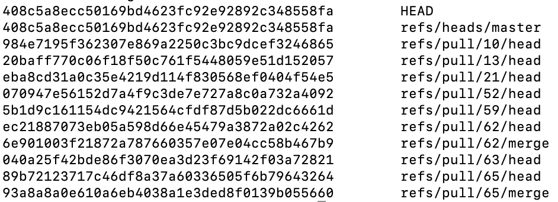
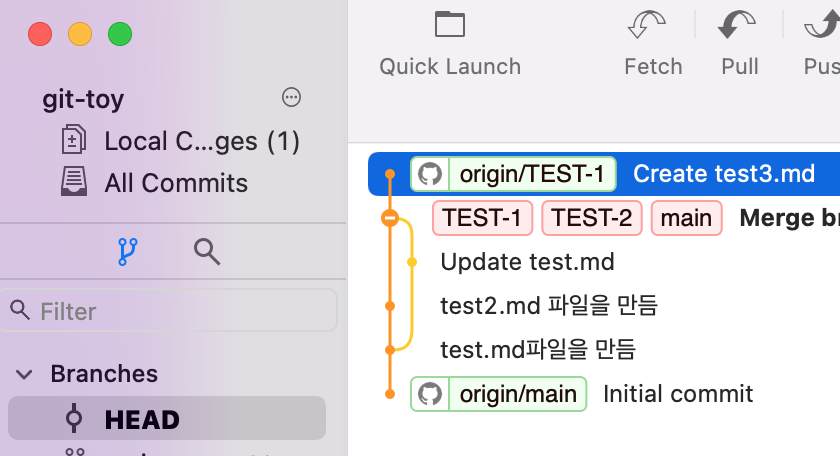
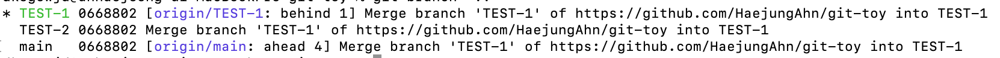
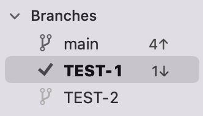
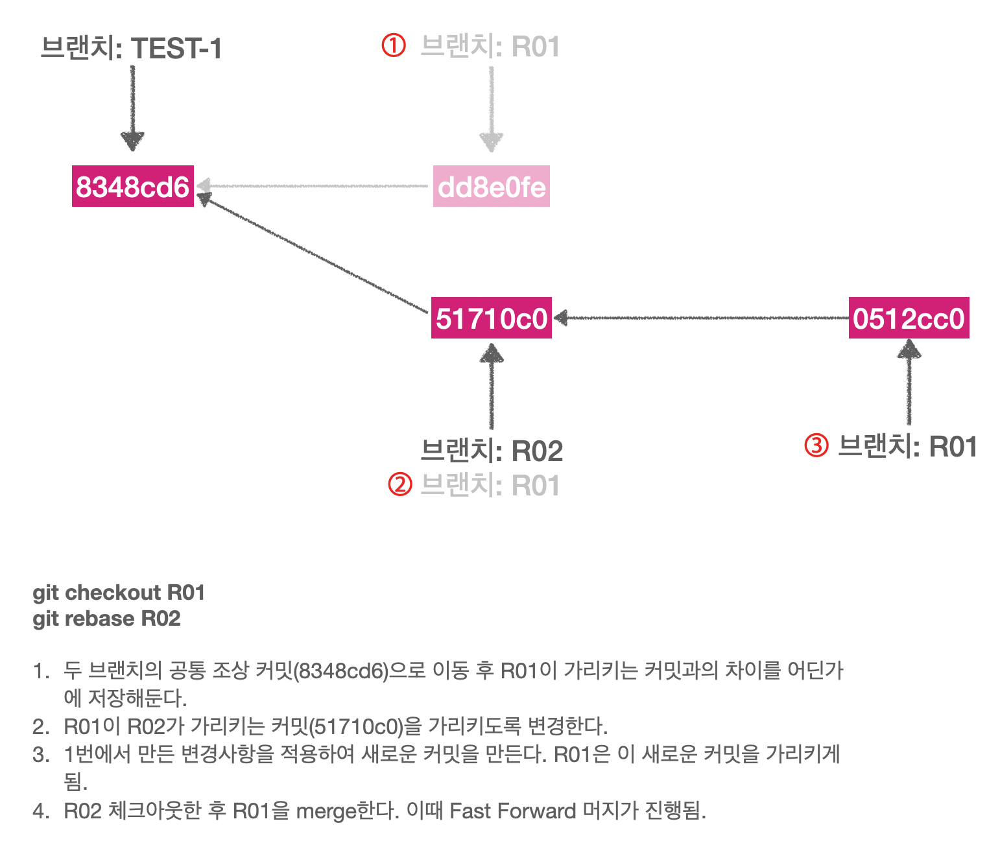
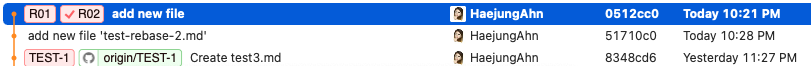
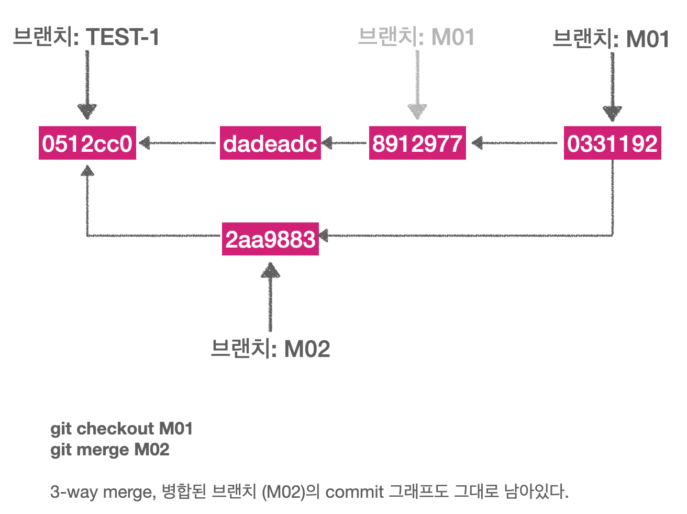
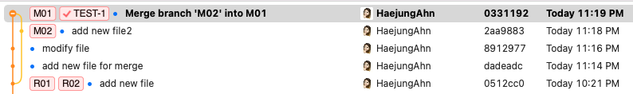

# 3. Git 브랜치

## [3.1 브랜치란 무엇인가](https://git-scm.com/book/ko/v2/Git-%EB%B8%8C%EB%9E%9C%EC%B9%98-%EB%B8%8C%EB%9E%9C%EC%B9%98%EB%9E%80-%EB%AC%B4%EC%97%87%EC%9D%B8%EA%B0%80)
[여기](https://backlog.com/git-tutorial/kr/stepup/stepup1_1.html)도 읽어봄.

### 브랜치란 무엇인가
- Git이 브랜치를 다루는 과정을 이해하려면 우선 Git이 데이터를 어떻게 저장하는지 알아야 한다.
- Git은 데이터를 Change Set이나 변경사항(Diff)으로 기록하지 않고 일련의 스냅샷으로 기록한다.
- 커밋하게 되면 아래와 같은 내용을 포함하는 커밋 개체(커밋 Object)를 저장한다.
    - 현재 Staging Area에 있는 데이터의 스냅샷에 대한 포인터(이걸 왜 저장???)
    - 저자나 커밋 메세지 같은 메타 데이터
    - 이전 커밋에 대한 포인터 
    - 기타 등등

- 이전 커밋 포인터가 있어서 현재 커밋이 무엇을 기준으로 바뀌었는지를 알 수 있다.
- 최초 커밋을 제외한 나머지 커밋들은 이전 커밋 포인터에 대한 정보를 가지고 있고, Merge 커밋 같은 경우 이전 포인터에 대한 정보가 여러개 있다.

- 커밋을 진행하면 아래와 같은 과정을 거치게 된다.
    1. 커밋되는 파일별 Blob 파일이 생성된다.
    2. 루트 디렉토리와 각 하위 디렉토리의 트리 개체를 체크섬과 함께 저장소에 저장한다. -> 여기서 말하는 디렉토리가 내가 알고있는 파일 디렉토리 말하는건가? 아님 다른 의미를 또 가지고 있는건가?   
       
    3. 커밋 개체를 만들고 메타데이터와 <u>루트 디렉토리 트리 개체를 가리키는 포인터 정보</u>(이걸 왜 커밋개체에 같이 넣음??)를 커밋 개체에 넣어 저장한다. -> 그래서 필요하면 언제든지 스냅샷을 다시 만들 수 있다???   
       

- 커밋과 이전 커밋
<div style="text-alignmet: center;">

</div>   

- Git의 브랜치는 커밋 사이를 가볍게 이동할 수 있는 포인터 같은 것이다.
- Git의 브랜치는 어떤 한 커밋을 가리키는 40글자의 SHA-1 체크섬 파일에 불과하기 때문에 만들기도 쉽고 지우기도 쉽다. (! 파일 전체를 다시 복사하는게 아니다! 그냥 포인터 같은 개념이다) 새로운 브랜치를 만드는 것은 41바이트 크기의 파일(40자와 줄 바꿈 문자 한개) 하나를 만드는 것에 불과하다.
- Git은 기본적으로 master 브랜치를 만든다. 처음 커밋하면 이 master 브랜치가 생성된 커밋을 가리킨다. 이후 커밋을 만들면 master 브랜치는 자동으로 가장 마지막 커밋을 가리킨다.

### 새 브랜치 생성하기
- `git branch <브랜치명>`   
아래 이미지에서는 위 명령어를 이용해 "testing"이라는 이름을 가진 브랜치를 만들었다. (하지만 브랜치를 옮기지는 않는)   
       
- 가장 마지막 커밋을 master도 가리키고 있고, 방금 만든 "testing"도 가리키는 것을 볼 수 있다.
- 마지막 커밋을 가리키는 브랜치가 2개 이상일 경우, Git은 현재 작업중인 브랜치가 무엇인지 어떻게 구별할까?
- `HEAD`라는 특수한 포인터로 이를 구별할 수 있다. 이 것은 <u>지금 작업하는 로컬 브랜치</u>를 가리킨다.
- `git log --oneline --decorate` 명령어를 이용해 현재 커밋과 해당 커밋을 가리키고 있는 브랜치에는 어떤 것들이 있는지 확인할 수도 있다.
       
    - 위 이미지에 있는 내용을 해석해보면!   
        - `0668802`라는 커밋을 로컬 브랜치인 TEST-1, TEST-2, 원격 브랜치인 TEST-1이 가리키고 있다는 것을 볼 수 있다.
        - 현재 로컬에서 작업중인 브랜치는 TEST-1이라는 것을 알 수 있다.

- `git checkout <브랜치명>`
    - checkout한 브랜치가 가리키고 있는 커밋을 `HEAD`가 가리키도록 수정하고
    - 워킹 디렉토리의 파일도 `HEAD`가 가리키는 그 시점으로 변경시킴.

- `git checkout -b <브랜치명>`: 브랜치 만들고 체크아웃 하기

- `git branch -d <브랜치명>` : 브랜치 삭제


## [3.2 브랜치와 Merge의 기초](https://git-scm.com/book/ko/v2/Git-%EB%B8%8C%EB%9E%9C%EC%B9%98-%EB%B8%8C%EB%9E%9C%EC%B9%98%EC%99%80-Merge-%EC%9D%98-%EA%B8%B0%EC%B4%88)

### 브랜치로 작업하기
- 보통 특정 이슈를 해결하거나 hotfix 이슈가 발생하는 경우 master 브랜치를 기반으로 새로운 브랜치를 만들어서 작업하게 된다.
- 브랜치를 이동하기 위해서는 아직 커밋하지 않은 파일이 체크아웃 할 브랜치와 충돌(파일 내용이 서로 상이한 경우인가?)이 발생하면 안된다. 충돌 발생 시 브랜치를 이동할 수 없다.
- 따라서 브랜치를 변경하기 전에 워킹 디렉토리를 정리하는 것이 좋으며, Stash나 커밋 Amend를 통해 이런 문제를 다룰 수 있다. 이는 [Stashing과 Cleaning](https://git-scm.com/book/ko/v2/ch00/_git_stashing)에서 다룰 것이다.

### 브랜치 병합(Merge)하기
- `git merge` 명령어를 이용해 브랜치를 합칠 수 있다.

   
- 만약 위 그림에서 hotfix 브랜치를 master 브랜치에 합쳐야한다면, master로 체크아웃 후 `git merge hotfix` 명령어를 사용하면 된다. 그럼 아래와 같은 내용이 콘솔에 보여진다.
    ```Bash
    Updating f42c576..3a0874c
    Fast-forward
    index.html | 2 ++
    1 file changed, 2 insertions(+)
    ```
- 위 내용에서 "**Fast-forward**"라는 키워드가 보일 것이다. hotfix 브랜치가 가리키는 `C4` 커밋이 `C2` 커밋에 기반한 브랜치이기 때문에 <u>브랜치 포인터는 Merge 과정 없이 그저 최신 커밋으로 이동</u>한다. 이런 Merge 방식을 "Fast-forward"라고 부른다.


- hotfix를 master 브랜치에 merge한 이후 iss53 브랜치를 작업하여 아래와 같은 상태가 되었다고 가정하자.   

- 위와 같은 상태에서 iss53 브랜치를 master 브랜치에 merge 하게되면 아래와 같은 내용을 콘솔에서 확인할 수 있다.
    ```Bash
    Merge made by the 'recursive' strategy.
    index.html |    1 +
    1 file changed, 1 insertion(+)
    ```
- hotfix를 Merge 했을 때와는 메세지가 다른데 그 이유는 iss53 브랜치가 가리키는 커밋이 merge할 브랜치의 조상 브랜치가 아니기 때문이다. Git은 이런 경우 Fast-forward로 merge 하지 않는다.
- 이 경우 git은 merge 대상 브랜치들(iss53, master)이 가리키는 커밋 두개와 두 브랜치의 공통 조상 하나를 사용하여 merge를 진행하며 이를 **3-way Merge**라고 한다.   

- fast-forward처럼 단순히 브랜치 포인터를 최신 커밋으로 옮기는게 아니다. <u>3-way merge의 결과를 별도의 커밋으로 만들고 난 이후 해당 브랜치가 그 커밋을 가리키도록 이동</u>시킨다. 그래서 이런 커밋은 부모가 여러개고 **Merge 커밋**이라고 부른다.   


#### ✋ 3-way merge는 구체적으로 어떻게 이루어질까?
- [[Git] Merge(3-way merge) 이해하기](https://wonyong-jang.github.io/git/2021/02/05/Github-Merge.html)의 1-1) 3-way merge를 읽어보면 됨. 
- 정리하자면 공통 조상 브랜치를 기반으로 merge할 두 브랜치의 변경사항을 비교해서 최종 커밋을 만들어내는 것이다.   


### 충돌의 기초
- 가끔 3-way Merge가 실패할 때도 있다. Merge하는 두 브랜치에서 같은 파일의 한 부분을 동시에 수정하고 Merge하면 Git은 해당 부분을 Merge하지 못한다.
- 자동으로 Merge하지 못해 새로운 커밋을 추가하지 못하고, 그래서 브랜치 포인터도 이동시킬 수 없기 때문에 이런 충돌이 발생하는 경우 개발자가 충돌을 해결해야 한다.
- 어떤 파일이 Merge할 수 없었는지를 살펴보려면 `git status` 명령을 이용한다.
    ```Bash
    $ git status
    On branch master
    You have unmerged paths.
    (fix conflicts and run "git commit")

    Unmerged paths:
    (use "git add <file>..." to mark resolution)

        both modified:      index.html

    no changes added to commit (use "git add" and/or "git commit -a")
    ```
    - 충돌이 발생한 파일은 unmerged 상태로 표시된다.
    - 충돌이 발생한 부분은 아래와 같이 표시된다.
        ```
        <<<<<<< HEAD:index.html
        <div id="footer">contact : email.support@github.com</div>
        =======
        <div id="footer">
        please contact us at support@github.com
        </div>
        >>>>>>> iss53:index.html
        ```
    - `=======` 위쪽의 내용은 HEAD 버전의 내용이고 아래쪽은 iss53브랜치의 내용이다. 충돌을 해결하려면 위쪽이나 아래쪽을 하나 선택하거나 혹은 새로 작성해서 Merge한다.
    - 수정을 진행한 이후에는 `<<<<<<<`, `=======`, `>>>>>>>`가 포함된 행을 삭제하고 `git add` 명령으로 다시 Git에 저장한다.
    - 이후 `git commit` 명령어로 merge한 것을 커밋한다. 이때 어떻게 충돌을 해결했고, 좀 더 확인해야 하는 부분은 무엇이고 왜 그렇게 해결했는지에 대해 자세히 기록할 수 있다.

## 브랜치 관리
- `git branch`   
브랜치 목록 조회
- `git branch -v`   
브랜치 목록 & 마지막 커밋 메세지도 함께 보여준다.
- `git branch --merged`   
현재 체크아웃한 브랜치를 기준으로 Merged된 브랜치 목록을 보여준다.
- `git branch --no-merged`   
현재 체크아웃한 브랜치에 아직 Merge 하지 않은 브랜치 목록을 보여준다.

#### 이 챕터를 읽으면서 궁금했던 점
>"수정한 내용을 커밋하면 `master` 브랜치에 커밋되고"

- 위 문장을 천천히 읽어보았는데 이해가 좀 안간다. "커밋"이라는 것이 구체적으로 어떤 작업을 진행하는지 잘 몰라서 이해가 안가는 것 같다.   
- 📒  commit : 기록하다, 기억하다.
- 위 뜻을 토대로 다시 문장을 만들어보면,   
"지금 수정한 내용을 기록하면 `master` 브랜치에 기록되고"라는 문장이 만들어진다. 
- 이 페이지의 상단에서도 언급했듯이 git은 데이터를 일련의 스냅샷으로 "기록"하기 때문에 commit 한다는 것은 스냅샷으로 기록한다는 행위를 의미한다. 그리고 이 스냅샷에는 blob 파일, 트리 정보, 커밋 객체가 저장된다.
- 브랜치는 단순히 SHA-1 체크섬 파일이고 41바이트밖에 안되기 때문에 브랜치에 커밋된다는 것은 스냅샷의 정보를 현재 브랜치의 체크섬이 참조하고 있다로 생각할 수 있을 것 같다.


## 브랜치 워크플로
### Long-Running 브랜치
- 배포했거나 배포할 코드만 master 브랜치에 Merge
- 개발을 진행하고 안정화하는 브랜치는 develop이나 next라는 이름으로 추가적인 브랜치를 만들어서 사용한다.
- 브랜치를 이용해 여러 단계에 걸쳐 안정화해 나아가면서 충분히 안정화가 됐을 때 안정 브랜치로 머지함.   
<div style="text-align:center">
    
</div>   

### 토픽 브랜치
- 어떤 한가지 주제나 작업을 위해 만든 짧은 호흡의 브랜치다.

### Git flow
해당 챕터가 git flow를 보기 가장 적절한 챕터가 아닐까 싶어 오늘 살펴본다.   
🔗  [우아한형제들 기술블로그, 우린 Git-flow를 사용하고 있어요](https://techblog.woowahan.com/2553/)   
<div style="text-align:center">
    
</div>   

- Git flow에는 5가지 종류의 브랜치가 존재한다.   
    - master : 제품으로 출시될 수 있는 브랜치
    - develop: 다음 출시 버전을 개발하는 브랜치
    - feature: 기능을 개발하는 브랜치(~~feature에서 작업을 하는동안 develop 브랜치에서 발생하는 변화는 mergeg하지 않는다.~~) develop에 추가된 기능을 feature에 가져와야 할 경우도 있다.
    - release: 이번 출시 버전을 준비하는 브랜치(develop 브랜치에서 개발을 진행하고 이번 버전에 필요한 기능들이 모두 merge됐을 경우 QA를 위해 release 브랜치를 생성한다. 오로지 버그 픽스만 진행한다.)
    - hotfix : 출시 버전에서 발생한 버그를 수정하는 브랜치
- Upstream remote repo를 개발자마다 fork한다는 것도 생소했고 왜 이렇게 하는거지?! 라는 의문이 들었는데 그런 생각이 들자마자 글에서 왜 그렇게 하는지 나옴. 모두가 공유하고 있는 Upstream remote repo에서 새로운 기술을 도입하거나 이것저것 실험하는 것보다는 fork한 Repo에서 더 안정감 있게 실험할 수 있기 때문이라고 한다.
- 큰 회사라 그런지 feature에도 종류가 있다는 것이 신기하다. (feature-user)
- 커밋 그래프를 단순하게 가져가는 이유는?   
    - 여기서는 하나의 ticket 당 하나의 commit이 되도록 내부적으로 약속을 정했기 때문에 티켓 하나 당 업무가 작아야만 한다. 따라서 하나의 기능에 여러개의 티켓이 생성되고, 여러개의 커밋이 생성되는 거임. 그래서 이를 하나의 커밋으로 합친다고 함. 
    - 또한 커밋 그래프가 복잡해지면 이력 확인이 어렵기 때문에.
- `git merge –no-ff upstream/develop`
    - `-no-ff` 옵션 : 현재 브랜치와 merge 대상의 관계가 fast-forward이던 아니던 무조건 Merge 커밋과 같이 merge되는 옵션
    - merge 커밋? 봤는데 기억이 안난다..! 봤다는 기억만 난다.ㅎㅎ.. 주말에 꼭 복습해야겠다. 


## 리모트 브랜치
- Remote references are references (pointers) in your remote repositories, including branches, tags, and so on.    
리모트 레퍼런스(Refs)는 브랜치, 태그 등을 포함하는 리모트 레포지토리의 참조(포인터)다.

- `git ls-remote <리모트 저장소 주소>`   
    - [여기](https://nochoco-lee.tistory.com/30) 참고
    - 원격 저장소를 `clone`, `fetch` 하지 않고도 해당 저장소의 정보를 조회해볼 수 있음. 요청된 리모트 저장소의 refs/heads와 refs/tags 목록을 표시해준다.
           
- `git remote show <리모트 저장소 주소>`
    - 모든 리모트 브랜치와 그 정보를 보여준다.
    - `ls-remote`와 비슷하게 show 뒤에 리모트 저장소 주소를 붙였더니 아래와 같은 오류 메세지가 나왔다.   
        ```Bash
        fatal: not a git repository (or any of the parent directories): .git
        ```
    - 검색해보니 현재 명령어를 수행하는 디렉토리에 .git 폴더가 있어야 한다고 해서 .git 폴더가 만들어진 곳으로 이동 후 다시 동일한 명령어를 입력했더니 결과가 잘 나옴.
- 리모트 Refs가 있지만 보통은 리모트 트래킹 브랜치를 사용한다.

### 리모트 트래킹 브랜치
- <u>리모트 브랜치를 추적하는 레퍼런스이며 브랜치다.</u> 일종의 북마크라고 할 수 있다.    
리모트 저장소에 마지막으로 연결했던 순간에 브랜치가 무슨 커밋을 가리키고 있었는지를 나타낸다.
- 리모트 트래킹 브랜치는 로컬에 있지만 임의로 움직일 수 없다.(브랜치의 위치를 이동시키거나 할 수 없다는 의미인 것 같다.) 리모트 서버에 연결할 때마다(`git fetch`, `git pull`) 리모트의 브랜치 업데이트 내용에 따라서 자동으로 갱신될 뿐이다.
- 리모트 트래킹 브랜치의 이름은 `<remote>/<branch>` 형식으로 되어 있다.   
예를 들어 origin이라는 이름의 리모트 저장소에 있는 master 브랜치를 보고 싶다면 `origin/master`라는 이름으로 브랜치를 확인하면 된다.
- 다른 팀원과 함께 어떤 이슈를 구현할 때 그 팀원이 `iss53` 브랜치를 서버로 Push했고 당신도 로컬에 `iss53` 브랜치가 있다고 가정하자. 이때 서버의 `iss53`브랜치가 가리키는 커밋은 로컬에서 `origin/iss53`이 가리키는 커밋이다.   
    - 다른 사람이 develop 브랜치에 push하거나 merge한 변경사항이 (내가 아무것도 하지 않았음에도) 나의 소스트리나 Git-fork 등에 표시되는 경우가 있다.(`↓5` 이런것들!!) 이게 리모트 트래킹 브랜치 덕분이었구나~~
- 리모트 서버로부터 저장소 정보를 동기화하려면 `git fetch origin` 명령을 사용한다. 이때 과정은 아래와 같다.
    - 우선 origin 서버의 주소 정보를 찾음.
    - 로컬 저장소가 갖고 있지 않은 새로운 정보가 있으면 모두 내려받음.
    - 받은 데이터를 로컬 저장소에 업데이트
    - `origin/<branch>` 포인터의 위치를 최신 커밋으로 이동시킨다.


### 브랜치 추적
- 리모트 트래킹 브랜치를 로컬 브랜치로 Checkout하면 자동으로 트래킹(Tracking) 브랜치가 만들어진다.
- 로컬 브랜치 중에서도 리모트 트래킹 브랜치를 Tracking하는 브랜치이다. 트래킹 하는 대상 브랜치를 "Upstream" 브랜치 라고 부른다. (Tracking 브랜치의 Upstream 브랜치는 리모트 트래킹 브랜치!!)
    ```Bash
    # github에 올라가있는 git-toy repo로 테스트해봄
    # 현재 remote에 있는 브랜치는 main, TEST-1이 있음.
    git checkout origin/TEST-1
    ## 아래와 같은 메세지가 나옴. 
    ## detached HEAD 지난번에 나왔던건데!! 
    ##------
    "detached HEAD" 상태에서는 작업을 하고 커밋을 만들면, 태그는 그대로 있으나 새로운 커밋이 하나 쌓인 상태가 된다. 그리고 새 커밋에 도달할 수 있는 방법이 따로 없게 된다. 물론 커밋의 해시 값을 정확히 기억하고 있으면 가능하긴 하다. 
    ##------
    Note: switching to 'origin/TEST-1'.

    You are in 'detached HEAD' state. You can look around, make experimental changes and commit them, and you can discard any commits you make in this state without impacting any branches by switching back to a branch.

    If you want to create a new branch to retain commits you create, you may do so (now or later) by using -c with the switch command. Example:

    git switch -c <new-branch-name>

    Or undo this operation with:

    git switch -

    Turn off this advice by setting config variable advice.detachedHead to false

    HEAD is now at 0668802 Merge branch 'TEST-1' of https://github.com/HaejungAhn/git-toy into TEST-1

    # 이 상태에서 브랜치를 확인해보면 아래와 같이 나온다. detached HEAD를 확인할 수 있음. 그리고 이 브랜치는 리모트 트래킹 브랜치 origin/TEST-1을 checkout 했기 때문에 트래킹 브랜치라고 말할 수 있다.
    git branch
    * (HEAD detached at origin/TEST-1)
      TEST-1
      TEST-2
      main
    ```
- 트래킹 브랜치에서 `git pull` 명령을 내리면 리모트 저장소로부터 데이터를 내려받아, <u>연결된 리모트 브랜치와 자동으로 Merge한다.</u>
    - 테스트를 위해 git-toy의 TEST-1 브랜치에 test3.md 파일을 추가함.
    - 트래킹 브랜치에서 `git pull`을 해보면 아래와 같이 가져와진 것을 확인할 수 있다!   
           
        
    - "연결된 리모트 브랜치와 자동으로 Merge한다"는게 잘 이해가 안간다.   

- 서버로부터 저장소를 clone하면 git은 자동으로 master 브랜치를 origin/master 브랜치의 트래킹 브랜치로 만든다.(리모트 트래킹 브랜치를 트래킹하는 브랜치)
- 트래킹 브랜치는 아래 명령어로 만들 수 있다.   
    - `git checkout -b <branch> <remote>/<branch>`   
    - 혹은 `--track` 옵션을 사용하여 로컬 브랜치 이름을 자동으로 생성할 수 있다.   
    `git checkout --track <remote>/<branch>`
    - 이 명령은 매우 자주 쓰이기 때문에 더 생략할 수도 있다. 입력한 브랜치가 있는 리모트가 딱 하나 있고, 로컬에는 없으면 git은 트래킹 브랜치를 만들어준다.   
    `git checkout <branch>`

- 트래킹 브랜치에서 push나 pull을 하면 자동으로 `<remote>/<branch>`로 데이터를 보내거나 가져온다. 👉  이게 트래킹 브랜치의 가장 중요한 특징인 것 같은데..!

- 트래킹 브랜치가 어떻게 설정되어 있는지 확인하기 위해서는 `git branch -vv`를 활용한다.   
       
    - TEST-1 브랜치는 origin/TEST-1 브랜치를 추적하고 있으며, 현재 상태는 리모트보다 한개 뒤에 위치한다는 것(behind 1)을 나타낸다.
    - TEST-2 브랜치는 트래킹하고 있는 브랜치가 없다.
    - main 브랜치는 origin/main을 트래킹하며, 로컬에 있는 것이 리모트에 있는 것보다 4개 commit 앞서있다.(ahead 4)
    - 위 이미지에 나와있는 ahead, behind 정보를 git-fork와 비교해보면 아래와 같음(참고용)   
           
- 여기서 중요한 점은 명령을 실행했을 때 나타나는 결과는 **모두 서버에서 데이터를 가져온(fetch) 시점을 바탕으로 계산한다는 점**이다. 이 말은 즉, fetch를 하지 않는다면 서버에 있는 실제 데이터와 `git branch -vv`를 통해 확인한 데이터에 차이가 있을 수 있다는 말이다.
- 따라서 `git fetch --all; git branch -vv` 두 명령어를 함께(순차적으로) 사용하는 것이 좋다.

### 리모트 브랜치 삭제하기
`git push <remote> --delete <remote 브랜치 이름>` 


## Rebase 하기
- 한 브랜치에서 다른 브랜치로 합치는 방법은 두가지가 있다. 하나는 `Merge`이고 하나는 `Rebase`다.
- rebase는 "base를 새롭게 설정한다"는 의미이다. 3-way merge에서 base 브랜치를 기반으로 merge할 브랜치들의 변경사항을 비교해서 merge하게 되는데 기반이 되는 base 브랜치를 새롭게 설정하겠다는 의미이다.

### Rebase의 기초
- 일반적으로 하나의 뿌리`C2`에서 두개로 쪼개진 브랜치(각각 `C3`, `C4`라 하겠음)를 merge하는 경우 `C3`와 `C4`, 그리고 두 브랜치의 공통 뿌리인 `C2`을 기반으로 `3-way merge`로 새로운 커밋을 만들어낸다.
- 비슷한 결과를 만드는 다른 방식으로는, `C3`에서 변경된 사항을 Patch로 만들고 이를 다시 `C4`에 적용시키는 방법이 있다. Git에서는 이런 방식을 `Rebase`라고 한다.   
   
   

- merge하는 경우에는 병합대상이 되는 브랜치가 commit 그래프에 그대로 남아있는 걸 확인할 수 있다.   
   
   


- Rebase는 보통 리모트 브랜치에 커밋을 깔끔하게 적용하고 싶을 때 사용한다.
- Rebase를 하던 Merge를 하던 최종 결과물은 같다. 단지, 커밋 히스토리만 다르다는 것이 중요하다. rebase는 다른 브랜치의 변경사항을 순서대로 적용하면서 합치고 Merge의 경우 두 브랜치의 최종 결과만을 가지고 합친다.

### Rebase의 위험성
- 이미 공개 저장소에 Push한 커밋을 Rebase하지 마라.
- rebase는 기존 커밋을 그대로 사용하는게 아니라 내용은 같지만 다른 커밋을 새로 만든다. 새 커밋을 서버에 Push하고 동료 중 누군가가 그 커밋을 Pull해서 작업을 한다고 하자. 그런데 그 커밋을 git rebase로 바꿔서 Push해버리면 동료가 다시 Push 했을 때 동료는 다시 Merge해야 한다. 그리고 동료가 다시 Merge한 내용을 Pull하면 내 코드는 정말 엉망이 된다. ?? (이어서 봐야 함.)
---
👀 읽어볼 거리
- [Git: Remote Tracking Branch vs. Tracking Branch](http://dogfeet.github.io/articles/2012/git-tracking-vs-remote-tracking.html)
- [[Git] Merge(3-way merge) 이해하기](https://wonyong-jang.github.io/git/2021/02/05/Github-Merge.html)
