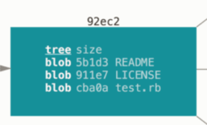
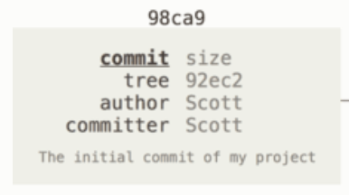
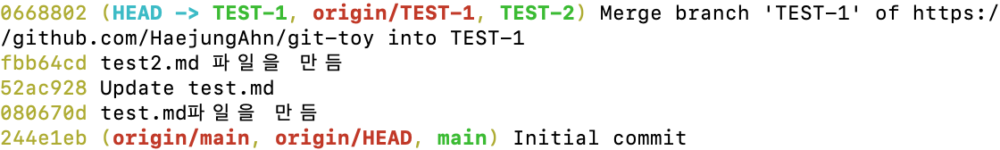

# 3. Git 브랜치

## [3.1 브랜치란 무엇인가](https://git-scm.com/book/ko/v2/Git-%EB%B8%8C%EB%9E%9C%EC%B9%98-%EB%B8%8C%EB%9E%9C%EC%B9%98%EB%9E%80-%EB%AC%B4%EC%97%87%EC%9D%B8%EA%B0%80)

### 브랜치란 무엇인가
- Git이 브랜치를 다루는 과정을 이해하려면 우선 Git이 데이터를 어떻게 저장하는지 알아야 한다.
- Git은 데이터를 Change Set이나 변경사항(Diff)으로 기록하지 않고 일련의 스냅샷으로 기록한다.
- 커밋하게 되면 아래와 같은 내용을 포함하는 커밋 개체(커밋 Object)를 저장한다.
    - 현재 Staging Area에 있는 데이터의 스냅샷에 대한 포인터
    - 저자나 커밋 메세지 같은 메타 데이터
    - 이전 커밋에 대한 포인터 
    - 기타 등등

- 이전 커밋 포인터가 있어서 현재 커밋이 무엇을 기준으로 바뀌었는지를 알 수 있다.
- 최초 커밋을 제외한 나머지 커밋들은 이전 커밋 포인터에 대한 정보를 가지고 있고, Merge 커밋 같은 경우 이전 포인터에 대한 정보가 여러개 있다.

- 커밋을 진행하면 아래와 같은 과정을 거치게 된다.
    1. 커밋되는 파일별 Blob 파일이 생성된다.
    2. 루트 디렉토리와 각 하위 디렉토리의 트리 개체를 체크섬과 함께 저장소에 저장한다. -> 여기서 말하는 디렉토리가 내가 알고있는 파일 디렉토리 말하는건가? 아님 다른 의미를 또 가지고 있는건가?   
    
    3. 커밋 개체를 만들고 메타데이터와 <u>루트 디렉토리 트리 개체를 가리키는 포인터 정보</u>(이걸 왜 커밋개체에 같이 넣음??)를 커밋 개체에 넣어 저장한다. -> 그래서 필요하면 언제든지 스냅샷을 다시 만들 수 있다???   
    

- 커밋과 이전 커밋

- Git의 브랜치는 커밋 사이를 가볍게 이동할 수 있는 포인터 같은 것이다.
- Git의 브랜치는 어떤 한 커밋을 가리키는 40글자의 SHA-1 체크섬 파일에 불과하기 때문에 만들기도 쉽고 지우기도 쉽다. (! 파일 전체를 다시 복사하는게 아니다! 그냥 포인터 같은 개념이다) 새로운 브랜치를 만드는 것은 41바이트 크기의 파일(40자와 줄 바꿈 문자 한개) 하나를 만드는 것에 불과하다.
- Git은 기본적으로 master 브랜치를 만든다. 처음 커밋하면 이 master 브랜치가 생성된 커밋을 가리킨다. 이후 커밋을 만들면 master 브랜치는 자동으로 가장 마지막 커밋을 가리킨다.

### 새 브랜치 생성하기
- `git branch testing` -> "testing"이라는 이름을 가진 브랜치를 만들자! (하지만 브랜치를 옮기지는 않는)   
    
- 가장 마지막 커밋을 master도 가리키고 있고, 방금 만든 "testing"도 가리키는 것을 볼 수 있다.
- 마지막 커밋을 가리키는 브랜치가 2개 이상일 경우, Git은 현재 작업중인 브랜치가 무엇인지 어떻게 구별할까?
- `HEAD`라는 특수한 포인터로 이를 구별할 수 있다. 이 것은 <u>지금 작업하는 로컬 브랜치</u>를 가리킨다.
- `git log --oneline --decorate` 명령어를 이용해 현재 커밋과 해당 커밋을 가리키고 있는 브랜치에는 어떤 것들이 있는지 확인할 수도 있다.
    
    - 위 이미지에 있는 내용을 해석해보면!   
        - `0668802`라는 커밋을 로컬 브랜치인 TEST-1, TEST-2, 원격 브랜치인 TEST-1이 가리키고 있다는 것을 볼 수 있다.
        - 현재 로컬에서 작업중인 브랜치는 TEST-1이라는 것을 알 수 있다.

- `git checkout <브랜치명>`
    - checkout한 브랜치가 가리키고 있는 커밋을 `HEAD`가 가리키도록 수정하고
    - 워킹 디렉토리의 파일도 `HEAD`가 가리키는 그 시점으로 변경시킴.