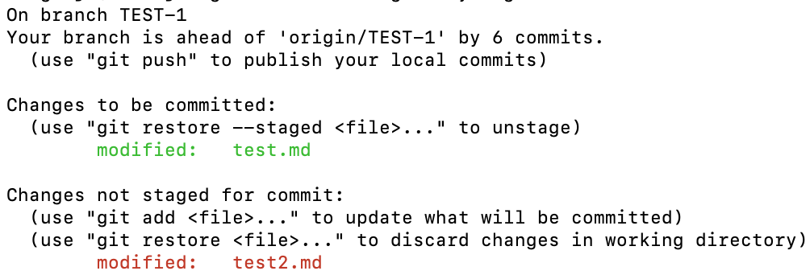
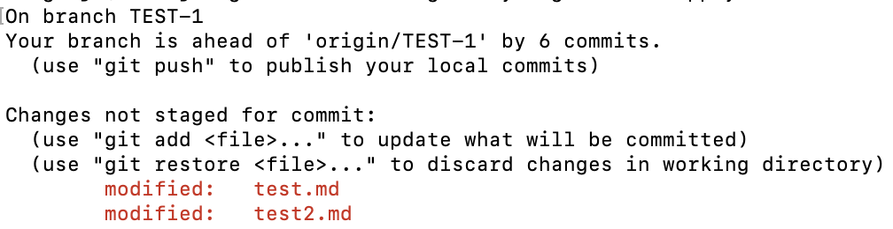

# 7. Git 도구
- 하나씩 보면 좋겠지만 시간관계 상 해당 챕터에서는 "Stashing과 Cleaning, Reset 명확히 알고 가기"를 먼저 보고 다음으로 넘어가도록 하겠다.

## [7.3 Stashing과 Cleaning](https://git-scm.com/book/ko/v2/Git-%EB%8F%84%EA%B5%AC-Stashing%EA%B3%BC-Cleaning)
### Stash
- 📒  stash : 숨기는 장소, 몰래 챙겨두다
- `git stash`가 해결하는 문제   
어떤 프로젝트의 한 부분을 작업하고 있는 중이었다. 근데 급한 요청으로 잠시 브랜치를 변경해야 할 필요가 있는 경우, 아직 미완성된 작업을 커밋하기는 껄끄러울 것이다. 이때 커밋하지 않고 나중에 다시 돌아와서 작업할 수 있도록 해주는게 `git stash`다.

- `git stash`명령을 사용하면 워킹 디렉토리에서 수정한 파일들만 저장한다.
- stash는 Modified이면서 Tracked 상태인 파일과 Staging Area에 있는 파일들을 보관해두는 장소다.
- git은 stash를 적용할 때 staged 상태(`git add`를 통해 staging area에 올라간 상태)였던 파일을 자동으로 다시 Staged 상태로 만들어주지 않는다. 그래서 `git stash apply`명령을 실행할 때 `--index` 옵션을 주어 Staged 상태까지 적용한다.
    ```Bash
    # test.md와 test2.md 파일을 수정하고, test.md 파일만 staged 상태로 만든다.
    $ git status
    ```   
       

    ```Bash
    # git stash를 진행하고 status를 확인해본다.
    $ git stash
    Saved working directory and index state WIP on TEST-1: 0331192 Merge branch 'M02' into M01

    # working directory가 깨-끗.
    $ git status
    ```

    ```Bash
    # git stash apply를 해주면 staged 상태가 적용되지 않은 것을 볼 수 있다.   
    # staged 상태도 적용하고 싶다면 --index 옵션을 붙여줘야 한다.
    $ git stash apply
    ```   
       

- `git stash apply`는 단순히 Stash를 적용하는 것 뿐이다. Stash는 여전히 스택에 남아있음.
    ```Bash
    $ git stash list
    stash@{0}: WIP on TEST-1: 0331192 Merge branch 'M02' into M01
    stash@{1}: WIP on TEST-1: 0331192 Merge branch 'M02' into M01
    stash@{2}: WIP on TEST-1: 0331192 Merge branch 'M02' into M01
    ```
- Stash를 삭제하고 싶다면 `git stash drop` 명령어를 사용하여 해당 stash를 제거한다.
    ```Bash
    $ git stash drop stash@{0}
    ```

### 그 외 옵션
- `git stash --include-untracked` 혹은 `git stash -u`   
기본적으로 추적 중인 파일만 저장하는데 위 옵션을 추가해주면 추적 중인 파일과 추적하지 않는 파일도 저장할 수 있다.
- `git stash --patch`   
모든 수정사항을 저장하지 않는다. 대신, 대화형 프롬프트가 뜨면서 변경된 데이터 중 저장할 것과 저장하지 않을 것을 지정할 수 있다.
- `git stash branch <브랜치명>`   
stash할 당시의 커밋을 체크아웃한 후 새로운 브랜치를 만들고 여기에 stash된 것을 적용함.

### 워킹 디렉토리 청소하기
- 작업하고 있던 파일을 Stash 하지 않고 단순히 그 파일들을 치워버리고 싶을 때가 있다.   
- `git clean`명령이 그 일을 한다. (단, untracked file에 대해서만)
- 이 명령은 신중하게 사용해야 한다. 이걸 사용하면 워킹 디렉토리 안에 있는 "추적하고 있지 않은" 모든 파일이 지워지기 때문이다. 한번 지워진 파일은 절대 돌아오지 못한다.😢
- `git stash --all` 명령을 이용하면 지우는 건 똑같지만, 먼저 모든 파일을 Stash하므로 좀 더 안전하다.   
    -> 실제로 해보니 untracked 파일이 모두 삭제된 것을 볼 수 있었다. 또한 수정 사항들이 Stash에 저장된 것도 확인함.

- `git clean -f -d` 명령을 사용하면 추적중이지 않은 모든 정보를 워킹 디렉토리에서 지울 수 있다. 하위 디렉토리까지 지워버린다고 함. 이 명령으로 어떤 일이 일어날지 미리 보고 싶다면 `git clean -d -n`(-n 옵션 추가)을 사용하면 됨.
- 기본적으로 `git clean`은 추적중이지 않은 파일만 지운다. `.gitignore`에 명시돼서 무시되는 파일은 지우지 않지만, 무시된 파일까지 지우려면 `-x`옵션도 추가해준다.

## [7.7 Reset 명확히 알고 가기](https://git-scm.com/book/ko/v2/Git-%EB%8F%84%EA%B5%AC-Reset-%EB%AA%85%ED%99%95%ED%9E%88-%EC%95%8C%EA%B3%A0-%EA%B0%80%EA%B8%B0)
- 오늘의 주제는 `reset`과 `checkout`이다.
### 세 개의 트리
- 여기서 트리는 "파일의 묶음"을 말한다. Git은 일반적으로 세가지 트리를 관리하는 시스템이다.
    - HEAD : 마지막 커밋 스냅샷, 다음 커밋의 부모 커밋
    - Index: 다음에 커밋할 스냅샷
    - 워킹 디렉토리: 샌드박스

### HEAD
- 현재 브랜치를 가리키는 포인터이다. 여기서 브랜치는 브랜치에 담긴 커밋 중 가장 마지막 커밋을 가리킨다.
- **현재 브랜치 마지막 커밋의 스냅샷**

### Index
- 바로 다음에 커밋할 것들로 "Staging Area"라고도 한다.
- 사용자가 `git commit` 명령을 실행했을 때 git이 처리할 것들이 있는 곳이다.
- 먼저 index는 워킹 디렉토리에서 마지막으로 checkout한 브랜치의 파일 목록과 파일 내용으로 채워진다. 이후 파일 변경 작업을 하고 변경한 내용으로 index를 업데이트할 수 있다.
- 업데이트 후 git commit 명령을 실행하면 index는 새 커밋으로 변환된다.

### 워킹 디렉토리
- HEAD와 Index는 효율적인 형태로 .git 디렉토리에 파일과 그 내용을 저장한다. 하지만 사람이 알아보긴 어렵다.
- 워킹 디렉토리는 실제 파일로 존재한다. 바로 눈에 보이기 때문에 사용자가 편집하기 수월하다.

### 워크플로
- `git add` 명령어를 실행하면 워킹 디렉토리의 내용이 index로 복사된다.
- `git commit` 명령어를 실행하면 index의 내용을 스냅샷으로 영구히 저장하고 그 스냅샷을 가리키는 커밋 객체를 만든다.    그리고 현재 체크아웃된 브랜치가 그 커밋 객체를 가리키도록 만든다.
- `git commit`까지 하고 난 이후 status를 살펴보면 변경사항이 없다고 나오는데 그 이유는 세 트리에 있는 내용이 모두 동일하기 때문이다.   
       
- status를 확인할 때 나오는 문자열에 대한 설명
    - "Changes not staged for commit" : Index와 워킹 디렉토리가 다른 내용을 담고 있다.
    - "Changes to be commited" : Index와 HEAD의 다른 파일들이 여기에 표시된다.
- 브랜치를 바꾸거나 Clone 명령도 내부에서는 비슷한 절차를 밟는다.   
브랜치를 checkout하면, HEAD가 새로운 브랜치를 가리키도록 바뀌고, 새로운 커밋의 스냅샷을 Index에 놓는다. 그리고 Index의 내용을 워킹 디렉토리로 복사한다.

### Reset의 역할
- 1 단계: HEAD 이동
    - `reset`은 HEAD 브랜치를 이동시킬 수 있다.
    - `checkout` 명령처럼 HEAD가 가리키는 브랜치를 바꾸는게 아니다.    
    **HEAD는 계속 현재 브랜치를 가리키고 있고, 현재 브랜치가 가리키는 커밋을 바꾼다.**
    - 만약 현재 HEAD가 master 브랜치를 가리키고 있다면, `git reset 9e5e6a4`라는 명령어는 master브랜치가 `9e5e6a4`를 가리키도록 만드는 것이다.
    - `reset --soft` 옵션을 사용하면 딱 여기까지 진행하고 동작을 멈춘다.
    - reset 명령은 가장 최근의 `git commit`명령을 되돌린다. git commit명령을 실행하면 커밋객체를 생성하고 HEAD가 가리키는 브랜치가 생성한 커밋객체를 가리키도록 업데이트한다.
    - reset 명령 뒤에 `HEAD~`(HEAD의 부모 커밋)를 주면 **Index나 워킹 디렉토리는 그대로 놔두고 브랜치가 가리키는 커밋만 이전으로 되돌린다.**
    - Index를 업데이트한 다음 `git commit` 명령을 실행하면 `git commit --amend` 명령의 결과와 같아진다.(마지막 커밋이 방금 생성한 커밋객체로 덮어씌워지는 것)

- 2 단계: Index 업데이트 (--mixed)
    - 1단계까지 진행하고 `git status`를 통해 상태를 확인해보면 현재 index와 reset 명령으로 이동시킨 HEAD의 다른 점이 출력된다.
    - `reset --mixed`을 통해 현재 HEAD가 가리키는 스냅샷으로 Index를 업데이트시킬 수 있다.
    - reset 명령 실행 시 아무 옵션도 주지 않고 실행시킬 경우 디폴트는 `--mixed`이다.
    - git commit과 git add 명령을 되돌리는 것이다.

- 3 단계: 워킹 디렉토리 업데이트 (--hard)
    - `reset --hard` 옵션까지 붙이면 워킹 디렉토리까지 되돌릴 수 있다.
    - git에는 데이터를 삭제하는 방법이 별로 없지만, 그 별로 없는 것 중 하나가 `reset --hard`이다.

### 정리하자면
- reset 명령은 정해진 순서대로 세 개의 트리를 덮어써 나가다가 옵션에 따라 지정한 곳에서 멈춘다.
    - HEAD가 가리키는 브랜치를 옮긴다. (--soft 옵션이 붙으면 여기까지)
    - Index를 HEAD가 가리키는 상태로 만든다. (--hard 옵션이 붙지 않았으면 여기까지)
    - 워킹 디렉토리를 Index의 상태로 만든다.

### 경로를 주고 Reset하기
- `reset` 명령을 실행할 때 경로를 지정하면 1단계를 건너뛰고 정해진 경로의 파일에만 나머지 `reset`단계를 적용한다.
- 예를 들어 `git reset file.txt` 명령을 실행한다면...
    - 이는 `git reset --mixed HEAD file.txt`를 짧게 쓴 것이다.   
    여기서 특정 커밋(HEAD)를 명시하면 그 HEAD가 가리키고 있는 커밋에서 파일을 가져온다는 의미다.
        1. HEAD의 브랜치를 옮긴다.(건너뜀)
        2. Index를 HEAD가 가리키는 상태로 만든다.(여기서 멈춤)
    - 이 명령은 file.txt 파일을 Unstaged 상태로 만든다. 파일을 Index에 올려두는 `git add`와 반대의 행동을 하게 만든다.

- Hunk단위와 --patch?

### Checkout
- `checkout`명령도 세 트리(HEAD, Index, 워킹 디렉토리)를 조작한다.
- reset과의 차이점
    - `checkout` 명령은 워킹 디렉토리를 안전하게 다룬다.   
    워킹 디렉토리에서 Merge 작업을 한번 시도해보고 변경하지 않은 파일만 업데이트한다.
    - 반면 `reset --hard` 명령은 확인하지 않고 모든 것을 바꿔버린다.
- `checkout` 명령은 어떻게 HEAD를 업데이트 하는가?
    - reset : HEAD가 가리키는 브랜치를 움직인다.
    - checkout: HEAD 자체를 움직인다.
    - 두 경우 모두 HEAD가 가리키는 커밋은 동일하지만 방식은 완전히 다르다.

- checkout 시 경로도 함께 입력할 경우
    - reset과 비슷하게 HEAD는 움직이지 않는다.
    - Index의 내용이 해당 커밋 버전으로 변경되고 워킹 디렉토리의 파일도 해당 커밋버전으로 변경된다.
    - `git reset --hard [branch] file` 명령의 동작이랑 같다.