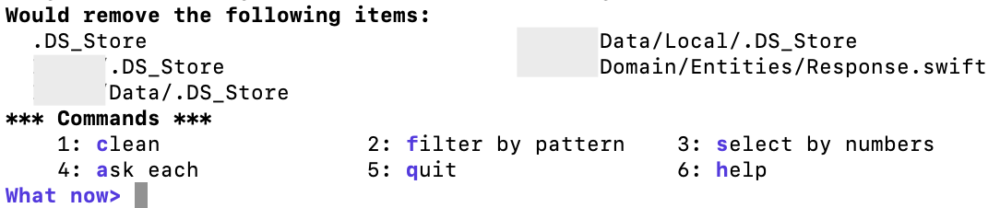

```bash
Untracked files:
  (use "git add <file>..." to include in what will be committed)
	.DS_Store
    /Entities/Response.swift
```

git으로 관리하지 않을 파일이 있어 삭제하려고 한다.   
우선 `git clean -n`으로 어떤 파일이 삭제되는지 다시 한번 확인해보고 난 이후 `git clean`을 실행했는데 아래와 같은 오류 메세지가 출력되면서 untracked 파일이 삭제되지 않음.

```bash
fatal: clean.requireForce defaults to true and neither -i, -n, nor -f given; refusing to clean
```
찾아보니 메세지에 나와있는 것처럼 clean.requireForce를 false로 설정하던가 혹은 `-f`, `-i` 플래그와 함께 `git celan`을 사용하면 된다고 한다. 

---
🔗 [fatal: clean.requireForce defaults to true and neither -i, -n, nor -f given; refusing to clean](https://stackoverflow.com/questions/34542204/fatal-clean-requireforce-defaults-to-true-and-neither-i-n-nor-f-given-ref)   
You have to either set `requireForce` to `false` in your `.gitconfig` or use the `-f` or `-i` flag with this command.

1. `git clean -f` will force to clean the untracked files even if `clean.requireForce` is set to true which is default.
2. `git clean -i` will give you an interactive way for cleaning each file
3. `git clean -n` will just show which files will be removed if you perform git clean.

Reference: [https://git-scm.com/docs/git-clean](https://git-scm.com/docs/git-clean)

---
오늘은 clean이 무엇인지, 그리고 untracked는 무엇이고 언제 untracked file이 되는지 확인해볼 예정!


## Untracked 파일이란 무엇인가?
🔗 [저장소 안의 파일들의 상태를 확인해보자 :: git status](https://coding-groot.tistory.com/36)
- 파일이 git 저장소 안에 있긴 하지만 git에 의해 관리되고 있지 않은 파일.
- unmodified/modified/stage 이 세가지 이외의 상태는 모두 Untracked.


🔗 [git clean 사용법: Git 저장소에 포함되지 않은 파일 삭제](https://www.lainyzine.com/ko/article/git-clean-removing-untracked-files-in-git-repository/)
## git clean이란
- Git 저장소에서 추적하지 않는 파일들(untracked file)을 삭제해주는 명령어다.
- 실행하면 돌이킬 수 없기 때문에 아주 위험한 명령어라고 함😲   
따라서 실행하기 전에 한번 더 심사숙고 해보고 진짜 필요한지 아닌지 생각해봐야 한다.
- requireForce는 강제 실행이 필요한지 아닌지 여부를 결정한다. true라면 명령어 실행 시 `-f`를 사용해야함.

## git clean 사용하기
```Swift
// 강제로 clean 진행
git clean -f 
// 기본적으로 파일만 삭제하지만, 폴더도 함께 삭제하고 싶다면
git clean -d -f
// 삭제될 파일 목록 미리보기
git clean -n
// 삭제될 파일 및 폴더 목록 미리보기
git clean -n -d
// 경로 지정해서 clean하기
git clean -f test1.txt test2.txt test3.txt
// 인터렉티브 모드로 삭제 대상 검토하기. 바로 아래 캡처이미지 참고!
git clean -i
```


## .gitignore에 의해 관리될 경우
- <u>.gitignore에 의해 관리되는 파일/폴더일 경우 Untracked file이라 하더라도 `git clean -n`으로 삭제대상 확인 시 나오지 않는다.</u>
- 이때 두가지 옵션을 사용할 수 있음.
```Swift
// -x : .gitignore로 관리하는 파일/폴더도 clean 대상으로 만듬.
git clean -n -x
// -X : .gitignore로 관리하는 파일/폴더"만" clean 대상으로 만듬.
git clean -n -X
```

## stash, reset, revert
- stash   
📒 몰래 챙겨두다   
현재 저장소의 변경사항을 임시 저장할 때 사용함.
- reset   
📒 초기화   
git 저장소를 특정 상태로 되돌려주지만, untracked file을 삭제하지는 않는다.
- revert   
📒 돌아가다, 복귀하다
특정 **커밋 내용을 취소하는 커밋**을 생성해줌.

---
오늘 clean 하려고 했던 파일들은 추후에도 사용하지 않을 파일들이라 git clean -f를 통해 삭제해줬다 !