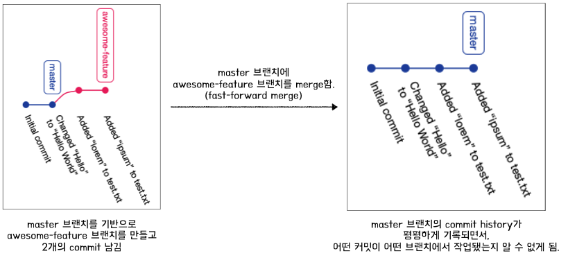

#### 🤔 <b>들어가며</b>
PR을 올리고 팀원들의 확인을 기다리는동안 추가적으로 수정할 것이 생겨 수정 진행, commit/push를 진행했다.   
그 후 PR을 merge했는데 어쩐일인지 마지막으로 commit한 것까지 merge가 되어버렸다.  
문자열을 바꾼 단 한개의 commit이었기에 망정이지 더 큰 작업, 크리티컬한 작업이었다면,,,🙀   

사실 이때까지만 해도 PR을 기준으로 merge될 commit들이 그룹핑 되는 줄 알았다.😅   
내가 PR을 사용하면서도 잘못 알고 있던 사실들이 있다는 것을 깨달았고, 왜 마지막 commit까지 merge됐을지 이해하기 위해 테스트를 진행했다.

#### <b>테스트 진행하기</b>
- 문제가 발생했던 과정을 재현하기 위해 아래와 같이 테스트를 진행했다.
    1. main 브랜치 기반으로 새로운 브랜치를 하나 만든다.
    2. 1차 수정을 진행하고 commit, push 후 PR을 올린다.
    3. 2차 수정을 진행하고 commit, push 진행한다.
    4. 2번 PR을 merge한다.

- 역시나 3번의 커밋까지 main 브랜치에 merge 된 것을 확인할 수 있었다.

#### <b>주니어의 생각의 흐름을 따라가보아요.</b>
1. merge에 문제가 있다고 생각했기 때문인지 이걸 보고 제일 처음 떠올랐던 키워드는 `fast-forward merge`였다.
2. 다음으로 들었던 생각은 'push할 때 fast-forward 옵션을 끄면 되겠다! 테스트하자!'라는, 다시 생각해보면 말도 안돼는 생각을 했다.
    - 🤷‍♀️ 아니 fast-forward는 merge와 관련 있는건데 push가 왠말이냐..!
3. 오케이!! 그럼 merge할 때 fast-forward 옵션을 꺼보자! 라는 생각으로 github PR의 Merge 옵션을 보았으나.. 그런 옵션이 없었다.
4. 이쯤되니 혼란스러웠다. 
    - 내가 뭘 모르고 있는 것인지조차 잘 모르겠다.😖 어디서부터 풀어나가야 하나..!
5. 우선은 궁금한 것들을 적어보자!

#### <b>질문에 답을 찾아보자.</b>
- `fast-forward` 옵션을 꺼야하는 경우는 언제이지? 해당 옵션의 용도를 잘못 이해하고 있는 것 같다.
- PR은 git이 제공해주는 것일까 혹은 github, bitbucket 등 저장소에서 편의를 위해 제공해주는 것일까?
- PR의 목적은 무엇일까? (왜 PR merge에는 -no-ff 옵션이 없는지 궁금해서)
- PR을 merge할 때는 `-no-ff` 옵션을 사용할 수 없는 것인가?
- PR을 올리고 나서 commit, push 진행함. 근데 이건 PR merge에 합져지지 않았으면 좋겠다! 이 경우 어떻게 해야할까?

#### Q1. `fast-forward` 옵션을 꺼야하는 경우?
- 일단 `fast-forward merge`에 대해 간략히 짚고 넘어가자면.
    - 두개의 브랜치 A와 B를 Merge할 때(A에 B를 merge) A와 B의 parent commit이 동일할 경우 별도 병합 없이 A 브랜치의 HEAD를 B 브랜치의 마지막 commit으로 위치 이동 시키는 merge 전략.
- fast-forward 전략으로 Merge를 진행하면 merge 한 브랜치(위 예시의 A 브랜치)의 커밋 히스토리에 B 브랜치의 커밋들이 flatten(평평)하게 기록된다. fast-forward 모드는 git의 기본 모드이다.   
       
- 이 방식의 문제는 크게 2가지가 있다.
    - 커밋 중 일부가 어떤 브랜치에서 작업이 됐는지 알 수 없다. 큰 맥락에서 커밋이 왜 추가되었는지에 대한 정보를 잃게 되는 것이다.
    - 아직 병합되어서는 안되는 커밋들 이었을 경우 해당 브랜치에서 작업한 커밋들이 어떤 것이었는지 확인할 수는 있다 하더라도 실행 취소가 복잡해진다.
- fast-forward를 사용하지 않기 위해 `-no-ff` 옵션을 추가할 수 있다. 해당 옵션을 이용해 merge를 진행하면 커밋 히스토리는 아래와 같다.   
       
- 결론 : commit history 관리를 위해, 혹시라도 병합된 것을 실행취소 하기 위해 필요하다.

#### Q2. PR은 git이 제공해주는 것일까 혹은 github, bitbucket 등 저장소에서 편의를 위해 제공해주는 것일까?

---
📚 참고사이트
- [Git fast-forward merge - why you should turn it off](https://betterdev.blog/turn-off-git-fast-forward-merge/)