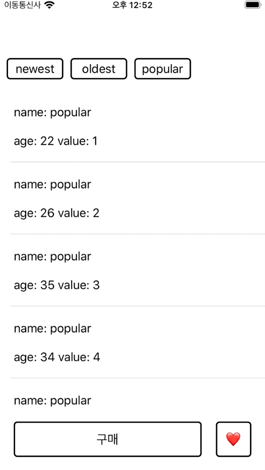

예제 프로젝트를 보며 RxSwift의 다양한 operator를 파악한다.   
👀  https://github.com/NohEunTae/RxMVVMSample (블로그 설명은 [여기](https://ntomios.tistory.com/13?category=935845) 한국어임)

---

**사용하는 라이브러리**

- RxSwift
- RxCocoa
- Alamofire
- SnapKit
- 명시적으로 podfile에 작성된 것은 아닌데 RxRelay 라이브러리도 함께 설치됨.

---

**키워드**
- RxSwift : DisposeBag, disposed, map, flatMapLatest, flatMap, bind, subscribe
- RxCocoa : tap, bind, willDisplayCell(RxSwift TableView 관련 내용 봐야할 듯)
- Subject 대신 Relay가 있네?
    - BehaviorRelay, PublishRelay 등
    - Help 인스펙터의 설명을 보면 각각 BehaviorSubject, PublishSubject의 wrapper라고 함.
    
- input/output

---

**공부할 순서**

1. ViewController
    - RxCocoa란 무엇이고 왜 사용?
    - DisposeBag, disposed, tap, bind, map, flatMapLatest, flatMap, rx의 테이블뷰, subscribe
2. Input/Output
    
    “Swift MVVM input output” 이라고 검색해보면 많이 나옴.
    
3. ViewModel
    - RxRelay에 대해, RxRelay와 Subject의 차이는?
    - skip
4. Network
    - Single
    - create()
5. RxSwift_Extension, Protocol 파일 확인해보기