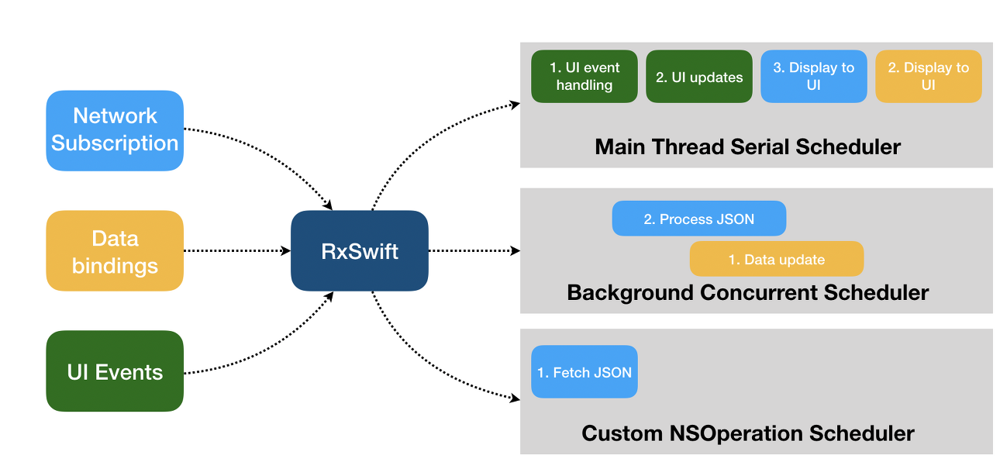

# **Schedulers**

- 함수를 실행하는 Thread를 결정하는 역할을 한다.
- 보통 UI 업데이트는 MainThread, API를 통한 데이터 fetch나 복잡한 연산 등을 하는 함수는 BackgroundThread에서 실행된다. Swift의 DispatchQueue를 통해 어떤 스레드에서 작업을 실행할지 컨트롤 할 수 있는데 동일한 역할을 하지만 DispatchQueue보다 훨씬 쉬운게 Schedulers라고 한다.
- RxSwift에는 여러 스케줄러가 이미 정의되어 있어서 개발자가 별도로 커스텀할 일은 많지 않다고 함.
    
    
    MainThread → MainThread   
    Background → concurrent Background GCD queue   
    NSOpersion → custom OperationQueue-based scheduler   