# WWDC21: Explore structured concurrency in Swift

[WWDC21: Explore structured concurrency in Swift](https://developer.apple.com/videos/play/wwdc2021/10134/)

## Structured Concurrency
Structured Concurrency는 Structured Programming(이하 구조적 프로그래밍)을 기반으로 한다.
- Structured Programming
    - 하향식(Top-Down) 설계
    - goto 문법(제어 흐름을 이곳저곳 이동할 수 있도록 함)의 사용 금지
        - 순차, 제어(if, switch 등), 반복(for, while 등)만 사용하여 구현하는 것
    - block이라는 단위를 이용하여 프로그램을 작성함.
        - block 내부에서만 유효한 변수를 선언할 수 있다.
        - block의 동작 방식 : block 진입 시 메모리에 할당이 이루어지고, block을 벗어나면 할당 해제되어 재접근이 안됨.
- static scope
    - scope는 변수의 유효(사용가능)범위를 나타낸다.
    - scope에는 Lexical Scope(또는 Static Scope)와 Dynamic Scope가 있다.   
    전자는 **어디서 선언**하였는지에 따라 스코프가 결정되는 것이다. 후자는 **어디서 호출**하느냐에 따라 스코프가 정해진다.
                
<br>


- 기존 비동기 코드에서는 구조적 프로그래밍을 적용하기 쉽지 않다. completion handler 안에서 에러 핸들링을 사용할 수 없고 반복문을 사용할 수 없기 때문이다.   

    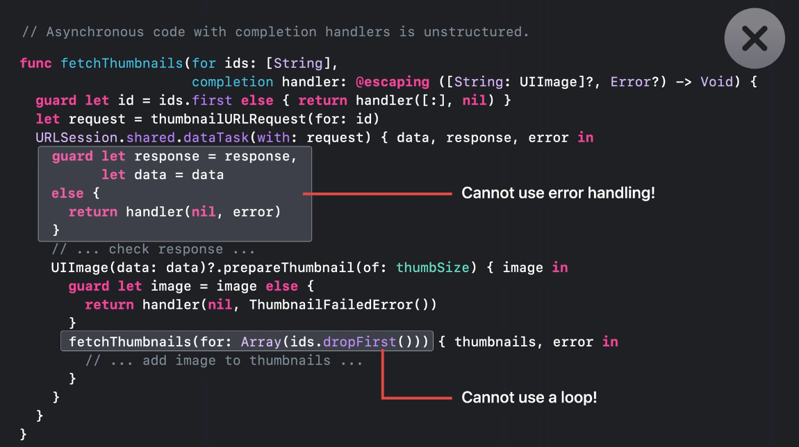   
    - error handling을 사용할 수 없는 것과 structured programming은 어떤 연관관계가 있는 걸까?

- 하지만 async, awiat의 도입으로 구조적 프로그래밍을 적용할 수 있게 됐다.   

    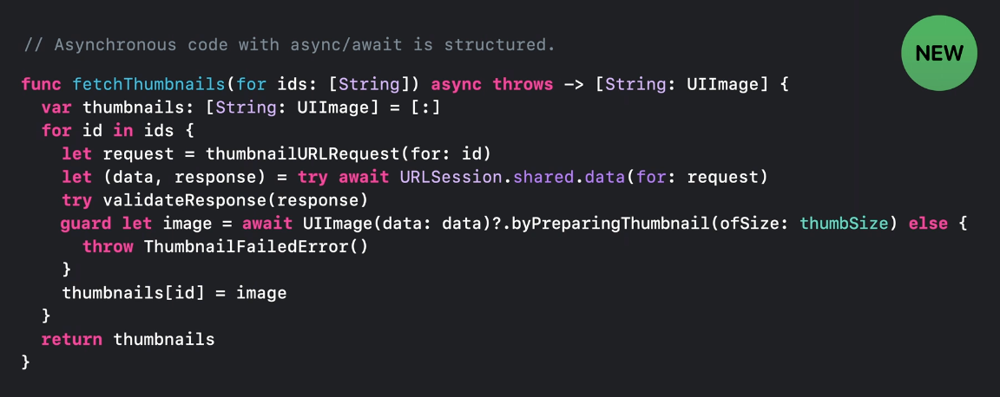 
    - 내부적으로 반복문을 사용할 수 있게 됐으므로 재귀적 호출을 피할 수 있으며, 에러 핸들링 역시 가능하다.

<br>
<br>
그런데 만약 썸네일 이미지를 수천장 생성해야 한다면 위 코드는 좋은 코드라고 말할 수 있을까? 그렇지 않다.    

왜냐하면 한번에 하나씩 이미지를 처리하기에는 시간이 너무 오래 걸리기 때문이다.   
또한 서로 다른 API를 호출하여 받은 데이터들을 조합해서 사용해야 한다면?(이미지 원본과 이미지 메타데이터 정보를 조합하여 화면에 보여줘야 한다면) 

위의 코드는 좋은 코드라고 말하기 어렵다.
→ 이러한 경우 concurrency를 이용해 여러 다운로드가 동시에 발생하도록 만들 수 있다. 이때 사용하는 것이 `Task`다.
    

## Task
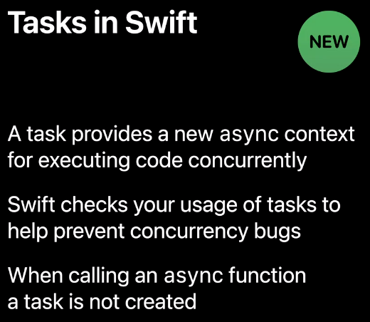   

- Task는 **코드를 concurrency하게 실행시키기 위해 새로운 async 컨텍스트를 제공**한다.
- Swift 컴파일러는 concurrency 버그를 막기 위해 Task의 사용을 체크한다.
- async 함수를 호출한다고 해서 Task가 생성되는 것은 아니다.

<br>

여러 종류의 Task가 있는데 각각의 용도와 허용 가능한 유연성의 정도가 다르다. 하나씩 살펴보도록 하자.
- async-let binding
- group task
- unstructured task
- detached task

<br>
<br>

## async-let binding

이해를 돕기 위해 평범한 let binding을 자세히 살펴보면 두가지 파트로 나뉜 것을 알 수 있다.

```swift
let result = URLSession.shared.data(...)
```

오른쪽에 initializer expression, 왼쪽에 변수 이름으로 구성된다.    
이걸 염두에 두고 아래 내용을 보자.

<br>

### Sequential bindings

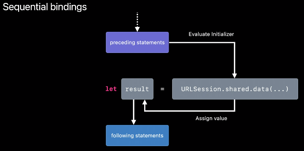   

① 오른쪽에 있는 initializer expression이 먼저 실행된다. 

② 작업이 완료되어 데이터를 받으면, 다음 코드를 실행하기 전에 이 데이터를 왼쪽에 위치한 변수 이름에 바인딩한다.

⚠️ 위의 이미지에는 **단 한개의 execution만 존재**한다는 것을 명심하자.

데이터를 다운받는 동안 스레드가 다른 작업을 할 수 있도록 만들고 싶다면 let 앞에 `async` 키워드를 붙이면 된다. 이것이 바로 `async-let binding`이다. 

해당 키워드를 붙이면 단순한 let binding이 concurrent binding으로 바뀌게 된다.

<br>

### Concurrent bindings

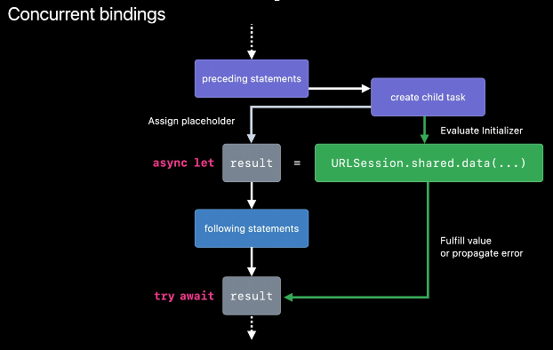   

① concurrent binding을 평가(evaluating)하기 위해 **Swift는 먼저 새로운 child Task를 만든다.**   
이 child task는 해당 task가 생성된 상위 task의 child가 된다.(parent-child 관계가 만들어짐)

② 위 이미지 우측 상단의 “create child task”가 완료되면 실행 흐름이 2개가 된다.(task가 2개이기 때문에) 초록색 화살표가 child, 하얀색 화살표가 parent이다.

- child task는 데이터를 다운로드 받는다.
- parent task는 `result` 변수에 placeholder 값을 바인딩해둔다.
- child task가 data를 다운로드를 하는 동안 parent task는 async let 바인딩 이후의 작업들(위 이미지의 following statement 부분)을 계속 진행해나간다.
- 그러다가 `result` 의 실제 값이 필요한 곳에 도달하게 되면, parent는 child task의 완료를 await(기다림) 하게 된다. 그래서 위 이미지 가장 하단에 있는 `result` 앞에 await 키워드가 붙은 것이다.
- 이 예제에서 URLSession에 대한 호출은 에러를 throw할 수도 있다. 이 말은 즉, `result` 에 들어갈 수 있는 게 실제 “값"이 될 수도 있지만 오류가 될 수도 있다는 말이다. 그래서 앞에 try await를 붙여준다.

위 흐름을 코드로 구현해보면 아래와 같다.   
*— 아래 코드의 시나리오는 서로 다른 API를 호출하는 경우에 해당된다.*

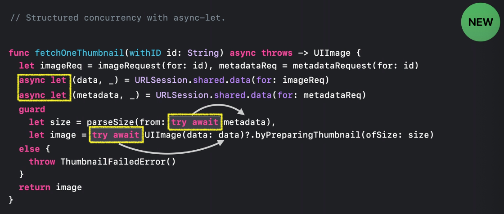   

- 원래 URLSession 부분에 try await을 붙여줬는데 이 경우 하나의 다운로드가 완료될 때까지 함수의 실행 자체가 suspend되어 버린다.
- 다른 작업을 이어서 진행할 수 있도록 try await 대신 async-let binding을 사용하도록 만들었다.
- async-let binding을 통해 받아온 결과는 바인딩 한 변수(metadata, data)를 사용하는 곳에 await 키워드를 붙임으로써 child task들의 작업이 완료될때까지 기다린다는 것을 알 수 있다.

위 코드를 보면 fetchOneThumbnail() 메소드를 실행하는 parent task 하나와 async-let binding을 통해 생성된 2개의 child task가 만들어진 것을 알 수 있다. 과연 이 task들은 어떻게 관리가 되는걸까?

<br>
<br>

## Task Tree
바로 Task Tree를 통해 관리가 된다. 이는 structured concurrency의 중요한 파트이다. Task의 Cancellation, priority, task-local variables와 같은 attributed에 영향을 준다.

Task가 특정 함수에 묶인 것은 아니지만 Task의 라이프타임은 특정 함수에 한정될 수 있다.(may be scoped to it.)

<br>

### Task Tree의 규칙
Task Tree는 Parent Task와 그들의 Child간 link로 구성된다. 이 link는 규칙을 강제하며 그 규칙은 아래와 같다.

> Parent Task는 자신의 모든 Child Task 작업이 끝난 뒤에만 종료될 수 있다.
> 
<br>

이 규칙은 Child Task의 작업 완료를 기다리지 못하도록 하는 비정상적인 실행 흐름을 맞닥뜨린 때에도 적용된다. “Child Task의 작업 완료를 기다리지 못하도록 하는” 상황은 어떤 상황일까? 아래 예시를 보자.

<br>

   
fetchOneThumbnail()의 코드를 다시 한번 확인해보자.   

위 코드의 try await 부분을 보면 metadata를 먼저 기다리고, 그 다음에 이미지 데이터를 기다리도록(await) 되어 있다. 

그런데 만약 metadata를 가져오는 Child Task가 Error를 Throw한다면 어떨까? 그 즉시 fetchOneThumbnail() 메소드를 빠져나가야 한다.

그럼 두번째 다운로드(이미지 데이터)를 수행하던 Child Task는 어떻게 되는걸까? 

이 경우 Swift는 자동으로 나머지 Child Task(Unawatied Task)를 Cancellation으로 표시하고 메소드를 빠져나가기 전 Cancellation으로 표시한 Task의 모든 작업이 완료될 때까지 기다린다. 

<br>

Task를 Cancellation으로 표시하더라도 작업이 즉시 중단되는 것은 아니다. 왜냐하면 표시된 Task의 모든 자식 Task들도 자동으로 취소되어야 하기 때문이다. 

메소드를 빠져나가기 전 기다림이 필요한 이유가 바로 이것 때문이다.

   

이 guarantee가 structured concurrency의 근본적인 동작과정이 된다.

<br>

그렇다면 Task는 최종적으로 언제 stop이 되는걸까?   
만약 Task가 중요한 transaction 작업의 중간에 있거나 네트워크 연결을 하고 있는 중이라면 Task를 당장 중단시키는 것은 적절치 않다. 이런 이유로 Swift의 Task cancellation이 cooperative한 것이다.

<br>

### Cancellation is Cooperative
Cancellation이 cooperative하다는 것은 아래와 같다.   
- Task들은 취소되었을 때 그 즉시 정지되지 않는다. (트리를 구성하는 다른 task들도 정지되길 기다림)
- Cancellation을 어디에서나 확인할 수 있다.
    - 비동기 함수던 아니던, 현재 Task의 cancellation 상태를 체크할 수 있다.
- Cancellation을 염두에 두고 코드를 만들어야 한다.
    - 특히 long-running 연산과 관련있는 API 라면 더더욱 Cancellation을 고려해야 한다.
    - API를 사용하는 클라이언트는 해당 API를 호출 시 취소가 가능한 Task를 사용할 수 있으며, 취소했을 때 가능한 빨리 연산이 중단되길 원할 것이다.

<br>

- Cancellation을 고려한 예제 코드는 아래와 같다.   
    ① Task.checkCancellation() - Task가 취소됐는지 확인하고 취소됐다면 Error를 Throw한다.   

    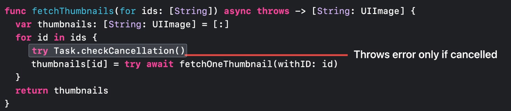   

    ② Task.isCancelled - Task가 취소됐는지 확인하고 Bool 값을 리턴한다. 이 경우 (아래와 같은 코드에서) 부분적인 결과를 리턴할 수도 있기 때문에 API에 이런 내용들을 명확하게 명시해둬야 한다.   

    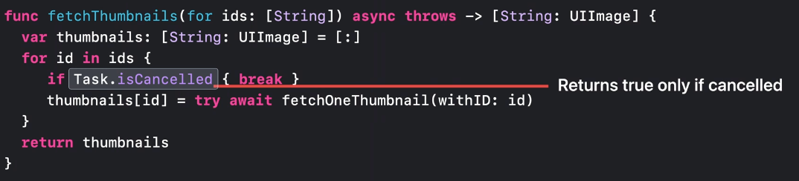  

<br>
<br>        
<br>

## Group tasks

Structured Concurrency의 한 종류로 고정되지 않은 수의 concurrency가 필요한 경우 사용하기 적합하다.

아래 코드를 다시 한번 보자.

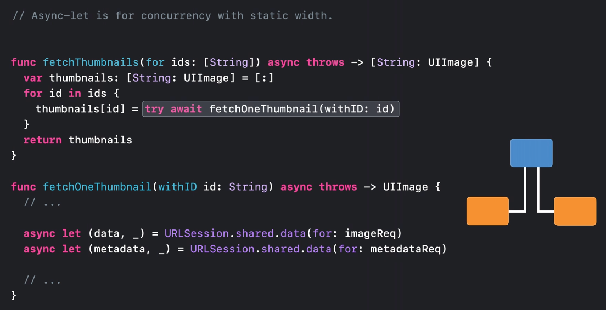   

async-let으로 만들어진 Task의 스코프는 변수 바인딩과 유사하다. 

즉, 두개의 child task(image data task와 metadata task)는 다음 반복문이 시작되기 전에 완료되어야 한다는 의미다. 따라서 반복을 돌며 **한번에 하나씩** 썸네일 가져오는 작업을 처리할 수 있다.

그런데 만약 반복을 시작한 뒤 모든 썸네일을 한꺼번에 가져오고 싶다면 어떻게 해야할까? 이 경우 필요한 concurrency의 양을 정적으로 알 수는 없다. 왜냐하면 매개변수로 들어오는 ids 배열의 사이즈에 따라 필요한 양이 달라지기 때문이다.

그래서 이런 시나리오에 대응하기 위해 Task Group을 사용하는 것이다. (여러 Task들이 묶여 있는 Group)

<br>

`withThrowingTaskGroup` 메소드를 호출하면 이를 사용할 수 있다. definition은 아래와 같다.

```swift
func withThrowingTaskGroup<ChildTaskResult, GroupResult>(
    of childTaskResultType: ChildTaskResult.Type,
    returning returnType: GroupResult.Type = GroupResult.self,
    body: (inout ThrowingTaskGroup<ChildTaskResult, Error>) async throws -> GroupResult
) async rethrows -> GroupResult where ChildTaskResult : Sendable
```

- body 매개변수는 `ThrowingTaskGroup<ChildTaskResult, Error>` 타입의 변수를 매개변수로 받아 `GroupResult` 타입을 리턴하는 함수 타입이다. inout 이라는 게 신기했는데 찾아보니 `ThrowingTaskGroup`이 struct 타입이었다. 
- async 함수이다.
- ChildTaskResult가 Sendable 프로토콜을 채택해야 한다.
- 해당 메소드에 대해 아래와 같이 설명되어 있다.
    
    > A group waits for all of its child tasks to complete, throw an error, or be canceled before it returns.
    > 
    
    → Group에 포함되어 있는 모든 Child Task의 완료 상태를 하나의 트랜잭션으로 묶어놓은 것 같다. 
    
- Group에 추가된 Task들은 Group이 정의된 Block의 스코프보다 오래 살 수 없다.
    
    > After this function returns, the task group is always empty.
    > 

<br>

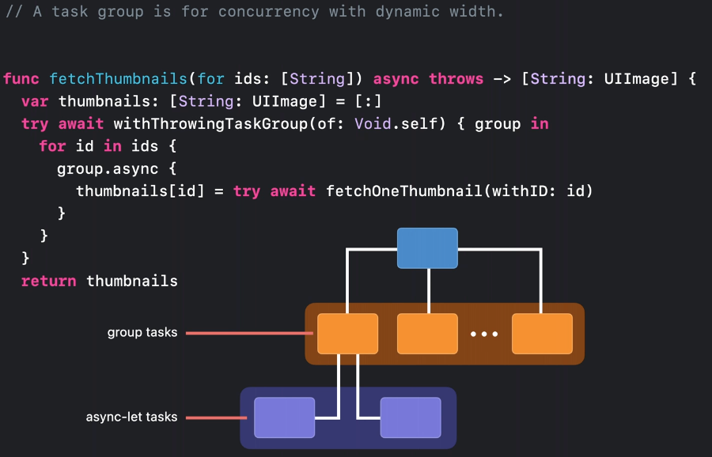   

- of 매개변수는 Child Task를 실행하고 리턴 받을 결과의 타입을 지정한다.
- 후행 클로저에 있는 `group` 은 TaskGroup<ChildTaskResult> 타입이다.
- 전체 for문을 group의 block 안에 두었기 때문에 group을 이용해 동적인 개수의 task들을 생성할 수 있다.
- 그룹 안에서 async method를 호출함으로써 child task를 만들 수 있다. 일단 task가 그룹에 추가되면, child task들은 어떤 순서로든(in any order) 작업을 시작한다.
- group 객체가 스코프를 벗어나게 되면, 그룹에 추가된 모든 task들의 completion이 암시적으로 awaited된다. 이건 task tree 규칙의 결과인데 group task들도 structured이기 때문이다.
- group task 안에서 async-let을 사용할 수 있으며 또는 async-let 안에서 task group을 생성할 수도 있다. 그리고 tree의 동시성 수준은 자연스럽게 구성된다.

<br>
<br>

## Data Race

하지만 위 코드는 문제가 있다. 빌드를 해보면 컴파일러가 data race 이슈가 있음을 알려주고 있기 때문이다.

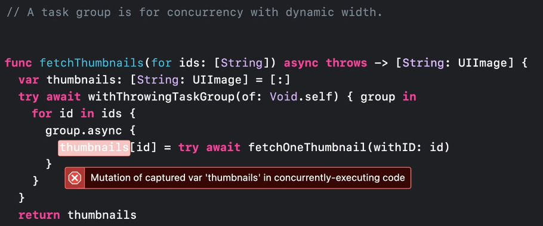   

- Child Task는 여러개인데 각각이 하나의 Dictionary안에 썸네일을 넣고 있다. 이 Dictionary는 한번에 여러개의 access를 처리할 수 없기 때문에 문제가 발생한다. 또한 두개의 Task가 썸네일을 동시에 추가하려고 하는 경우 Crash가 발생하거나 Data Corruption이 발생할 가능성이 있다.

<br>

### Data-race Safety

- 새로운 Task를 생성할 때 Task가 수행하는 작업은 `@Sendable`이라고 하는 새로운 클로저 타입 안에서 실행되어야 한다.
`@Sendable` 클로저는 <u>해당 클로저가 선언된 컨택스트 내에서 mutable한 변수를 캡처링 하는 것이 제한</u>된다. 왜냐하면 그런 변수들은 task가 실행되고 난 후 수정되어질 수 있기 때문이다.
- mutable한 변수들은 캡처할 수 없다.
- 다음에 해당하는 변수들만 캡처링 해야 한다.
    - int나 string 등의 value type
    - 멀티 스레드에서 접근 가능하도록 디자인된 객체(ex. actor)
    - 자신만의 synchronization을 구현한 클래스

<br>

- Data Race 문제를 개선한 코드는 아래와 같다.   

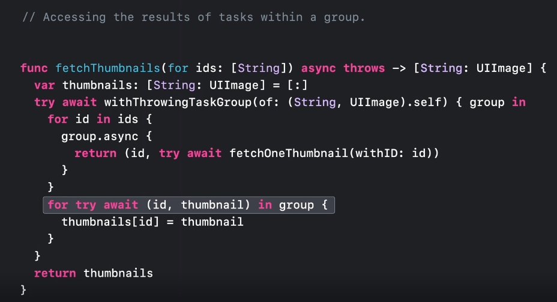   
    - `withThrowingTaskGroup` 의 of 매개변수를 보면 타입이 `Void`에서 `(String, UIImage)`의 튜플로 변경된 것을 알 수 있다.
    - `group`은 `TaskGroup<ChildTaskResult>` 타입이다. 위 이미지에 표시된 `(id, thumbnail) in group` 을 보고 헷갈리지 말자.
    - group의 Child Task들의 결과를 모으기 위해 `for-await-in` 구문을 활용한다.

<br>
<br>

### Async-let과 Task Group의 차이
Task Tree 규칙의 구현과 관련하여 async-let과 Task group에는 약간의 차이가 있다.

- Child Task에서 Error가 Throw됐을 때의 동작은 async-let과 동일하다(Cancellation이 전파됨)
- Child Task들이 정상적으로 완료되어 스코프를 벗어나게 되는 경우에는 차이가 있다. 이 경우 Cancellation이 암시적으로 이루어지지 않는다. 이런 특성은 Task Group을 이용해 [fork-join 패턴](https://en.wikipedia.org/wiki/Fork%E2%80%93join_model)을 적용하기 쉽도록 만들어주는데 작업이 취소되지 않고 await만 하기 때문이다.
- 그룹의 cancelAll() 메소드를 이용해 block이 종료되기 전 모든 task를 수동으로 취소할 수도 있다.
- async-let과 group task는 Swift에서 scoped structured task를 제공하는 방법들이다.

<br>
<br>
<br>

## Unstructured Tasks

프로그램에 task를 추가하기 위해서 항상 계층구조가 필요한 것은 아니다.

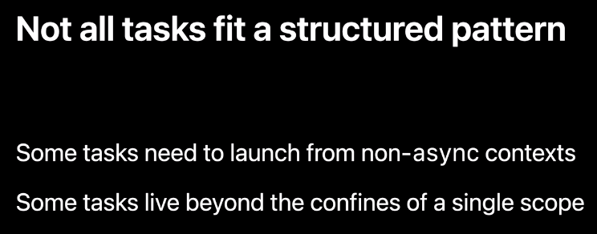   

Task가 명확한 계층 구조에 속하지 않을 수 있는 상황이 많이 있다. 가장 명백한 경우 중 하나는 non-async 코드에서 비동기 연산을 수행하는 작업을 시작하려는 경우다. 이 경우 parent task가 전혀 없을 수 있다.

또는 task에 대해 원하는 라이프타임이 단일 스코프 또는 단일 함수에 맞지 않을 수 있다. 예를 들어 어떤 객체를 활성 상태로 만드는 메소드 호출에 대한 response로 작업을 시작한 다음 객체를 비활성화하는 다른 메소드 호출에 대한 response로 실행을 취소할 수도 있다.

<br>

보통 AppKit이나 UIKit에서 delegate 객체를 구현하려할 때 많이 발생한다.

UI작업은 메인 스레드에서 실행되어야 하며, Swift Actor 세션에서 논의한 것처럼 Swift는 MainActor에 속하는 UI 클래스를 선언하며 이를 보장한다.

여기 UICollectionView가 하나 있고, 아직 datasource API를 사용할 수 없다고 가정해보자. 

UICollectionView의 아이템이 화면에 display될 때 네트워크로부터 썸네일을 가져오기 위해 fetchThumbnails() 함수를 이용하려고 한다.

   

문제는 delegate 메소드는 비동기 메소드가 아니기 때문에 async 함수에 대한 호출을 await할 수 없다.

어떻게 하면 이 작업이 UI priority를 가지면서 main actor에서 실행되도록 할 수 있을까? 바로 이런 경우에 Unstructured Task를 만들어야 한다.

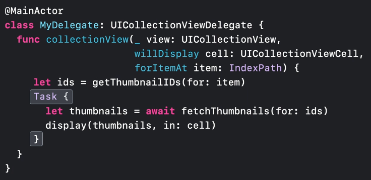   

- Main Thread에서 위 코드가 실행되다가 Task를 생성하는 코드에 도달하게 되면 Swift는 원래 스코프와 동일한 Actor에서 코드가 실행되도록 schedule한다.
- 그러는 동안 컨트롤은 즉시 caller에게 리턴된다. 썸네일 작업은 delegate method에서 메인 스레드를 즉시 차단하지 않고 opening하면 main thread에서 실행된다.
- 이런 식으로 task를 만드는 것은 structured와 unstructured 코드 사이의 중간 지점이 제공된다. 직접 생성된 Task는 여전히 (존재한다면) 실행된 컨텍스트의 액터를 상속하며, group task나 async-let과 마찬가지로 origin task의 우선순위 및 기타 특성도 상속한다.
- 그러나 새로운 Task는 스코프가 지정되지 않는다. 새로운 task의 스코프는 해당 task가 런치된 곳에 묶이지 않는다. origin(task가 시작되는 곳)이 심지어 async일 필요도 없다.
- 이러한 flexibility를 얻는 대신, 우리는 structured concurrency가 자동으로 관리해주던 것들을 수동으로 관리해야 한다. cancellation과 에러가 자동으로 전파되지 않으며, 우리가 명시적으로 처리하지 않으면 task의 결과가 암시적 awaited되지도 않는다.

    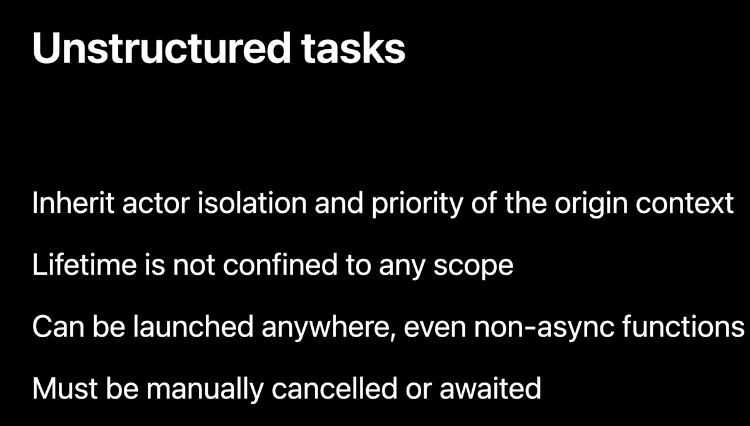   
    
<br>

- 어쨌든 위와 같은 방식으로 collection view 아이템이 화면에 display될 때 썸네일을 가져오는 작업을 시작할 수 있다. 우리는 썸네일이 준비되기 전에 아이템이 뷰에서 스크롤 아웃되었을 때 task가 취소되어질 수 있도록 만들어야 한다. unscoped task로 작업을 했기 때문에 이러한 취소는 자동이 아니다. 이걸 구현해보자.

- 우선 Task를 만들고 나서 얻은 값을 저장해보도록 하자. 우리는 task를 생성할 때 값을 row index로 keyed된 딕셔너리에 저장할 수 있다. 따라서 task를 취소할 때 이를 활용할 수 있다.

    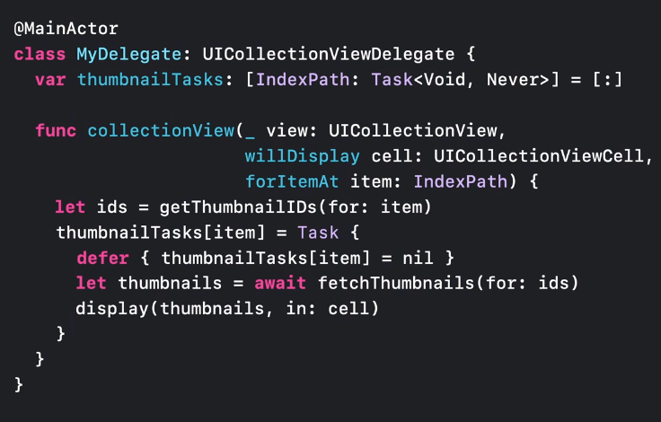   
    
    - defer가 들어간 이유는 task 취소 시 이미 finish된 task까지 cancellation하지 않도록 하기 위함임.
    - 컴파일러에 의한 data race flagged 없이 동일한 dictionary(thumbnailTasks)를 비동기 Task의 안과 밖에서 접근할 수 있다.
    - 우리의 delegate 클래스는 MainActor에 묶여있고 새로운 Task는 이를 상속받기 때문에 이들은 절대 병렬적으로 실행될 수 없다. 그래서 오류 없이 사용 가능한 것.
    - 우리는 data race에 대한 걱정 없이 해당 task 안에서 안전하게 main actor-bound 클래스들의 저장 프로퍼티에 접근할 수 있다.

    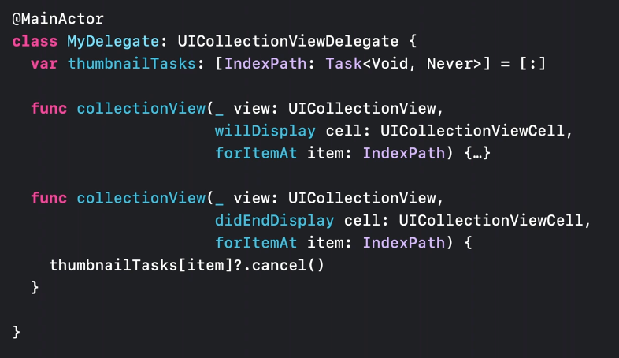   
    
    - 만약 delegate가 나중에 같은 table row가 화면에서 사라졌다는 것을 알려주면 value에 대한 cancel 메소드를 호출하여 task를 취소할 수 있다.
    
- 여기까지 해서 unstructured task(Task의 originating context에 있는 특성들을 상속받으면서도 scope의 independent를 가지는)를 만드는 방법에 대해 봤다.
- originating conext의 속성 중 그 어떠한 것도 상속받고 싶지 않은 경우가 있다. 최대치의 유연성을 위해 Swift는 detached task들도 제공한다.

<br>
<br>

## Detached tasks
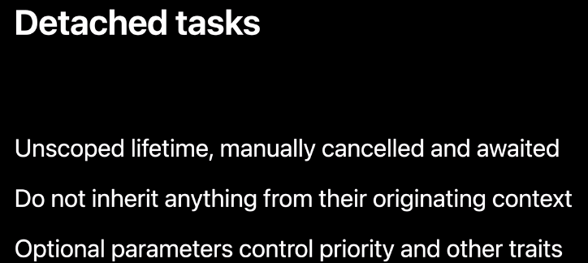   

이름에서 알 수 있듯 해당 Task는 그들의 context로부터 독립적이다. 이것들은 unstructured task에 해당되긴 한다. 이 task들의 라이브타임은 originating 스코프에 묶여 있지 않다. 또한 원래 스코프의 어떠한 속성도 상속받지 않는다. 우선순위를 비롯한 다른 속성들을 컨트롤하기 위해 옵셔널한 매개변수를 제공한다.

만약 네트워크로부터 썸네일을 받아와서 local disk cache에 이것들을 write한다고 가정해보자. 캐싱은 메인 액터에서 실행될 필요도 없고 모든 썸네일을 가져오는데 실패한다고 해도 정상적으로 가져와진 썸네일에 대해서는 캐싱을 해두는게 도움이 된다. 

코드로 위 시나리오를 구현해보자.

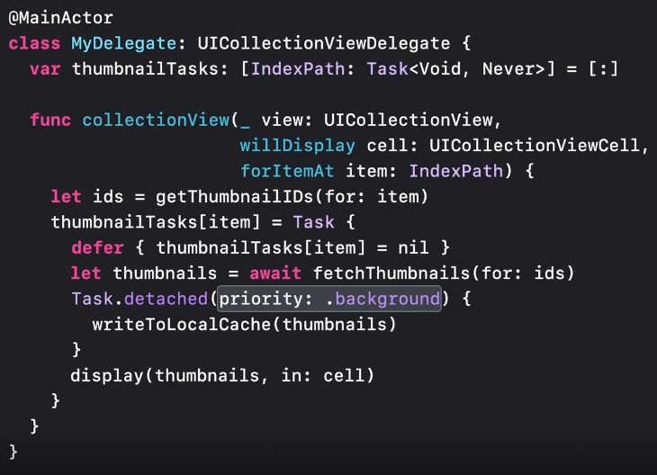   

Detached task 안에서 structured concurrency를 활용할 수도 있다.

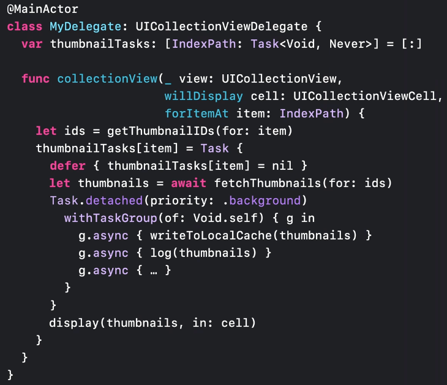   

이렇게 하면 structured concurrency의 장점들을 활용할 수 있다.

cacellation의 전파, 부모 task의 속성을 child가 상속

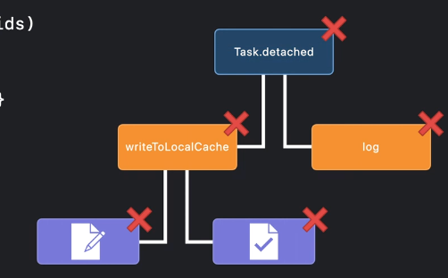   

<br>
<br>
<br>

## Flavors of tasks

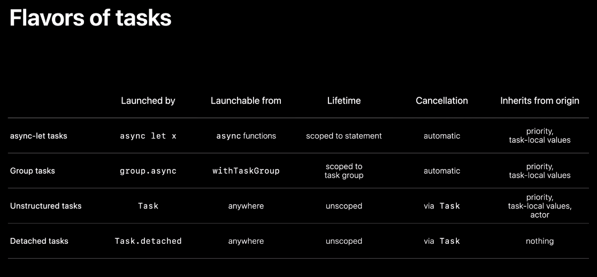   

---
이렇게 정리를 해도 머리에 남는게 없는 느낌이다. 뭐가 문제일까? 글을 영어에서 한글로 옮기긴 했지만 거기에 너무 신경쓰느라 글을 이해하지는 못한 것 같다는 생각이 들기도 한다. 마인드맵을 그려둬야 겠다. 빨리 아이패드 사야지 !