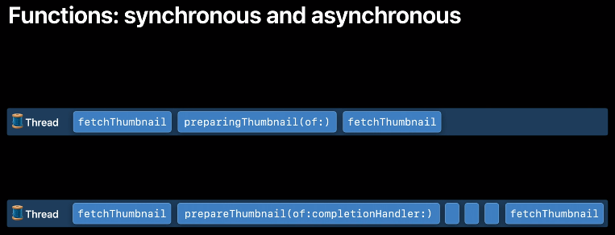
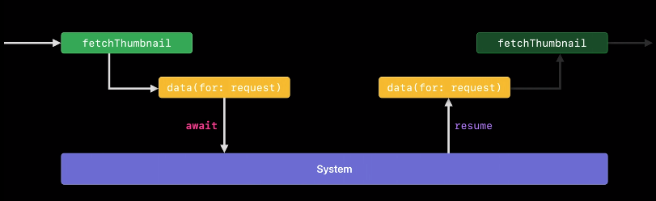

[WWDC 21: Meet async/await in Swift](https://developer.apple.com/videos/play/wwdc2021/10132/)

   

- sync function : 어떤 메소드가 특정 스레드 안에서 실행될 때, 그 메소드가 finish되기 전까지 스레드가 block됨. 따라서 해당 스레드는 어떤 작업도 할 수 없음.

- async function: 어떤 메소드가 특정 스레드 안에서 실행될 때, 그 메소드가 finish되지 않아도 스레드가 block되지 않음. 따라서 해당 스레드에서 다른 작업을 처리할 수 있음. async funcion이 finish되면 completion handler를 호출하여 작업이 완료되었음을 알림.

<br>

비동기 작업을 마치면 여러가지 방법으로 작업이 완료되었음을 알릴 수 있음.

1. completion handler
2. delegate callback
3. async로 표시

비동기 함수들의 공통점은 호출되어 메소드의 작업이 시작된 후 스레드를 빠르게 unblock으로 만든다는 것이다.

<br>

#### <b>시나리오: URL 문자열을 이용해 썸네일 이미지(UIImage) 만들기</b>

1. 썸네일 URL 문자열을 이용해 **URLRequest**를 만든다.
2. URLSession의 dataTask 메소드를 이용해 **request**로부터 **데이터**를 받아온다.
3. **받아온 데이터**로부터 **image**를 생성한다.
4. **원본 이미지(3번)**로부터 썸네일 이미지를 준비한다.

- 각각의 작업들은 이전 작업의 결과물에 의존한다. 즉, 순차적으로 수행되어야 하는 것이다.
- 1번, 3번 작업은 빨리 처리될 수 있는 작업이기 때문에 동기로 호출해도 상관없다.
- 그러나 2번, 4번 작업은 상당한 시간이 소요되기 때문에 비동기로 호출해야 한다.


위 시나리오로 코드를 작성해보자.

<br>

### 첫번째 방법: Completion handler

```swift
func fetchThumbnail(for id: String, completion: @escaping (UIImage?, Error?) -> Void) {
    let request = thumbnailURLRequest(for: id)
    let task = URLSession.shared.dataTask(with: request { data, response, error in
	if let error = error {
	    completion(nil, error)
	} else if (response as? HTTPURLResponse)?.statusCode != 200 {
	    completion(nil, FetchError.badID)
	} else {
	    guard let image = UIImage(data: data!) else {
		return
	    }
	    image.prepareThumbnail(of: CGSize(width: 40, height: 40)) {thumbnail in
		guard let thumbnail = thumbnail else {
		    return
		}
		completion(thumbnail, nil)
	    }
	}
    }
    task.resume()
}
```

위 코드에는 약간의 문제가 있다.

`fetchThumbnail` 을 호출한 곳(이하 caller)은 해당 메소드의 작업이 성공적으로 끝났을 때 뿐만 아니라 실패했을 때라도 작업이 종료됐다는 알림을 받을 수 있을 것이라 예상한다.

지금 코드로는 실패했을 때에 대한 대응을 할 수가 없다.

- request로 받아온 데이터를 이용해 UIImage 인스턴스를 만드는게 실패했을 경우 그냥 return 시켜버림.
- 썸네일 이미지 준비가 되지 않았을 경우 그냥 return 시켜버림.

위 조건에서 caller는 어떠한 응답도 받을 수 없으며, 따라서 이미지를 보여주는 view는 절대 업데이트가 되지 않을 것이다.

따라서 무슨일이 있어도 caller에게 notify를 제공하는 것은 매우 중요하다. 위 코드를 한번 수정해보자.

<br>

### 첫번째 방법의 개선1

```swift
func fetchThumbnail(for id: String, completion: @escaping (UIImage?, Error?) -> Void) {
    let request = thumbnailURLRequest(for: id)
    let task = URLSession.shared.dataTask(with: request { data, response, error in
	if let error = error {
	    completion(nil, error)
	} else if (response as? HTTPURLResponse)?.statusCode != 200 {
	    completion(nil, FetchError.badID)
	} else {
	    guard let image = UIImage(data: data!) else {
	    	completion(nil, FetchError.badImage)
		return
	    }
	    image.prepareThumbnail(of: CGSize(width: 40, height: 40)) {thumbnail in
		guard let thumbnail = thumbnail else {
	    	completion(nil, FetchError.badImage)
		    return
		}
		completion(thumbnail, nil)
	    }
	}
    }
    task.resume()
}
```

return 전에 항상 completion 핸들러를 호출하도록 만들었다.

여기서는 swift의 일반적인 에러 핸들링 메커니즘(예컨데 throw와 같은)을 사용할 수 없다. 문제가 발생하더라도 completion handler 안에서 에러를 throw할 수 없는 것이다.

Swift에게 있어 completion handler는 그저 클로저일 뿐이다. completion handler가 항상 호출되는지 확인하고 싶지만 Swift에서는 그렇게 하도록 강제할 방법이 없다. 그래서 방금 두개의 gaurd 문에서 return을 시키더라도 컴파일 오류가 발생하지 않았다.(That’s why I didn’t get a compilation error when I just returned from those two guards.)

어쨌든 이러한 방법으로 기능 구현은 했다.

하지만 20줄이 넘는 코드가 만들어졌고, 미묘한 버그가 침투할 수 있는 5개의 구멍이 포함되어 있다.(위 문맥 등으로 미루어보아 completion handler 호출을 강제하지 않음으로 인해 caller에게 notify를 할 수 없다는 버그인 것 같다.)

이러한 방식을 조금 더 안전하게 만드는 방법 중 하나로는 Standard 라이브러리의 Result Type을 사용하는 것이 있다.

<br>

### 첫번째 방법의 개선2

```swift
func fetchThumbnail(for id: String, completion: @escaping (UIImage?, Error?) -> Void) {
    let request = thumbnailURLRequest(for: id)
    let task = URLSession.shared.dataTask(with: request { data, response, error in
	if let error = error {
	    completion(.failure(error))
	} else if (response as? HTTPURLResponse)?.statusCode != 200 {
	    completion(.failure(FetchError.badID))
	} else {
	    guard let image = UIImage(data: data!) else {
	    	completion(.failure(FetchError.badImage))
		return
	    }
	    image.prepareThumbnail(of: CGSize(width: 40, height: 40)) {thumbnail in
		guard let thumbnail = thumbnail else {
	    	completion(.failure(FetchError.badImage))
		    return
		}
		completion(.success(thumbnail))
	    }
	}
    }
    task.resume()
}

```

조금 더 안전해지긴 했지만 의례적인 코드들이 추가되어(it also added ceremony) 우리 코드를 못생기게, 약간 길게 만든다.

<br>

### 두번째 방법: (드디어) async/await

simple, easy, safe(caller에게 성공했든 실패했든 항상 작업 종료에 대한 notify를 줄 수 있다면 safe 한 것)한 방법이다.

```swift
func fetchThumbnail(for id: String) async throws -> UIImage {
    let request = thumbnailURLRequest(for: id)
    // URLSession의 dataTask와 달리 data 메소드는 awaitable하다. 둘다 Foundation에서 제공하며 비동기로 동작한다.
    // 이전버전에서는 에러를 체크하고 명시적으로 completion handler를 호출하는 작업들이 많았는데,
    // 현재 버전에서는 이런 작업들이 try 안에 녹아있다.
    let (data, response) = **try await** URLSession.shared.data(for: request)
    guard (response as? HTTPURLResponse)?.statusCode == 200 else { throw FetchError.badID }
    let maybeImage = UIImage(data: data)
    guard let thumbnail = await maybeImage?.thumbnail else { throw FetchError.badImage }
    return thumbnail
}
```

- async 키워드의 위치는 throws 앞. `throws`가 없다면 `→` 앞
- 작업이 성공했을 경우 UIImage를 리턴하며, 오류가 발생했을 경우 오류를 throws 할 수 있다.
- URLSession.shared.data가 호출되면 자기자신을 빠르게 suspend(일시 중지)시키고 스레드를 unblocking한다. 그 이후 스레드는 다른 작업들을 할 수 있다.
- async로 표시된 함수를 호출하려면 await이 필요하다.

- 첫번째 방법과 대조적으로, 썸네일이 렌더링되지 않으면 Swift는 error throw 또는 값 리턴할 수 있도록 보장한다. 이런 이유로 조용히 실패(silently fail)할 수 없다.

- 하나의 작업이 끝나면 그 결과물이 다음 작업의 Input으로 들어갈 수 있고, 모든 경우마다 에러 또는 값을 리턴할 수 있다.

<br>

### deep dive `async`

- async 키워드는 function 뿐만 아니라 property에도 붙을 수 있다.
- 위 예제 중 `await maybeImage?.thumbnail` 에서 thumbnail은 프로퍼티다. 아래와 같은 모양새다.
    
    ```swift
    extension UIImage {
    	var thumbnail: UIImage?
    	get async {
	    let size = CGSize(width: 40, height: 40)
	    return await self.byPreparingThumbnail(ofSize: size)
    	}
    }
    ```
    - 오직 read-only 프로퍼티만 async로 마크할 수 있다. (setter 없어야 함)
    - swift 5.5부터 property getter도 throw를 사용할 수 있음.

- 이 외에도 AsyncSequence, AsyncStream 등이 있다.
    - AsyncSequence의 예제코드
        ```swift
        for await id in staticImageIDsURL.lines {
	    let thumbnail = await fetchThumbnail(for: id)
	    collage.add(thumbnail)
        }
        let result = await collage.draw()
        ```

<br>        

### Keypoint: async function might suspend there.

이게 무슨 의미를 뜻하는지 알아보자.

**normal function call: by finishing**

- 일반적인 함수의 경우 호출된 함수가 finish될 때까지(값 리턴 또는 오류 throw) 다른 작업을 할 수 없다.
    
    그리고 값 리턴 또는 오류 throw가 스레드의 control을 포기할 수 있는 유일한 방법이다. 
    

**asynchronous function call: by suspending**



- async 함수가 실행되면 스레드의 control을 포기한다. 그러나 호출함수에게 다시 control을 돌려주는 대신 system에게 control을 준다. 이렇게 되면, 호출함수도 suspend된다.

💡 **asynchronous function call: by suspending**을 보고 async/await가 조금 이해되기 시작했다.   
• 비동기(asynchronous)는 함수를 호출하고 스레드를 block시키지 않으며 control을 caller에게 다시 넘겨준다고 이해하고 있었다.    
• 😱 그래서 처음에 async/await 코드를 보고 이게 도대체 어떻게 실행이 되는거지..? await가 붙은 코드를 실행시키고 나서 그 아래에 작성된 코드들이 그대로 실행되는 건가..? 라는 생각이 들었다.    
• 😮 suspending 방식에 대한 설명을 들으니 caller에게 control을 넘겨주는게 아니라 system에게 control을 넘겨주며 함수가 **reseume되기 전까지 함수 전체가 suspending되는 것**이라는 것을 알고 보니 괜찮은듯. async/await에 대한 두려움이 조금 사라졌다.   


- `suspending`은 함수가 system에게 이렇게 말할 수 있도록 만든다.
    
    > 😎 I know you have a lot of work to do. You decide what’s most important.
    > 
    
    따라서 함수가 일단 자신을 suspend시키면, 시스템은 다른 작업을 처리하기 위해 스레드를 사용할 수 있다.
    
    어느 순간이 되면 시스템은 수행해야 할 가장 중요한 작업이 이전에 suspend된 async 함수를 이어서 실행하는 것이라고 결정할 것이다. 그 시점에 시스템은 함수를 resume시킨다. 그럼 해당 함수는 다시 스레드를 다시 제어하고 작업을 지속할 것이다.
    
- 몇번이고 스스로를 일시 중지시킬 수도 있는 반면 스스로를 중단시킬 필요가 전혀 없을 수도 있다. async로 표시되어 있다고 해서 반드시 suspend되는 것은 아니다.
- await가 표시된다고 해서 함수가 확실히 해당 위치에서 일시 중지된다는 의미가 아니다. 그러나 결국에는 일시중지 하지 않았던 resuming이 되었던 함수가 종료되면 값 또는 오류와 더불어 스레드의 control이 다시 함수에게 돌아올 것이다.
- 함수가 suspend되어 있는 동안 다른 작업들이 수행될 수 있기 때문에 await 키워드로 비동기 호출을 표시해야할 필요가 있다고 Swift가 얘기하는 것이다.
- await 키워드를 통해 코드 블럭이 한 트랜잭션 내에 실행되지 않음을 알 수 있다. 함수는 suspend 될 수 있고 다른 작업들이 발생할 수 있다.함수의 라인 사이에 일시중단되어 있는 동안?? (The function may suspend, and other things may happen while it’s suspended between the lines of the function.) 또한 함수는 완전히 다른 스레드에서 resume될 수 있다. → “Protect mutable state with Swift actors”를 보라.

<br>

**async와 관련된 중요한 사실들 정리해보자.**

- 함수를 async로 표시한다는 것은 그 함수가 suspend되도 괜찮다는 것을 의미하며 함수가 suspend되면 함수의 caller도 suspend된다. 따라서 calle도 반드시 async여야 한다.
    - 만약 async가 아닌 함수에서 async를 호출해야 한다면? async Task function을 활용, Task 클로저 안에 async 코드를 넣어준다. global dispatch queue와 비슷하게 사용 가능한 다음 스레드에서 즉시 코드가 실행될 수 있도록 이를 시스템으로 보낸다.
        
        ```swift
        Task {
	    self.image = try? await self.viewModel.fetchThumbnail(for: post.id)
        }
        ```
        
- async 함수에서 한번 또는 여러번 일시 중단될 수 있는 위치를 지정하기 위해 await 키워드가 사용된다.
- async 함수가 일시 중단된 동안 thread는 block된 상태가 아니다. 그래서 시스템이 다른 작업을 처리하는데 사용할 수 있다.
- async 함수가 다시 시작되면 리턴된 결과가 원래 함수로 전달되고 suspend된 곳에서부터 실행이 계속된다.

<br>

### 번외: awaitable한 함수는 어떻게 생겼을까?
- URLSession.shared.data(for:delegate:)

    ```swift
    @available(iOS 15.0, *)
    func data(for request: URLRequest, delegate: URLSessionTaskDelegate? = nil) async throws -> (Data, URLResponse
    )
    ```
    
    - 위 declaration에 있는 async가 awaitable함을 나타냄. async와 await은 한 쌍이다.
    
- byPreparingThumbnail(ofSize:)
    
    ```swift
    @available(iOS 15.0, *)
    open func byPreparingThumbnail(ofSize size: CGSize) async -> UIImage?
    ```

- async 키워드가 붙어있는 것을 알 수 있었음!
