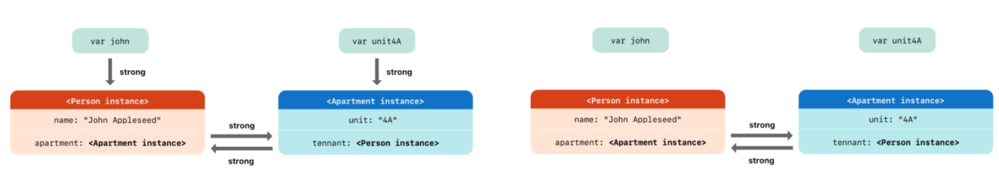

2022-02-21

---
- Swift는 “ARC(Automatic Reference Counting)”를 통해 메모리를 추적하고 관리한다.
- **참조 카운팅은 클래스의 인스턴스에만 적용된다.**

- ARC = 자동 참조 카운팅

  ✓ 인스턴스를 새롭게 생성하거나 이미 생성된 인스턴스를 다른 변수,상수, 프로퍼티에 할당할 때 참조 카운팅이 하나 증가한다. 참조 카운팅이 0이 되어야 메모리에서 해제된다.

  ✓ 상수/변수/프로퍼티에 할당될 때마다 강한 참조관계가 형성된다. (강한 참조는 참조 카운팅을 1 증가시킴)

- 강한 참조 사이클의 예시

① 클래스 인스턴스의 프로퍼티가 서로를 참조할 때

② 클로저에서 클래스 인스턴스를 참조할 때

- 예제코드
    
    ```swift
    class Person {
        var fullName: String = "Jane Doe"
        lazy var someClosure = { 
            print("print someClosure : \(self.fullName)")
        }
        deinit {
            print("Person deinit!")
        }
    }
    
    var person: Person? = Person()
    person?.fullName = "James Apple"
    person?.someClosure()
    person = nil
    ```
    

- 클래스의 새로운 인스턴스가 생성되면 인스턴스와 관련된 저장프로퍼티의 값과 함께 인스턴스 타입에 대한 정보가 메모리에 저장된다.

- **클래스 인스턴스 사이의 강한 참조 사이클**

✓ 참조한 상수나 변수, 프로퍼티에 nil을 할당하면 참조 카운팅이 -1된다.




```swift
// 이렇게 만들어주는게 강한참조를 끊어주는거네
// 좌측 이미지에서 아래 코드를 실행하면 우측이미지가 되는거임 
// 변수와 인스턴스 사이의 참조가 끊어진 걸 확인할 수 있음
john = nil
unit4A = nil
```

✓ **클래스 인스턴스 간의 강한 참조 사이클 해결하기**

`weak` 

- 참조하되 참조카운팅을 증가시키지 않음. 참조하는 값이 없을 경우 nil을 리턴함. 

- 따라서 weak는 optional로 wrapping 된다. 

`unowned` 

- 마찬가지로 참조 카운팅을 증가시키지 않음. 다른 인스턴스의 수명이 같거나 더 긴 경우 사용됨.(클래스의 관계를 봤을 때 개념적으로 포함되는 쪽에서 포함하고 있는 클래스를 unowned로 참조할 수 있음) 참조하는 값이 없을 경우 런타임 에러 발생함.

- unowned를 사용하면 “값이 무조건 있음"을 가정하는 것이기 때문에 옵셔널 값에 대한 해제를 하지 않아도 됨. (장점은 이거밖에 없는 것 같다)

- 옵셔널 참조를 unowned로 표기할 수도 있다.(Swift 5.0부터 가능) 이 경우 weak와 같은 컨텍스트에서 사용될 수 있다(=즉 weak를 사용하는 곳에 unowned optional 참조를 사용할 수 있다.)

- 초기화가 완료되면 nil이 절대 아님이 보장될 경우 암시적 언래핑된 변수/상수/프로퍼티에 unowned 를 붙일 수 있음.

example : Person 클래스와 Apartment 클래스 - Person이 Apartment 인스턴스보다 오래 살아있다.(예를 들어 아파트 명의확인 서비스라고 할 경우) 

- 클로저에 대한 강한 참조 사이클 : 클래스 인스턴스의 프로퍼티에 클로저를 할당하고(네트워크 통신후 클로저에서는 상관이 없나?), 해당 클로저 바디 내에서 ‘`self`’ 키워드를 이용해 인스턴스를 캡처하는 경우 발생함. 왜냐하면 클로저는 reference type이기 때문이다.

```swift
class Apartment {
    var brand: String = ""
    init(brand: String) { 
        self.brand = brand
    }
    deinit {
        print("Apartment is deinitialized")
    }
    
    // completion이 클로저인가? 그냥 아무 인자도 없고 아무 리턴도 없는 타입의 함수인데.
		// 내가 클로저에 대해 잘 모르는 것 같다.
    func printApartmentBrand(completion: () -> ()) {
        print("printClosureTest")
        completion()
    }
}

class Person {
    var name: String
    var apt: Apartment?
    // 이걸 호출하면 deinit 호출안됨.
    lazy var getInfo: () -> () = {
        print("\(self.name) have a '\(self.apt!.brand)' Apartment.")
    }
    
    init(name: String) {
        self.name = name
    }
    
    deinit {
        print("Person is deinitialized")
    }
    
    func changeInfo(name: String, brand: String) {
        apt!.printApartmentBrand {
            self.name = name
            self.apt!.brand = brand
            print("change apt brand name is done!")
        }
    }
}

var tomy: Person? = Person(name: "Tom")
tomy!.apt = Apartment(brand: "Green House")
tomy!.changeInfo(name: "Tomy", brand: "White House")
tomy!.getInfo()

tomy = nil
```

Swift의 메모리 구조

메모리는 4개의 영역으로 나뉜다.

코드 : 소스코드가 저장됨, read-only 형태로 저장

데이터 : 전역변수와 정적변수(static, 타입 프로퍼티?)가 저장되며 프로그램 시작과 동시에 할당되고 프로그램이 종료되야 메모리에서 해제된다, read-write

힙 : ARC에 의해 관리되는 부분이 이 부분이다. reference type(클래스, 클로저)이 저장되는 곳. 런타임에 사이즈가 결정되기 때문에 메모리 크기에 제한이 없다. 또한 가변적인 사이즈의 string, array 등이 여기에 할당된다고 함.

스택 : 함수 내부에서 사용되는 값 또는 함수 호출 시 사용하는 값(인자 등)이 저장됨. 함수 종료 시 이 값들은 메모리에서 해제됨. 컴파일 시 사이즈가 결정되기 때문에 크기에 제한이 있음.

힙과 스택은 동일한 메모리 공간을 공유함.

힙은 낮은 주소 → 높은 주소로 메모리를 사용하고 스택은 높은 주소 → 낮은 주소로 메모리를 사용함.

| Heap의 장단점 | 출처 : https://babbab2.tistory.com/25 |
| --- | --- |
| 장점 | - 메모리 크기에 대한 제한 없음
- 본질적인 범위가 전역이기 때문에, 프로그램의 모든 함수에서 액세스 할 수 있음 |
| 단점 | - 할당작업, 해제 작업으로 인한 속도 저하
- 힙 손상(이중 해제, 해제 후 사용 등) 작업으로 인한 속도 저하
- 힙 경합(두 개 이상 쓰레드가 동시에 접근하려 할 때 Lock이 걸림)으로 인한 속도 저하
- 메모리를 직접 관리해야 함(해제해주지 않을 시 메모리 누수 발생) |

| Stack의 장단점 | 출처 : https://babbab2.tistory.com/25 |
| --- | --- |
| 장점 | - CPU가 스택 메모리를 효율적으로 구성하기 때문에 속도가 매우 빠름
- 메모리를 직접 해제해주지 않아도 됨 |
| 단점 | - 메모리 크기에 대한 제한
- 지역 변수만 액세스 가능 |

아래와 같이 변수가 선언됐을 때

```swift
class ViewController: UIViewController {
	let testView = UIView()
}
```

`testView` 는 스택에 할당되고, 실제 인스턴스는 힙에 할당됨.

**GC와 RC**

— 👀 출처 : [https://babbab2.tistory.com/26?category=831129](https://babbab2.tistory.com/26?category=831129)

GC - Garbage Collection

RC - Reference Counting

둘다 모두 Heap을 관리하는 방법임.

Java의 GC와 Swift의 RC의 차이는 “참조를 계산하는 시점”이다.

|  | GC | RC |
| --- | --- | --- |
| 참조 계산 시점 | - 런타임
- 앱이 실행되는 동안 주기적으로 참조를 추적하여 사용하지 않는 인스턴스를 해제함. | - 컴파일 타임
- 컴파일 되는 시점에 자동으로 메모리 관련 코드가 삽입됨.( 출처는 여기 ) |
| 장점 | - 인스턴스가 해제될 확률이 높음(RC에 비해) | - 개발자가 참조해제 시점을 파악할 수 있음
- 런타임 시 추적이 필요하지 않기 때문에 추가 리소스 발생하지 않음. |
| 단점(장점과는 반대임) | - 개발자가 참조 해제 시점 알 수 없음
- 런타임 시 추적을 위한 추가 리소스 발생, 성능 저하로 이어질 수 있음. | - 순환 참조 발생 시 영구적으로 메모리 해제가 되지 않음 |

**MRC와 ARC**

Manual vs Automatic

Manual은 직접, 수동으로 메모리를 할당, 할당해제 하는 것을 의미하는데 2011년 이전까지는 objective-c가 이 방식으로 메모리 관리를 했다고 함. 그래서 objective-c 코드에 `retain`, `release` 라는 함수들이 있음.