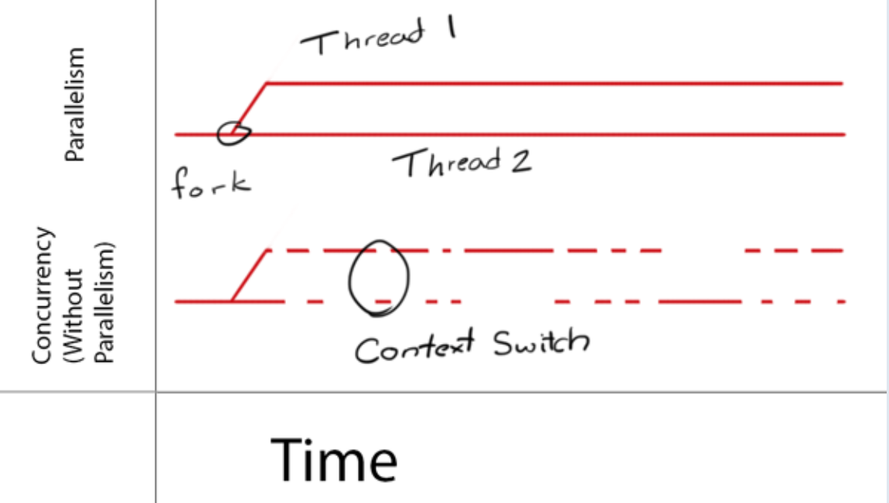
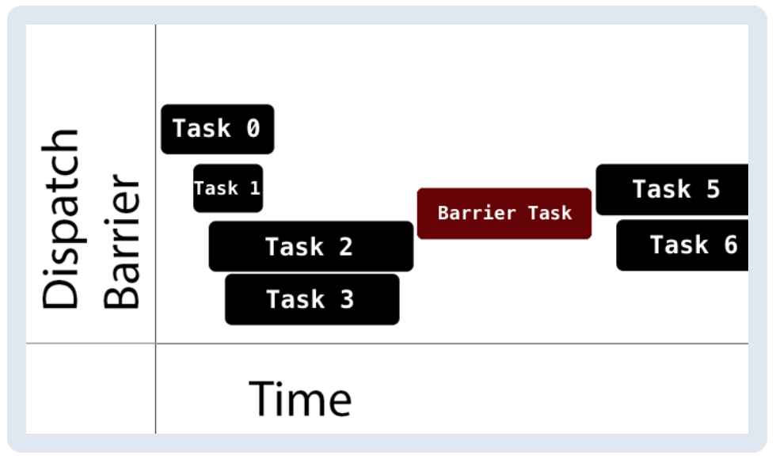

# GCD

iOS에서 멀티스레딩을 사용할 수 있도록 도와주는 것 : GCD, NSOperation  
둘의 차이는 대략적으로 다음과 같다. (출처는 [여기](https://thoonk.tistory.com/30))
- GCD는 C기반의 low-levle API이고 NSOperation은 Objective-C 기반의 high-level API이다.
- NSOperation의 특징
    - **재개, 취소, 중지 등 GCD에서 지원하지 않는 기능들**이 있다. 
    - **KVO 사용이 가능**하다. 
    - 작업 간 의존성을 만들어 순차적으로 작업이 실행되도록 만들 수도 있다. 
    - 하지만 OperationQueue에 추가된 작업은 완료전까지 대기열에 남아있으며 추가된 후 queue에서 직접 제거할 수 없다. 모든 작업이 끝나지 않은 상태에서 OperationQueue를 중지시키면 메모리 릭이 발생할 수도 있다고 한다.

그렇다고 한다. 다음에 더 자세히 보도록 하겠음. 오늘 주제는 GCD니까 GCD 먼저 공부함.

---
📝 공부한 내용을 요약하자면..  
- GCD는 DispatchQueue로부터 들어온 작업들이 어떤 스레드에서 ~~어떤 우선순위를 가지고~~ 처리되야 할지를 관리하는 `스레드 중앙 관리자`의 역할을 한다.
- DispatchQueue는 작업의 실행을 관리하는 객체다. serial하게 작업을 실행할지 혹은 concurrent하게 작업을 실행할지, sync로 처리할지 async로 처리할지, 해당 queue에 들어온 작업의 우선순위는 어떠한지를 결정한다.


## Concurrency(동시성)
- Concurrency : 동시에 여러 작업을 진행할 수 있음.
- iOS에서 프로세스는 한개 이상의 스레드로 이루어져 있음(Mutithreading)
- Single core 디바이스는 “Time-Slicing”기법을 이용해 동시성을 달성함.
    
- Parallelism은 동시성(Concurrency)을 필요로 하지만, Parallelism이 있어야만 동시성을 구현할 수 있는 것은 아니다. 위 이미지에서도 보았듯이 Single core라 할지라도 Time-Slicing 기법을 통해 동시에 여러 작업이 진행되는 것처럼 보이도록 만들 수 있음.

## GCD(Grand Central Dispatch)
- **동시성 작업(concurrent operations)**을 관리하기 위한 low-level API이다.
- GCD는 스레드들의 위에 만들어지며(스레드들의 가장 상위에 있는 존재), 내부적으로 공유된 스레드 풀을 관리한다.
- 코드 블럭이나 작업 항목이 DispatchQueue에 추가되면, **GCD는 queue에 추가된 작업들을 어떤 스레드에서 수행할지 결정**한다.
- DispatchQueue에 제출된 작업들은 FIFO의 순서로 처리된다. 이를 통해 queue에 추가된 작업들의 시작 순서가 보장됨을 알 수 있다.
- GCD의 장점은
    - Thread-safe(여러 스레드에서 동시에 접근해도 문제 없이 프로그램이 실행됨)
    - GCD의 장점을 체감하기 위해서는 DispatchQueue가 코드의 일부분에 thread-safe를 제공하는 방법을 이해해야 한다.
    - 이를 위해 올바른 종류의 DispatchQueue를 선택해야하고, Queue에 작업을 제출할 때 사용할 올바른 dispatching API를 선택하는 것이 중요하다.

### DispatchQueue의 종류 : serial과 concurrent

- queue는 serial하게 동작하도록 만들 수도 있고, concurrent하게 동작하도록 만들수도 있다.
    - serial : 여러 개의 작업을 처리해야할 경우, **한번에 하나씩** 처리하는 것
    - concurrent : 여러 개의 작업을 처리해야할 경우, **한번에 여러개** 처리하는 것
- queue는 작업이 queue에 추가된 순서대로 시작되는 것을 보장한다.
- 다른 작업이 시작되는 시점이나, 작업이 겹칠 때 다른 코어에서 실행시킬지, context switch를 통해 이를 실행시킬지 등을 결정하는 것은 모두 GCD의 몫이다. (따라서 이 시점을 명확하게 캐치할 수 없고 이런 특성들을 개발에 활용할 수 없음.)
- Queue의 타입은 3종류가 있다.
    - `MainQueue` 
        - 메인 스레드에서 실행, serial
        - **전체 시스템에 의해 공유되는 concurrent queue**이다. 
    - `GlobalQueue` 
        - 백그라운드 스레드에서 실행
        - **전체 시스템에 의해 공유되는 concurrent queue**이다. 
        - global queue는 4개 존재하는데 서로 우선순위가 다르다.  
        우선순위 : `high`, `default`, `low`, `background`(시스템에 미치는 부정적인 임팩트들을 최소화하기 위해 I/O 작업들이 조절*throttled*됨)
    - `CustomQueue` 
        - 개발자가 생성할 수 있음. 
        - 백그라운드 스레드에서 실행
        - serial/concurrent 선택해서 만들 수 있음.

### 작업의 우선순위
- GlobalQueue에 작업을 추가할 때(보낼때, dispatch할 때) 위에서 언급된 우선순위를 다이렉트로 지정하면 안됨.   
- 대신 QoS(Quality of Service) 클래스를 이용해야한다.   
QoS는 작업의 우선순위를 나타내며, GCD가 작업에 우선순위를 결정할 때 가이드를 제공한다.
- QoS의 종류
    - User-Interactive
        - 좋은 UX를 위해 **즉시 완료되야 하는 작업인 경우** 이를 사용함. 
        - 시스템에서 가장 높은 우선순위를 가지고 있다.
        - UI업데이트, 애니메이션, 이벤트 핸들링 등의 작업.
    - User-Initiated
        - **UI를 통해 사용자가 비동기 작업을 시작한 경우**에 사용함. 
        - 사용자가 즉각적인 결과를 기다리거나 기다리는동안 interaction이 계속되야 하는 작업일 경우 사용함. 
        - GlobalQueue에 추가되며 우선순위는 `high`다.
    - Utility
        - `userInteractive` `unserInitiated` `default` 다음 단계의 우선순위다.
        - 일반적으로 사용자가 볼 수 있는 진행률이 표시되는 Long - running 작업에 사용됨. 
        - 연산, I/O, 네트워킹, 지속적인 데이터 피드(?) 및 유사한 작업에서 사용된다. 
        - 에너지 효율적으로 디자인되었으며, GlobalQueue에 추가됨. 우선순위는 `low`다.
    - Background
        - 사용자가 직접 인식하지 못하는 작업에 유용함. 
        - prefetching이나 interaction이 필요하지 않은 경우, 시간에 민감하지 않은 작업일 경우에 사용함. 
        - GlobalQueue에 추가되며 우선순위는 `background`이다.
    - [DispatchQoS](https://developer.apple.com/documentation/dispatch/dispatchqos)  
        `userInteractive` `unserInitiated` `default` `utility` `background` `unsepcified`
        
    

### DispatchQueue에 제출된 작업의 동작유형 : sync와 async

- DispatchQueue에 제출되는 작업들은 모두 `DispatchWorkItem` 타입이다.
- GCD를 사용하면 작업을 queue에 추가(dispatch)할 때 동기로 수행할지 비동기로 수행할지 결정할 수 있다.
    - `DispatchQueue.sync(execute:)`  
    제출된 작업을 동기로 수행한다. 즉, 작업이 모두 끝날 때까지 기다렸다가 끝나고 난 이후 caller에게 컨트롤이 돌아감.
    - `DispatchQueue.async(execute:)`  
    제출된 작업을 비동기로 수행한다. 즉, 작업이 시작될 수 있도록만 하고 바로 caller에게 컨트롤이 돌아감. 따라서 현재 thread가 다음 함수를 수행하는 것을 block 하지 않는다.

### 어디에서 async를 사용할까?
- MainQueue에 async 사용하기  
concurrent queue 안에서 작업이 끝나고 UI를 업데이트해야할 경우 자주 사용된다.
- GlobalQueue에 async 사용하기  
백그라운드에서 UI 작업이 없는 작업을 수행할 때
- Custom Serial Queue에서 async 사용하기  
백그라운드에서 작업을 serial하게 수행할 때. 이렇게 하면 serial의 특정 상 한번에 하나의 작업만 수행하기 때문에 resource contention, race condition 문제를 제거할 수 있음.

### DispatchQueue를 이용해 실행을 delay 시킬수도 있다.

- `DispatchQueue.main.asyncAfter(deadline:)`
- Timer를 사용할 수도 있지만 아래와 같은 Timer의 특징을 고려해야함.
    - 실제 실행하는 메소드가 Timer를 정의한 부분과 떨어져 있어 가독성 떨어짐.
    - Timer는 특정 시간 간격마다 어떤 작업이 반복되야 하는 경우 유용함.
    

## Singleton 관리하기
- 싱글톤은 프로그램의 여러 곳에서 “동시에” 접근이 가능하기 때문에 thread-safe하지 않다.
- thread-safe한 코드는 앱 크래시나 data corruption 등의 문제를 야기하지 않으면서 여러 thread나 concurrent task에서 안전하게 호출할 수 있다.
- thread-safe하지 않다면 한번에 하나의 컨텍스트에서만 실행되야 하는데 그렇게 되면 싱글톤을 사용할 이유가 없음.
- Swift에서 싱글톤 객체를 만드는 방법은 아래와 같은데 이렇게 만들어지기 때문에 싱글톤 객체를 초기화할 때는 thread-safe하지 않음으로 인해 발생하는 문제가 없다.
    - 싱글톤 상수를 static으로 생성
    ```Swift
    static let shared = SomeObject() /// 다른 스레드에서 접근하기 전에 이미 생성됨
    ```
    - 이니셜라이저를 private으로 생성
    ```Swift
    private init() {  } /// 외부에서 초기화할 수 없음.
    ```
- 문제는 싱글톤이 가지고 있는 공유 자원(`var`로 선언된 변수들)을 읽거나 쓸때 발생한다. 
- 여러 스레드에서 동시에 특정 자원을 “읽는"것은 큰 문제를 야기하지 않는다. 하지만 **어떤 스레드에서 특정 자원을 “읽고"있는데 다른 스레드에서 특정 자원을 “쓰고(수정하고)"있다면** 이는 큰 문제다.

### GCD의 Dispatch Barrier
- 위의 문제를 해결하기 위해 GCD는 Dispatch Barriers라는 것을 제공한다.
- Barriers는 장벽이라는 의미다.
- Dispatch Barriers 사용하는 방법
    - DispatchQueue에 DispatchWorkItem(이하 작업)을 제출할 때 플래그로 “barrier”를 설정한다.
    - 해당 플래그의 의미  
        - 특정 시간동안 지정된 Queue에서 실행되는 유일한 항목임을 나타냄.
        - 즉, barrier 플래그가 달린 작업 전에 제출된 모든 작업들은 barrier 작업이 실행되기 전 반드시 종료되야 하고 barrier 작업이 진행되는 동안 다른 작업이 진행되면 안된다는 의미임.
    - barrier 플래그가 달린 작업이 실행될 순서가 되면, 해당 작업이 실행되고 그 시간동안 queue는 다른 어떤 작업도 실행하지 않음이 보장된다.
- 어떤 queue와 함께 사용하는게 좋을까?
    - global queue는 전체 시스템에서 공유되는 자원이기 때문에 사용 시 주의가 필요하다.
    - custom serial queue는 이미 serial이기 때문에 barrier 플래그를 사용하면 serial이란 특성이 중복된다.
    - custom concurrent queue에서 barrier 플래그를 사용하는게 가장 적절함.
    
- Dispatch Barrier의 동작 방식
