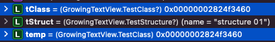

2022-02-17

---
## **[Optional](https://bbiguduk.gitbook.io/swift/language-guide-1/the-basics#optionals)**

- optional : 선택적

- 값이 있을 수도 있고 없을 수도 있다. 

- `nil` : 값이 없음을 나타냄

- 옵셔널 타입의 값을 사용하기 위해서는 `언래핑`이 필요하다. 언래핑은 옵셔널 변수/상수 뒤에 !와 함께 쓰이며, 값이 있는지 없는지 체크하지 않고 강제로 값을 꺼내어 쓴다. 만약 강제 언래핑을 했는데 값이 없을 경우 런타임 에러가 발생한다. 

- `옵셔널 바인딩` 옵셔널이 값을 가지고 있는지 확인하고 만약 있다면 이를 임시 변수/상수에 바인딩 시켜 안전하게 사용할 수 있도록 해준다.

[옵셔널 바인딩 예제 코드]

```swift
import Foundation

// class의 경우 reference type이기 때문에 
// 임시 변수/상수에 할당 후 이를 수정하더라도 원본에 변경사항이 반영된다.
class TestClass {
    var name: String = ""
    init(name: String) {
        self.name = name
    }
}

// structure의 경우 value type이기 때문에 
// 임시 변수/상수에 할당 후 이를 수정하면 임시 변/상수에만 수정사항이 반영될 뿐 원본은 그대로이다.
struct TestStructure {
    var name: String = ""
}

let tClass: TestClass? = TestClass(name: "class 01")
let tStruct: TestStructure? = TestStructure(name: "structure 01")

// reference type의 경우 임시 "상수"로 선언 후 클래스의 프로퍼티를 수정하더라도 메모리주소값은 그대로이기 때문에 
// 아래 코드는 이상없이 동작함.
if let temp = tClass {
    temp.name = "class 02"
    print("type of temp: \(type(of: temp))")        // TestClass
    print("type of tClass: \(type(of: tClass))")    // TestClass?
    print("temp class name is \(temp.name)")        // "class 02"
    print("original class name is \(tClass!.name)") // "class 02"
} else {
    print("tClass is nil")
}

print("================")
// value type의 경우 값 자체가 복사되기 때문에 구조체의 프로퍼티 수정이 필요하다면 반드시 임시 "변수"를 만들어야함.
if var temp2 = tStruct {
    temp2.name = "structure 02"
    print("type of temp2: \(type(of: temp2))")        // TestStructure
    print("type of tStruct: \(type(of: tStruct))")    // TestStructure?
    print("temp struct name is \(temp2.name)")        // "structure 02"
    print("original struct name is \(tStruct!.name)") // "structure 01"
} else {
    print("tStruct is nil")
}
```

클래스의 경우 디버깅을 통해 tClass와 temp의 주소가 같음을 직접 확인했지만 Structure는 메모리 주소가 찍히지 않아 직접 확인할 수 없었다. 조금 찾아보니 withUnsafePointer 메소드를 통해 주소를 확인해볼 수 있다고 하지만 Swift에서 포인터의 개념과 메모리 구조, inout 변수에 대한 개념들이 부족하기 때문에 우선은 여기까지만 하고 넘어간다.



- 암시적으로 언래핑하기 

간혹 개발을 하다보면 옵셔널 값을 처음 설정한 후 항상 값을 갖고 있는 것이 분명한 경우가 있다. 이 경우 “항상 값이 있다"고 가정할 수 있기 때문에 값을 사용할 때마다 확인하고 사용할 필요는 없다. 

이 경우 “암시적으로 언래핑된 옵셔널"을 활용할 수 있다. → 타입을 선언할 때 `타입!` 형태로 선언함.

   내부적으로는 옵셔널이지만 해당 값에 접근할 때 옵셔널이 아닌 값처럼 사용할 수 있다.

암시적으로 언래핑된 옵셔널 역시 강제언래핑, 옵셔널 바인딩 사용 가능하다.

```swift
// 암시적으로 언래핑된 옵셔널
let optStr: String? = "Hi~"
print("type of 'optStr' is \(type(of: optStr))")     // String?
let implicitStr: String! = "안녕하세요 :)"
print("type of 'implicitStr' is \(type(of: optStr))")// String?
print("=============")

// 옵셔널인 'optStr'은 강제 언래핑을 해줘야지만 String 타입의 상수에 할당될 수 있음.
let optStr2: String = optStr!
print("type of 'optStr2' is \(type(of: optStr2))")           // String

// 암시적으로 언래핑된 옵셔널 타입인 'implicitStr'은 우선 기존의 옵셔널 값을 사용하려함.
// 하지만 상수의 타입이 이미 "String"으로 명시되어 있기 때문에 옵셔널 값을 사용할 수 없음.
// 이 경우 강제로 언래핑 함.
let implicitStr2: String = implicitStr
print("type of 'implicitStr2' is \(type(of: implicitStr2))") // String

// 만약 아래와 같이 할당할 변수의 타입이 지정되지 않은 경우라면 
// 옵셔널 값을 사용할 수 있기 때문에 아래 상수의 타입은 String?이 됨.
let implicitStr3 = implicitStr
print("type of 'implicitStr3' is \(type(of: implicitStr3))") // String?

print("=============")
print("\(optStr!)👋") // 강제언래핑 안해주면 "Optional("Hi~")👋" 이렇게 나옴.
print("\(implicitStr2)👋")
```

## **[Optional Chaining](https://bbiguduk.gitbook.io/swift/language-guide-1/optional-chaining)**

- 옵셔널들(프로퍼티, 메소드, 서브스크립트 등)을 서로 연결시켜 값을 조회하는 프로세스
   (nil이 아닌 타입들도 체인에 연결시킬 수 있다)

- 전체 체인에 포함되는 옵셔널들이 모두 값을 가지고 있다면 해당 체인은 값 호출에 성공하지만, 하나라도 nil이 있을 경우 값 호출에 실패하고 nil을 리턴한다.

- 강제 언래핑의 대안이 된다. 옵셔널 값 뒤에 `?` 를 붙임으로써 optional chaing을 지정할 수 있음. nil일 때 런타임 에러가 발생하는 강제 언래핑과 달리 옵셔널 체이닝은 nil을 반환한다.

- optional chaning을 통해 값 호출을 성공하더라도(따라서 값이 존재하더라도) 항상 옵셔널로 래핑되서 리턴된다. 

- 값을 호출할 때 뿐만 아니라 값을 설정할 때도 옵셔널 체이닝을 활용할 수 있다.

```swift
//: [Previous](@previous)

import Foundation

class Person {
    var residence: Residence?
}

class Residence {
    var address: Address?
    var rooms: [Room] = []
    var numberOfRooms: Int {
        return rooms.count
    }
    subscript(i: Int) -> Room {
        get {
            return rooms[i]
        }
        set {
            rooms[i] = newValue
        }
    }
    func printNumberOfRooms() {
        print("The number of rooms is \(numberOfRooms)")
    }
}

class Room {
    let name: String
    init(name: String) { self.name = name }
}

class Address {
    var buildingName: String?
    var buildingNumber: String?
    var street: String?
    func buildingIdentifier() -> String? {
        if let number = buildingNumber, let street = street {
            return "\(number) \(street)"
        } else if buildingName != nil {
            return buildingName
        } else {
            return nil
        }
    }
}

let john = Person()

/// Residence 생성 후 코드를 실행하려면 아래 주석해제
//let johnsHouse = Residence()
//johnsHouse.rooms.append(Room(name: "Living Room"))
//johnsHouse.rooms.append(Room(name: "Kitchen"))
//john.residence = johnsHouse

print(john.residence) // 아직 residence에 값을 넣지 않았기 때문에 nil임.

// 옵셔널 체이닝에서 'residence'가 nil이므로 아래 접근은 실패하게 되고 따라서 else 부분이 실행됨
if let roomCount = john.residence?.numberOfRooms {
    print("john's residence has \(roomCount) room(s).")
} else {
    print("Unable to retrive the number of rooms.")
}

func registerAddress() -> Address {
    print("registerAddress called!")
    
    let someAddress = Address()
    someAddress.buildingNumber = "29"
    someAddress.street = "Acacia Road"
    
    return someAddress
}

// registerAddress()가 정상적으로 호출됐다면 "registerAddress called!"라는 문구가 찍혀야 하는데
// residence가 nil이기 때문에 옵셔널 체이닝 실패하면서 registerAddress()도 호출되지 않았고 그 결과 아무것도 찍히지 않음.
john.residence?.address = registerAddress()

// 옵셔널 체이닝을 통해 값을 가져올 경우 값이 있더라도 옵셔널로 래핑되서 리턴된다고 했음.
// 따라서 printNumberOfRooms() 호출 시 반환 값은 빈 튜플이 아닌 '빈 튜플의 옵셔널' 형태가 됨(즉, nil이 리턴될 수 도 있다는 의미임)

// ✋ 리턴이 없는 함수인데 리턴 값이 있다?
//    반환타입이 지정되지 않은 함수들도 암묵적으로 Void라는 반환타입을 가지고 있으며, 빈 튜플을 리턴한다.

// 아래 옵셔널 체이닝을 보면 아직까지 residence가 nil이기 때문에 값 호출에 실패하게 되고, 따라서 "fail print the number of room"이 찍힘.
if john.residence?.printNumberOfRooms() != nil {
    print("success print the number of room")
} else {
    print("fail print the number of room")
}

// 옵셔널 체이닝을 통해 프로퍼티의 값을 설정할 수 있는데 이 경우도 바로 위에 있는 조건문과 유사하게 사용할 수 있다.
// 마찬가지로 여기도 residence가 nil이기 때문에 프로퍼티 접근에 실패 -> "fail to set the address."가 찍힘.
let someAddress = Address()
if (john.residence?.address = someAddress) != nil {
    print("success to set the address.")
} else {
    print("fail to set the address.")
}

// 서브스크립트와 옵셔널 체이닝 사용 예
// 복잡하게 이것저것 많지만, 핵심은 옵셔널 타입 바로 뒤에 ?를 추가하는 것이다.
if let firstRoomName = john.residence?[0].name {
    print("The first room name is \(firstRoomName).")
} else {
    print("Unable to retrieve the first room name.")
}
// Dictionary에서 사용되는 서브스크립트는 해당 key에 매칭되는 value가 없을 수 있기 때문에 value가 항상 옵셔널로 리턴된다.
// 따라서 dictionary의 서브스크립트에서 옵셔널 체이닝을 활용할 경우
// 옵셔널로 리턴되는 testScores[key] 뒤에 물음표를 붙여 접근해야한다.
var testScores = ["Dave": [86, 82, 84], "Bev": [79, 94, 81]]
print("\n\ntestScores['Dave'] : \(testScores["Dave"])") // Optional([86, 82, 84])

testScores["Dave"]?[0] = 91
testScores["Bev"]?[0] += 1
testScores["Brian"]?[0] = 72
// the "Dave" array is now [91, 82, 84] and the "Bev" array is now [80, 94, 81]
```