# WWDC21: Protect mutable state with Swift actors

[WWDC21: Protect mutable state with Swift actors](https://developer.apple.com/videos/play/wwdc2021/10133/)

<br>

concurrent program을 작성하며 어려운 것 중 하나는 data race 문제를 피하는 것이다. data race란 멀티스레드 환경에서 어떤 공유 자원에 두개 이상의 스레드가 동시에 접근할 때 발생하며, 이때 적어도 한 스레드에서 해당 공유자원에 쓰기 작업을 진행할 때 발생하게 된다. 이로 인해 crash가 발생하거나 data corruption(데이터 손상)이 발생하게 된다. 

<br>
<br>

## Data Race가 발생하는 상황
아래는 예시코드이다. Detached Task를 두개 만들고, 두 Task에서 각각 increment() 메소드를 호출한다.   
결과가 1, 2 또는 2, 1로 나올거라 예상할 수 있지만 실제 실행해보면 1, 1 또는 2, 2로 결과가 나올 수 있다.

<p align="center">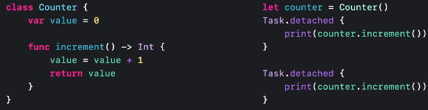</p>   

<br>

## Data Race가 발생하는 이유: Shared mutable state
data가 변경될 수 없거나 여러 concurrent task 사이에서 공유되지 않는다면 data race가 발생하지 않는다.

data race를 피하는 한가지 방법은 <u>value semantic을 이용해 immutable한 데이터를 사용하는 것</u>이다. value type의 변수들을 사용하면 모든 mutation은 로컬이다. 게다가 value semantic type의 “let” 프로퍼티들은 완전히 immutable하다. 그래서 서로 다른 concurrent task에서 접근해도 안전하다.

<br>
<br>

그럼 value-sematic을 이용해 위 Counter 증가 예제를 개선시켜보자.

class였던 `Counter`를 struct로 변경했다.   
let 이었던 `counter`는 var로 변경했는데 struct 타입은 그래야만 값 수정이 가능하기 때문이다. 

하지만 이렇게되면 우리는 또다시 race condition을 마주하게 된다. 왜냐하면 counter가 두 concurrent task에서 모두 참조되기 때문이다.

<p align="center">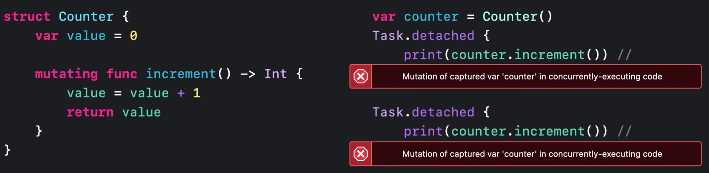</p>   

<br>

🤔  근데 어떻게 컴파일러가 data race를 잡을 수 있는걸까? 

그건 detached의 definition을 보면 알 수 있다. operation 매개변수의 정의부분을 보면 `@Sendable` 이 붙어있는걸 볼 수 있는데 지난 WWDC 영상(Explore structured concurrency in Swift)에서 언급한 것처럼 `@Sendable`은 클로저에서 mutable한 변수를 캡처링하지 못하도록 제한하기 때문이다.

```Swift
public static func detached(priority: TaskPriority? = nil, operation: @escaping @Sendable () async -> Success) -> Task<Success, Failure>
```

>`@Sendable` 클로저는 해당 클로저가 선언된 컨텍스트 내에서 mutable한 변수를 캡처링 하는 것이 제한된다. 왜냐하면 그런 변수들은 task가 실행되고 난 후 수정되어질 수 있기 때문이다.

<br>

아래와 같이 각 Task 별로 local 변수를 두면 어떨까? 이제 data race 문제는 발생하지 않는다. 

<p align="center">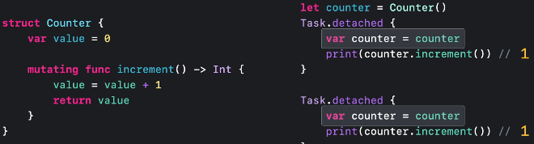</p>   

다만, 결과는 둘다 1로 나올 것이다. 왜냐하면 <u>Counter 인스턴스가 두 Task 사이에서 공유되지 않기 때문</u>이다. 즉, data race가 발생한다 하더라도 우리는 공유된 mutable state가 필요하다는 것이다.

<br>
<br>

## Shared mutable state in concurrent programs
Shared mutable state는 synchronization을 필요로 한다. 이러한 기능을 제공하는 기본 요소가 있는데 아래와 같다. 
- Atomics
- Locks
- Serial dispatch queues

모두 각자의 특성이 있다. 다만, 이것들은 모두 치명적인 약점을 가지고 있다. 정확하게 사용하기 위해서는 매우 신중해야하며, 그렇지 않으면 data race로 끝나게 된다는 것이다. 

즉, 위의 방법들을 사용한다 하더라도 data race가 발생할 가능성이 여전히 존재한다는 것이다. 바로 이런 점 때문에 Actor가 만들어지게 됐다.

<br>
<br>

## 🥳 Actor
Actor는 shared mutable state를 위한 syncrhonization(이하 동기화) 매커니즘이다. Actor는 자기가 가진 state를 자신을 제외한 나머지 프로그램으로부터 고립(isolate)시킨다. <u>Actor가 가지고 있는 state에 접근하기 위해서는 오직 그 state를 가지고 있는 Actor를 이용해야만 한다.</u> 

Actor를 이용할 때 Actor의 동기화 매커니즘은 다른 코드가 **동시에 Actor의 state에 접근하지 못하도록** 막는다.

이러한 보장은 lock이나 serial dispatch queue를 수동으로 사용하는 것과 동일한 mutual exclusion property를 제공한다. 차이가 있다면 Actor의 경우 Swift에서 이를 기본으로 보장한다는 것이다. 

Actor는 Swift의 타입으로 class와 유사하다. 속성, 메소드, 이니셜라이저나 서브스크립트를 가질 수 있으며 extension이나 protocol 사용도 가능하다. 또한 reference type이다. 왜냐하면 Actor가 만들어진 목적 자체가 mutable state를 'share' 하는 것이기 때문이다.

class와 차이가 있다면 Actor는 자신의 instance data를 외부로부터 고립시킨다는 것과 데이터에 대한 동기화된 접근을 보장한다는 것이다.

<br>

위에서 봤던 Counter 예제로 돌아가보자.

<p align="center">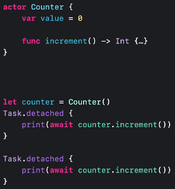</p>   

- Counter를 actor로 선언하면, <u>하나의 increment() 호출이 종료되고 나서 다른 하나가 시작됨을 actor의 내부 동기화 메커니즘이 보장</u>한다. 이후 결과는 우리가 예상했던 대로 나오게 된다.

- `counter.increment()` 앞에 await가 붙은 이유는 하나의 Task가 actor와 상호작용 하는 동안 다른 Task는 대기하고 있어야 하기 때문이다.

<br>
<br>

이제 Counter 예제를 조금 더 확장해보자.

<p align="center">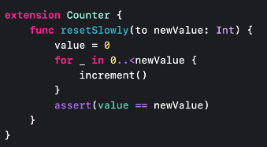</p>   

- extension으로 새로운 메소드를 추가했다. value를 0으로 초기화하고 매개변수로 들어온 newValue만큼 반복을 돌며 값을 추가시키는 로직이다.
- extension이기 때문에 해당 메소드에서는 value property에 접근할 수 있다.
- 동기적으로 actor에 있는 다른 메소드를 호출할 수 있다.(increment()와 같은)    
actor 안에 있는 메소드에서 또 다른 actor 내부 메소드를 호출할 때에는 `await`이 필요하지 않은데 그 이유는 이미 우리가 actor에서 실행되는 것을 알고 있기 때문이다.
- actor는 한번에 하나의 execution만 접근해서 실행되므로 기다림(await)이 필요치 않은 것이다. 이것은 actor의 중요한 속성이다. <u>actor의 동기 코드는 중단 없이 항상 완료될 때까지 실행된다.</u>

<br>
<br>

## Actor reentrancy(재진입)
actor는 종종 서로 혹은 비동기 코드와 interact할 수 있다. 비동기 코드와 actor에 대해 한번 보도록 하자. 그 전에 Counter 예제보다 더 좋은 예제가 있다.

<p align="center">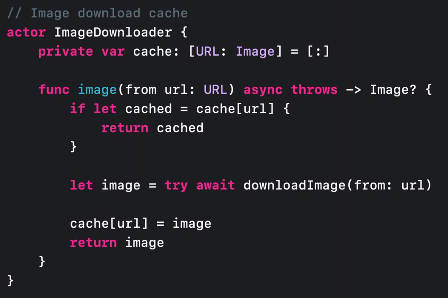</p>   

- ImageDownloader가 actor이기 때문에 이 코드는 `low-level data race`로부터 안전하다. 어떤 수의 이미지라도 동시에 다운로드 받을 수 있다.

- actor는 한번에 하나의 execution만 자신의 프로퍼티에 접근하도록 하기 때문에 cache 데이터가 corrupted될 가능성은 없다.

- 위 코드의 await 부분을 보자. await이 있다는 것은 함수가 이 시점에 suspend될 수 있다는 것을 의미한다. 프로그램의 다른 코드가 실행될 수 있도록 CPU를 포기하여 전체 프로그램 상태에 영향을 준다. 함수가 resume 되는 시점에 전체 프로그램 상태가 변경되어있을 수 있다. 따라서 <u>await 이전의 상태가 await 이후에도 동일할 것이라는 가정을 해서는 안된다.</u>

<br>

👀 위 코드를 염두에 두고, 아래 상황을 상상해보자.
```Swift
url 주소 = "aaa.com/cat-image" // 실제 이미지는 우측 이모지와 같다.😻

Task 1: 해당 url이 캐싱되어 있는지 확인 후 이미지 다운로드 시작(await)

Task 2: (아직 해당 url로 캐싱되어 있는 데이터 없으므로, 위 코드 line 5) 이미지 다운로드 시작(await)

Task 1: 이미지 다운로드 완료 😻

그 사이에 이미지가 변경됐음. 😻 → 🙀

Task 1: 캐싱하고 returning

Task 2: 이미지 다운로드 완료 🙀

Task 2: 캐싱하고 returning
```
이런 경우 예상치 못한 문제가 발생하는 것이다. 

low-level data race는 발생하지 않았지만 await 이전과 이후의 state가 같을 것이라는 가정때문에 잠재적인 버그로 함수가 만들어졌다.

이를 고칠려면 await이후 우리의 가정을 한번더 체크하면 된다. 이미지를 다운로드 받은 후 아래 코드를 추가해준다.
```Swift
cache[url] = cache[url, default: image]
```

<br>

### Reentracy를 고려하여 잘 설계하려면,
- Perform mutation in synchronous code

    actor state의 mutation(변경)을 동기 코드에서 실행해야 한다. 이상적으로, 동기 함수 안에서 실행함으로써 모든 state 변경이 잘 캡슐화되도록 만든다.
    
- Expect that the actor state could change during suspension
    
    상태 변경은 일시적으로 actor를 일관성 없는 상태로 만든다. await 전에 일관성을 복원해야 한다?
    
- Check your assumption after an `await`
    
    await는 잠재적인 suspension point임을 명심해야 하며, <u>actor의 state는 suspension 동안 변경될 수 있음을 예상하고 있어야 한다.</u> global state, clock, timer, actor에 대한 가정들은 await 이후 반드시 한번 더 체크되어야 한다.

<br>
<br>

## Actor isolation
`actor isolation`은 actor type의 가장 기초적인 behavior다. 직전까지는 actor 외부에서 발생하는 비동기 코드와의 interaction에 대해서 봤는데 이번 챕터에서는 protocol 채택, 클로저, 클래스를 포함한 다른 language 특징들과 actor isolation의 interact에 대해 살펴볼 것이다.

<br>

### Protocol
<p align="center">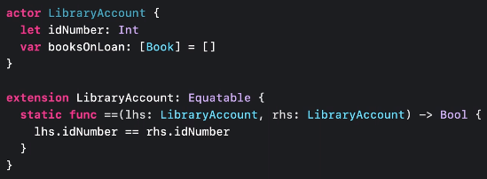</p>   

actor도 다른 named type과 동일하게 프로토콜을 채택할 수 있다.

위 코드는 Equatable 프로토콜을 채택한 actor에 대한 코드이다. `==` 메소드는 static이고 내부적으로 self를 사용하지 않았기 때문에 <u>actor 안에 고립되어 있지 않다.</u>

대신에 lhs, rhs라는 actor type의 매개변수가 2개 있으며, 이 static 메소드는 lhs, rhs 매개변수의 밖에 있다. (Instead, we have two parameters of actor type, and this static method is outside of both of them.)

비록 `==` 메소드가 비록 매개변수로 들어온 인스턴스의 외부에 위치하지만 둘 다 `idNumber` 라는, actor의 immutable한 상태에만 접근하기 때문에 괜찮다.

<br>

이번에는 Hashable 프로토콜을 채택해보도록 하겠다.

<p align="center">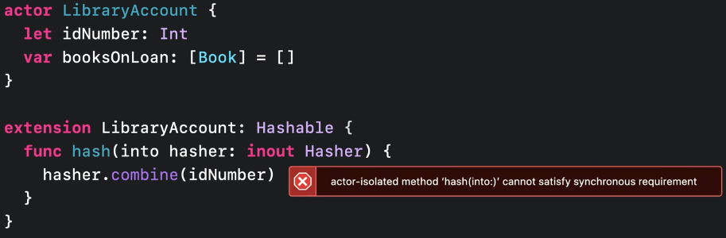</p>   

위와 같이 컴파일 에러가 발생하는 것을 볼 수 있다.

왜 이런 에러가 발생하는걸까? Hashable을 이런 식으로 구현하는 것은 이 function이 actor의 바깥에서 호출될 수 있다는 의미인데 `hash(into:)`는 async가 아니기 때문에 actor isolation을 유지할 방법이 없다.

→ 바깥에서 호출될 수 있다는 말은 여러 Task에서 동시에 호출될 수 있다는 의미도 내포하고 있다. 이때 한 개를 제외한 나머지 Task는 기다려야 하기 때문에 `await  hasher.combine(idNumber)` 이렇게 코드를 작성해야 한다. 그런데 await 키워드는 async 메소드 내에서만 사용할 수 있기 때문에 "actor isolation을 유지할 방법이 없다"고 언급한 것으로 보인다.

이를 수정하기 위해서는 `func hasn(into:)` 앞에 `nonisolated` 키워드를 붙여준다. 이 키워드는 해당 메소드가 비록 문법적으로 actor 안에 정의되어 있지만, actor 바깥쪽에 있는 것처럼 다뤄진다는 것을 의미한다.

`nonisolated` 메소드가 actor 외부에 있는 것처럼 다뤄지기 때문에 actor 안에 있는 mutable state를 참조할 수 없다. (그럼 actor 안에 있는 immutable state는 참조할 수 있나? ㅇㅇ 가능하다고 함.)

actor 외부에서 actor의 mutable state에 접근하는 것은 data race를 허용하는 것이기 때문에 컴파일러는 에러를 보여줄 것이다. 간단하게 테스트하여 오류가 발생함을 확인했다.
```Swift
actor LibraryAccount {
    let idNumber: Int
    var bookName: String
    
    init(idNumber: Int, bookName: String) {
        self.idNumber = idNumber
        self.bookName = bookName
    }
}

let account = LibraryAccount(idNumber: 124, bookName: "Hello")
print(account.bookName)  // Error: Actor-isolated property 'bookName' can not be referenced from a non-isolated context
```
<br>

여기까지가 프로토콜과 관련된 이야기였다. 이제 클로저와 actor에 대해 얘기해보자.

<br>
<br>

###  Closures
클로저 역시 함수와 비슷하게 actor-isolated가 될 수도 있고 nonisolated가 될 수도 있다.

<p align="center">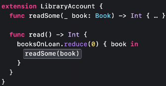</p>   

`readSome` 메소드에는 await 키워드가 없다는 것을 참고해라. 왜냐하면 “read” 함수 내에서 형성되는 클로저 자체가 actor-isolated 함수이기 때문이다.

<br>

<p align="center"></p>   

detached task는 actor가 수행하는 다른 작업과 동시에 클로저를 실행한다. (자신이 정의되어 있는 컨택스트로부터 어떠한 것도 상속받지 않으며, lifetime도 별도임) 

따라서 해당 클로저는 actor의 context 안에 있을 수 없거나 data race가 발생할 수 있다. 따라서 이 클로저는 actor에 isolated되어 있지 않다.

<br>
🤔  번외

self-contained : 메모리가 값 자체를 스스로 다 가지고 있다는 관점에서 해석할 수도 있을 것 같다. 영상의 내용을 듣다보니 문득 든 생각..

<br>
<br>

### Data
LibraryAccount 예제에서 **변수**(var)였던 Book의 타입을 생각해보자.

만약 value type이라면 library account actor 인스턴스의 모든 상태가 self-contained이기 때문에 book이 필요하면 깊은 복사를 하게 될 것이고 여기에 대한 변화가 다른 곳까지 영향을 미치지 않는다.

<p align="center">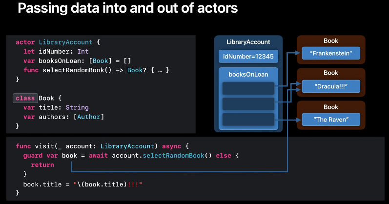</p>   

<br>
<br>

하지만 만약 class라면 어떨까? 이제 LibraryAccount actor는 book class의 인스턴스를 참조하게 됐다. 이것 자체는 문제가 아니다. 그러나 actor에 정의된 `selectRandomBook() → Book?` 메소드를 호출하게 되면 어떨까? 이제 actor 외부에 actor의 mutable state에 대한 참조가 생길 것이고 이는 잠재적으로 data race가 발생할 수 있다.

value 타입이라면 concurrently하게 사용하는 것에 문제가 없겠지만 class와 같은 reference 타입이라면 문제가 발생할 것이다. → 그래서 이에 대한 대안으로 `Sendable`이라는 타입을 만들었다. concurrently하고 안전하게 사용할 수 있다.

<br>

### Sendable
- Sendable types are safe to share concurrently
    
    actor 간 concurrent하게 공유하기 안전한 타입이다. 한 곳에서 다른 곳으로 값을 복사하면 서로 간의 간섭없이 <u>양 쪽 모두 안전하게 값의 복사본을 수정</u>할 수 있다.

- Sendable에 해당하는 것들
    - Value types
        - struct일 경우 내부적으로 가지고 있는 프로퍼티가 모두 Sendable해야 함.
    - Actor types(왜냐하면 자신이 가지고 있는 mutable state에 대한 액세스를 동기화하기 때문)
    
    - Classes는 `Sendable`할 수 있다.
        - 클래스 및 해당 클래스의 서브클래스들이 오로지 immutable data만 가지고 있다면,
        - 또는 lock 등을 이용해 내부적으로 synchronization을 구현하여 동시 접근에 대해 안전하다는 것이 보장된다면 `Sendable`할 수 있다.
        - 하지만 대부분의 클래스는 `Sendable`이 될 수 없을 것이다.(조건이 제한적이므로)
        
    - Function은 반드시 Sendable인 것은 아니므로 actor 간 안전하게 전달할 수 있는 새로운 함수 유형이 있다.

        <p align="center">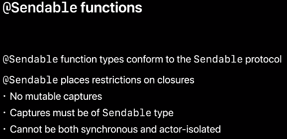</p>   
    
        - Sendable 프로토콜을 채택한 function type이다.
        - @Sendable은 클로저에 제약을 건다. 
            - mutable 캡처 불가
            - 반드시 Sendable한 타입만 캡처 가능
            - synchronous 하면서 actor-isolated 할 수 없음
        

<br>
<br>

### Main actor
@MainActor 메인 스레드를 나타내는 actor이다.

1. main actor는 main dispatch queue에서 모든 동기화를 수행한다. 이 말은 런타임 관점에서 main actor가 DispatchQueue.main과 interchangeable하다는 말이다.
2. 메인 스레드에 있어야 할 코드와 데이터가 여기저기 흩어져 있다. ???

<br>

메인 액터를 사용한 예시는 아래와 같다.

<p align="center">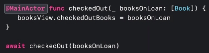</p>   

만약 main actor 함수를 외부에서 호출한다면, 메인 스레드에서 비동기적으로 처리되어지기 위해 await해야한다.

<br>

<p align="center">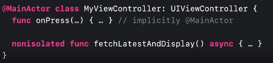</p>   

named 타입 역시 MainActor가 붙을 수 있다. 이 말은 타입이 가지고 있는 모든 멤버와 subclass가 main actor가 되는 것이다. 개별 메소드는 nonisolated 키워드를 붙임으로써 main actor 옵션을 끌 수 있다.