# WWDC21: Behind the scenes

[WWDC21: Behind the scenes](https://developer.apple.com/videos/play/wwdc2021/10254/)

<br>

## Threading model
이 세션에서는 news feed reader app이 예시로 나온다.

<br>

👀  news feed reader app 간략히 둘러보기
- UI; 사용자와의 인터렉션에 사용
- Database; 사용자가 구독한 뉴스 피드 카테고리를 저장
- Networking; 피드의 최신 컨텐츠를 가져오는 networking 로직

<br>

사용자가 최신 뉴스를 요청하는 경우를 가정해보자. 

- 메인 스레드에서 사용자 이벤트를 처리하고 Serial Queue(서브스레드)에서 피드를 network로부터 가져온다.
- 이렇게 하는 이유는 두가지가 있는데 우선, dispatching 작업을 다른 queue에서 진행함으로써, 많은 양의 데이터를 가져오더라도 메인 스레드가 User input에 반응할 수 있도록 하기 위함이다. 두번째로 Database에 대한 접근이 보호되는데 serial queue가 mutual exclusion(상호 배제, 동시에 두개 이상의 접근이 불가능하다는 의미로 이해함)을 보장하기 때문이다.
- DB에서 사용자가 구독하는 뉴스 피드 카테고리들만큼 반복을 돌며 Networking에서 URLSession을 통해 최신 뉴스들을 다운로드하게 된다. 이때 작업들은 Concurrent Queue를 통해 동시에 여러 작업이 처리된다.


<p align="center">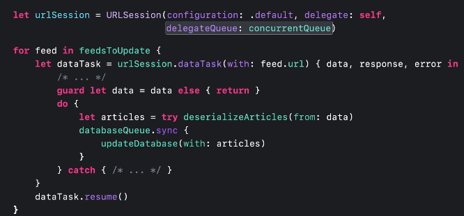</p>   

하지만 위 코드는 숨겨진 성능 함정이 있다. 이 함정을 이해하기 위해서는 GCD queue에 있는 작업들을 처리하기 위해 thread가 어떻게 불러와지는지를 먼저 봐야 한다.

GCD에서는 queue에 작업이 제출되면 시스템이 작업을 처리할 스레드를 불러온다.

concurrent queue는 한번에 여러개의 작업 아이템을 처리할 수 있기 때문에 시스템은 모든 CPU 코어가 가득찰 때까지 몇개의 스레드를 불러오게 된다.

그러나 만약 스레드가 block된 상태인데 아직 queue에 처리해야할 작업들이 남아있는 상태라면 GCD는 나머지 작업들을 처리하기 위해 더 많은 스레드를 불러오게 된다. 이렇게 되는 이유는 첫째로, 프로세스에 다른 스레드를 제공하여 각 코어가 주어진 시간에 작업을 실행하는 스레드를 계속 갖도록 할 수 있다.(즉, 코어가 쉬지 않고 일하도록 만들 수 있다.) 이렇게 함으로써 지속적으로 좋은 수준의 concurrency를 제공하게 된다. 둘째로, block된 스레드는 이후 작업을 진행하기 전 semaphore 같은 리소스를 기다리고 있을 수 있다. 

<br>

*코어가 2개인 apple watch라고 가정

<p align="center">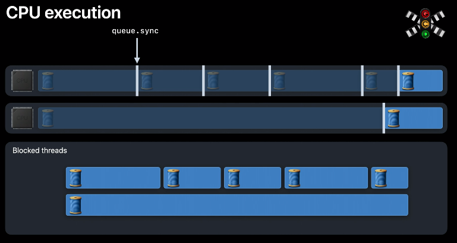</p>   

위 코드에서 GCD는 database queue에 있는 콜백 블럭에서 스레드를 계속 가져오려 할 것이고 결과적으로 앱에 많은 스레드가 존재하게 된다. 

앱에 많은 스레드가 존재한다는 것은 시스템이 CPU 코어보다 더 많은 스레드로 과도하게 커밋(overcommitted)되었음을 의미한다. 이걸 thread explosion 현상이라고 부른다. 이는 앱의 deadlock 가능성을 야기한다. 또한 해당 현상은 메모리, scheduling 오버헤드를 가져온다.

각각의 스레드는 다시 실행되길 기다리면서 valuable 메모리와 resources를 holding하고 있다. 각각의 block된 스레드는 stack을 가지고 있으며 스레드를 추적하기 위해 kernel data structures와 연관되어 있다. 이런 스레드 중 일부는 현재 실행중인 다른 스레드가 필요로 하는 잠금을 유지하고 있을 수 있다. 진행되지 않는 스레드를 위해 많은 리소스와 메모리를 보유하고 있어야 한다.

또한 thread explosion으로 인해 스케줄링 오버헤드도 어마어마 하다. 새로운 스레드를 가져오면, CPU는 full thread 컨택스트 스위치를 수행해야 한다. 이전 스레드에서 새로운 스레드로 전환하고 새로운 스레드를 수행하기 위해. 블럭된 스레드가 다시 runnable하게 되면, 스케줄러는 CPU의 스레드를 timeshare(시분할)해야 이후 작업을 진행할 수 있다.

> [https://pinelover.tistory.com/153](https://pinelover.tistory.com/153)   
시분할(time-sharing) : 각 사용자들에게 컴퓨터 자원을 시간적으로 분할하여 사용할 수 있게 해준다.
여러명의 사용자가 사용하는 시스템에서 컴퓨터가 사용자들의 프로그램을 번갈아가며 처리해줌으로써 각 사용자에게 독립된 컴퓨터를 사용하는 느낌을 주는 것, 라운드 로빈 방식이라고도 한다.
하나의 CPU는 같은 시점에 여러개의 작업을 동시에 수행할 수 없기 때문에, CPU의 전체 사용시간을 작은 작업 시간량으로 쪼개어 그 시간량 동안만 번갈아가면서 CPU를 할당하여 각 작업을 처리한다.
>

적은 수의 timesharing이 발생한다면 괜찮지만, thread explosion으로 제한된 코어를 가진 device에 수백개의 thread에 대한 time share가 이루어지면 이는 excessive context switching을 야기한다. 이런 스레드의 스케줄링 대기 시간은 수행할 수 있는 유용한 작업 양을 능가하므로 CPU가 비효율적으로 실행된다.

<p align="center"></p>   


이런 경험을 토대로 Swift concurrency는 이를 보완할 수 있도록 디자인됐다.

<br>
<br>

### Concurrency in Swift
swift에서는 차단된 모든 스레드가 사라지고 대신 Continuation이라는 가벼운 객체를 사용한다. 해당 객체는 작업의 resumption(재개)을 추적한다.

<p align="center">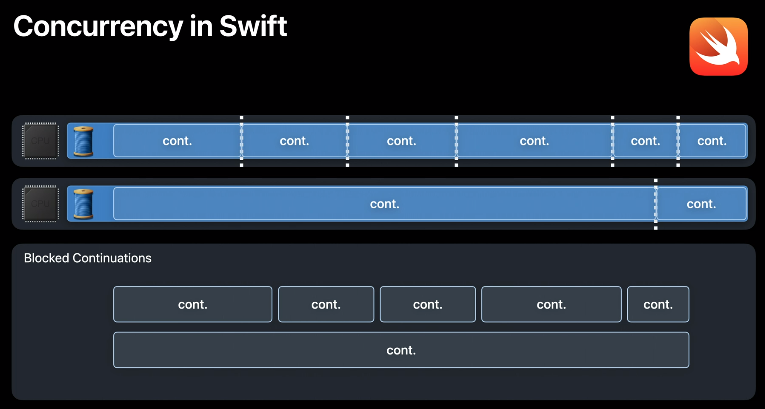</p>   

스레드가 Swift Concurrency로 작업을 처리하면 full thread context switching 대신 continuation 객체 간 전환이 이루어진다. 이제 function call에 대한 비용만 치르면 되는 것이다.

Swift Concurrency를 사용하면 CPU 코어 수만큼 스레드가 만들어지고, 스레드가 block될 때 작업 항목 간 저렴하고 효율적으로 전환할 수 있도록 만든 것이다.

이를 달성하기 위해 OS는 thread가 block되지 않을 것(threads are always able to make forward progress)이라는 runtime contract가 필요하다. 이는 언어가 이를 제공하는 경우에만 가능하다?

<br>

런타임에서 contract를 유지하도록 만들어주는 두가지 language feature가 있다.

<br>

### `await` 와 non-blocking 스레드

async/await에서도 봤던 것처럼, await를 만나면 현재 스레드가 block되는게 아니다. 스레드의 제어권을 시스템에게 위임하고 function 자체가 suspend되는 것이다. 이게 어떻게 가능한걸까?

여기서는 non-async function의 스레드에 대해 먼저 설명해준다. 함수가 호출되면 호출스택에 새로운 프레임이 push된다. 새로운 프레임은 local variables, return address, 그 외 함수 실행에 필요한 정보들을 저장하고 있다. 함수 실행이 끝나면 stack에서 pop된다.

<br>

이제 async function에 대해 보자.
<p align="center">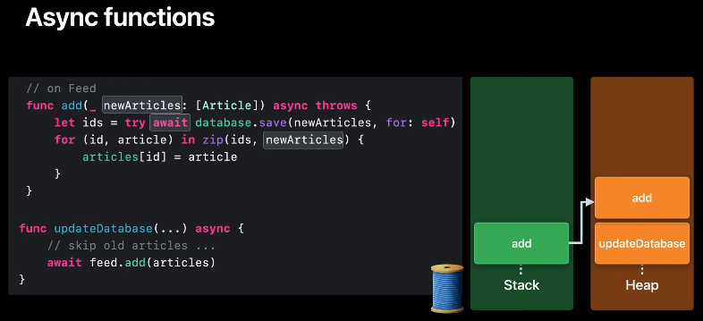</p>   

- stack 프레임은 suspension point(await)에서 사용할 필요가 없는 local variables를 저장해둔다. 예를 들어 add function의 for loop에 선언된 id와 article은 정의되어 사용되기 전까지 어떠한 await도 없기 때문에 스택 프레임에 저장된다.

- heap에는 두개의 async frame이 존재한다. 하나는 `updateDatabase()`, 또 다른 하나는 `add()`이다.(둘다 async function이라 그런 것 같다.) heap에는 suspension 지점에서 사용할 수 있어야 하는 정보를 저장한다. 위 코드에서 newArticles가 await 전에 정의되어 있지만 awiat 후에 사용할 수 있어야 한다. 즉, add 함수의 async 프레임이 newArticles를 계속 추적해야 한다는 것이다.

<br>

<p align="center">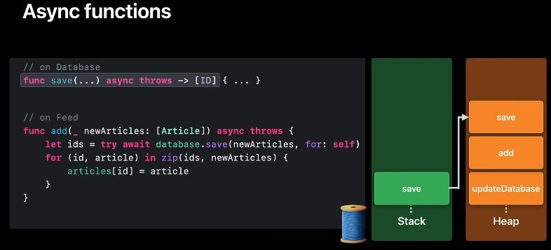</p>   

- `database.save()` 메소드가 실행되면, add 함수를 위한 stack frame은 save 함수를 위한 stack frame으로 “교체(replace)”된다. 왜냐하면 미래에 사용될 variables들이 이미 async frame에 저장되었기 때문이다.

<br>

<p align="center">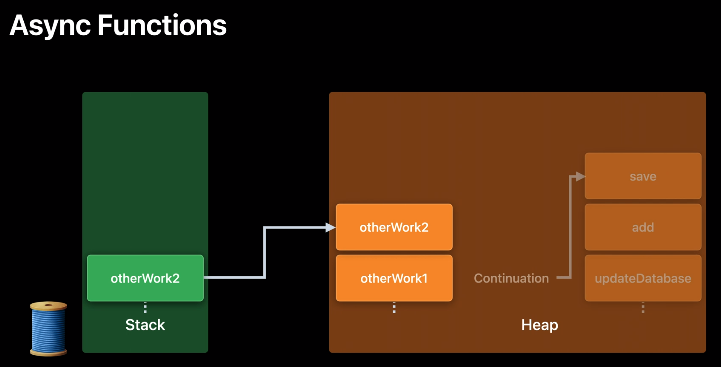</p>   

- 만약 `save()` 메소드도 await하게 되면, 해당 스택 프레임이 다른 것으로 replace된다. 이미 resume된 후 필요한 데이터들은 모두 heap에 저장(된 async frame에 저장)되었기 때문에 이게 가능한 것이다.
- 이런 async frame의 리스트는 continuation의 runtime representation이다.
- await했던 작업이 끝나면, 어떤 스레드(이전과 같은 스레드일수도, 아닐수도 있다)가 freed up된다.

<br>

<p align="center">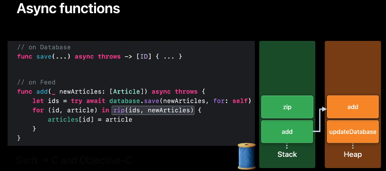</p>   

- async 작업이 아니라면 함수 호출은 stack 프레임을 생성하지만(위 이미지의 zip), async 작업이라면 stack 프레임 생성대신, 최상단 스택을 Replace하고 heap에 async 프레임이 추가된다.

<br>
<br>

### Swift task model의 의존성 추적(Tracking of dependencies in Swift task model)

<p align="center">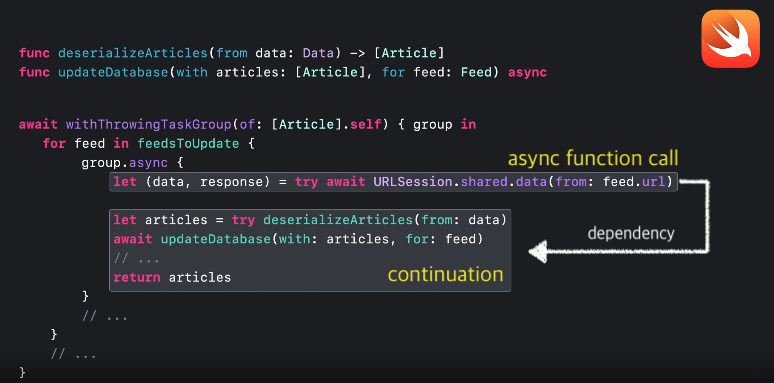</p>   

async function 호출 이후에 있는 것들을 continuation이라고 한다. continuation은 항상 async function이 실행된 후 호출된다. 이것은 Swift concurrency 런타임에 의해 추적되는 dependency다.

<p align="center">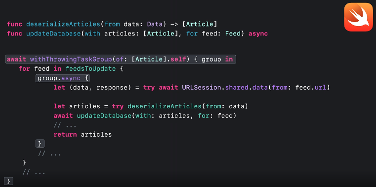</p>   

마찬가지로 withThrowingTaskGroup 안에 여러개의 child task(group.async)가 만들어질 수 있으며 child task들 각각은 parent task가 다음으로 넘어가기 전에 반드시 완료되어져야 한다. 이것이 task group의 스코프에 의해 코드에서 표현되어지는 dependency다.

<br>
<br>

<p align="center"></p>   

<p align="center">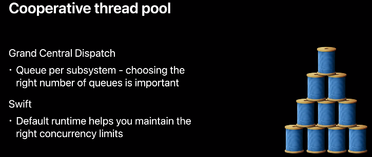</p>   

<br>
<br>
<br>

## Adoption of Swift concurrency
Swift Concurrency를 적용할 때 염두에 두어야 할 것들

### 성능
- concurrency comes with costs
- ensure that benefits of concurrency outweighs costs of managing it
- profile your code!

<br>

### await and atomicity(원자성)
- >No guarantee that the thread which executed the code before the `await` will execute the continuation as well.   
→ continuation이 이전과 동일한 스레드에서 실행되지 않을 수 있음.
- Breaks atomicity by voluntarily descheduling the task.
- awiat는 atomicity가 깨질 수 있다는 것을 명시적으로 알 수 있는 포인트다.
- await를 넘어 lock을 걸면 안된다. 또한 thread에 한정된 데이터 역시 await를 건너면 보존되지 않는다.

<br>

### Swift Runtime contract
- thread will always be able to make forward progress(thread always nonbloked)
- 이 계약을 기반으로 Swift의 기본 executor가 될 Cooperative Thread pool을 구축했다.
- swift concurrency를 채택하게 되면 코드에서 이 계약을 계속 유지할 것임을 보장해야 한다. 또한 이를 통해 Cooperative thread pool이 정상적으로 동작됨을 보장해야 한다.

<p align="center">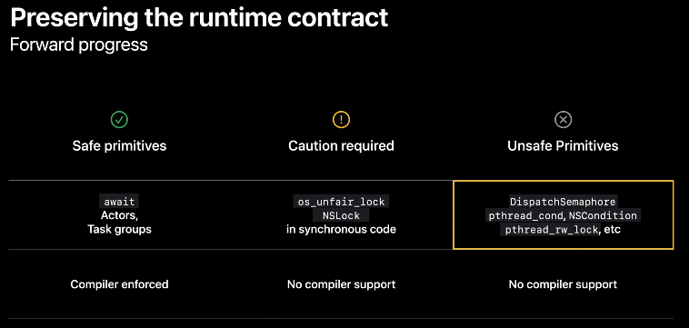</p>   

특히 unstructure task를 생성한 후 unsafe primitives를 사용하여 경계를 넘지 말아라.

<p align="center">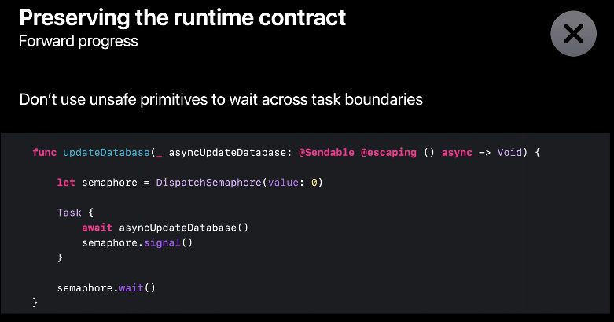</p>   

`LIMDISPATCH_COOPERATIVE_POOL_STRICT=1`  디버그 환경변수를 활용하여 위와 같이 runtime contract를 위반한 경우를 찾을 수 있다. 해당 변수를 활용해 빌드를 했을 때 “`com.apple.root.user-initiated-qos.cooperative (serial)`” 이란 Thread가 보인다면 unsafe blocking primitive의 사용을 나타내는 것이다.

<br>
<br>
<br>

## Synchronization via actors
### actor의 동작
actor는 mutual exclusion을 보장한다. 이는 한번에 딱 하나의 메소드 콜만 실행되는 것을 말한다. mutual exclusion은 actor의 상태에 동시적으로 여러 접근이 불가한 것을 말하며 data race를 방지한다.

### actor와 기존 synchronization 요소들을 비교해보자.
**serial queue sync / lock**
```Swift
databaseQueue.sync { updateDatabase(articles, for: feed }
```
아직 실행중이지 않으면 contention(경합)이 없다고 말할 수 있다. 이 경우 호출된 스레드는 어떤 컨텍스트 스위치도 없이 새로운 작업 아이템을 실행하기 위해 재사용할 수 있다.

만약 이미 실행중이라면 이는 contention 상태라고 말할 수 있다. 이 상황에서 호출된 스레드는 blocked된 상태다. 그리고 이렇게 블럭된 스레드는 thread explosion을 야기하게 된다.

<br>

blocking과 관련된 문제때문에 일반적으로 async dispatch를 사용하는 것이 좋다.

<br>

**async queue**
```Swift
databaseQueue.async { /* background work */ }
```
async dispatch의 이점은 nonblocking이라는 것이다. 그래서 contention 상태일때라도 thread explosion을 야기하진 않는다. 단점은 contention이 없다할지라도 호출된 스레드가 계속해서 다른 작업을 수행하는 동안 Dispatch는 async 작업을 처리하기 위해 새로운 스레드를 요청해야 한다는 것이다. 따라서 async dispatch를 자주 사용하면 스레드 wakeup 및 컨텍스트 전환이 excess 할 수 있다.

<br>

이로 인해 actor가 만들어졌다.

<br>

**actor**
<p align="center">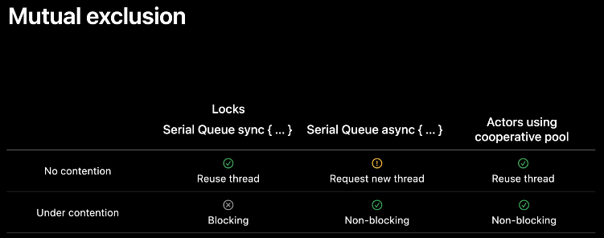</p>   

<br>
<br>

<p align="center">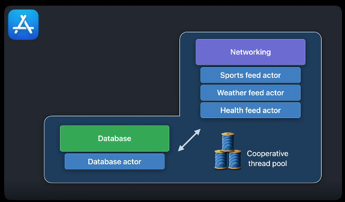</p>   

dispatchQueue를 actor로 변경했다. 이제 이 actor들은 cooperative thread pool 에 포함되게 된다.

하나의 cooperative thread pool에 포함된 actor들은 서로 상호작용하며 여기에는 execution switching이 포함된다. 이것을 actor hopping이라고 부름.

<br>

feed를 다운로드 받은 후 `database.save()`를 호출했을 때, 만약 database가 사용되고 있지 않다면 이는 uncontended case이며 thread는 바로 feed actor에서 database actor로 hop(깡충깡충 뛰다)할 수 있다. actor를 hopping하는 동안 스레드는 블럭되지 않으며, hopping에는 다른 스레드를 필요로 하지 않는다.

thread에서 실행되던 actor 작업이 끝나면 어떤 작업을 수행할지 선택해야 한다. D2, S1, W1 중 하나를 선택할 수도 있고 혹은 전혀 다른 작업을 처리할 수도 있다.

<p align="center">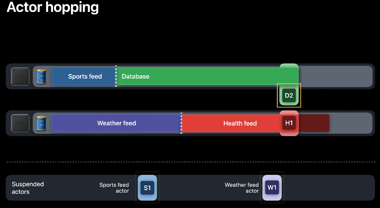</p>   

여기서 dispatchqueue와 actor의 차이가 드러난다. 어떤 작업을 처리할지 선택할 때 priority가 적용되는 것이다.

actor는 reentrancy라는 개념으로 인해 system이 작업의 우선순위를 지정할 수 있도록 설계되었다. 그러나 reentrancy가 왜 중요한지를 이해하기 위해 GCD가 우선순위를 처리하는 방법을 먼저 보도록 하자.

<br>

### 우선순위 처리하기
<p align="center">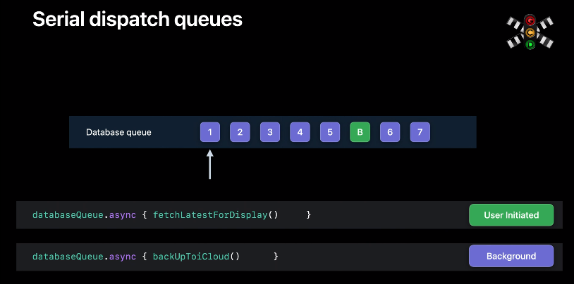</p>   

dispatch queue는 “queue”이기 때문에 먼저 들어온 순서대로 처리가 된다. 따라서 우선순위가 높더라도 늦게 들어왔다면 우선순위가 낮은 작업부터 처리가 될 수 있는데 이를 **priority inversion**이라고 한다.

serieal queue는 우선순위가 높은 작업(위 이미지의 초록색 박스)보다 먼저 queue에 들어온 모든 작업들의 우선순위를 임의로 높여 priority inversion을 해결한다.

하지만 주요한 이슈는 해결하지 못했는데 바로 “순차적으로 작업이 처리"된다는 것이다. high priority를 가진 B 작업을 처리하기 위해서는 1 ~ 5의 작업이 완료되어야 한다.

<br>
<br>

이 문제를 해결하려면 FIFO로부터 멀어져야 한다.

이런 이유로 actor reentrancy가 도입되었다. reentrancy가 어떻게 순서와 연관되는지 다음 예시를 보도록 하자.

<p align="center">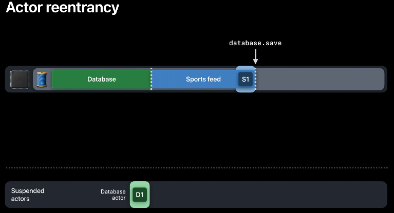</p>   

sports feed를 불러오고 난 후 database.save 메소드를 호출하면, 비록 D1이라는 pending된 아이템이 있을지라도 actor hopping이 이루어진다. database actor가 Thread의 control을 가져가고, 새로운 워크 아이템(D2)을 생성해 작업을 진행하는 것이다.

<p align="center">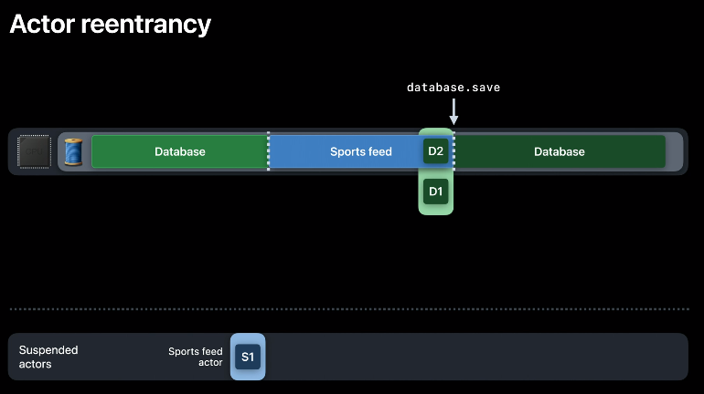</p>   

이게 actor reentrancy가 의미하는 바다. actor의 한개 이상의 더 오래된 워크아이템이 suspend 되는 동안 새로운 워크아이템이 실행되어질 수 있는 것이다.  actor는 여전히 mutual exclusion을 유지한다. actor는 FIFO의 방식으로 작업 아이템을 처리하지 않는 것을 알 수 있다.

다시 이전 예시로 돌아가서 만약 queue가 아닌 actor였다면, 우선순위가 높은 작업이 Queue의 앞쪽으로 이동되어질 수 있다.

<p align="center">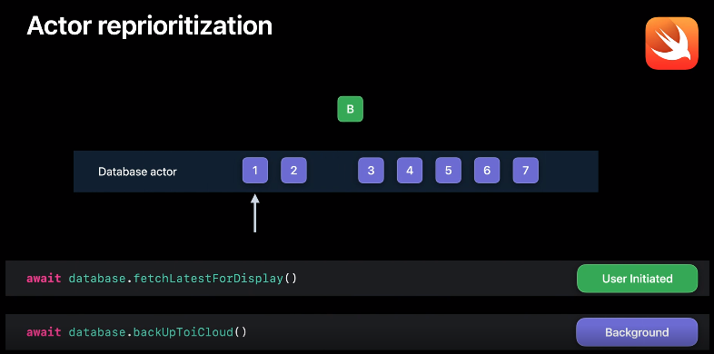</p>   

<br>
<br>

### Main actor
시스템의 기존 개념인 main thread를 추상화한 것이다. 메인 스레드는 cooperative pool에 조인되지 않기 때문에 컨텍스트 스위치가 필요하다.
<p align="center">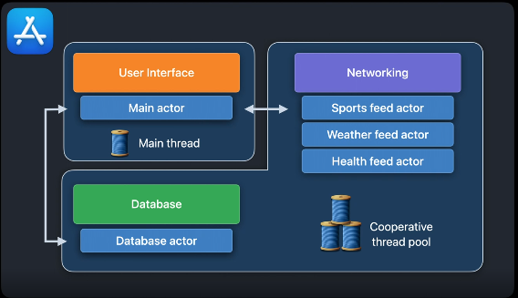</p>   

<p align="center"></p>   

main actor는 메인 스레드를 추상화한 것이고 cooperative pool에 조인되지 않기 때문에 await를 실행할 때 한번의 context switch가 발생한다. 그리고 await가 끝나고 다시 돌아올때(updateUI는 MainActor에서 실행되므로)  한번 더 context switch가 발생한다.

이런 경우 코드를 재배치함으로써 context switching을 줄일 수 있다.

<p align="center">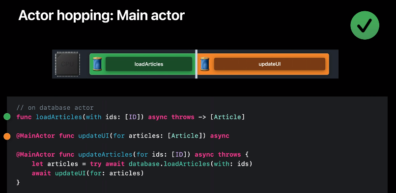</p>   