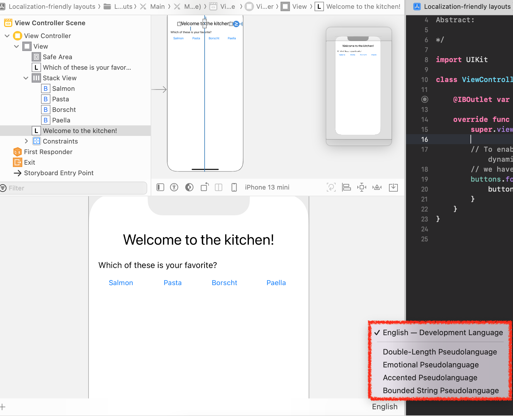
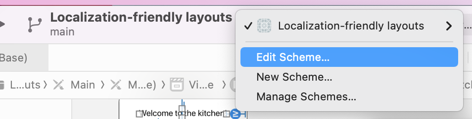
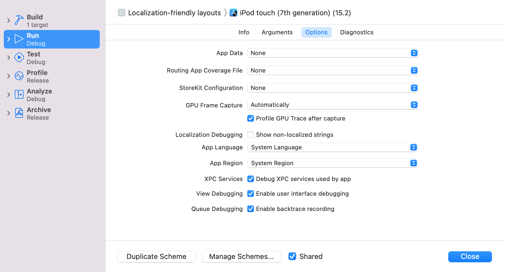
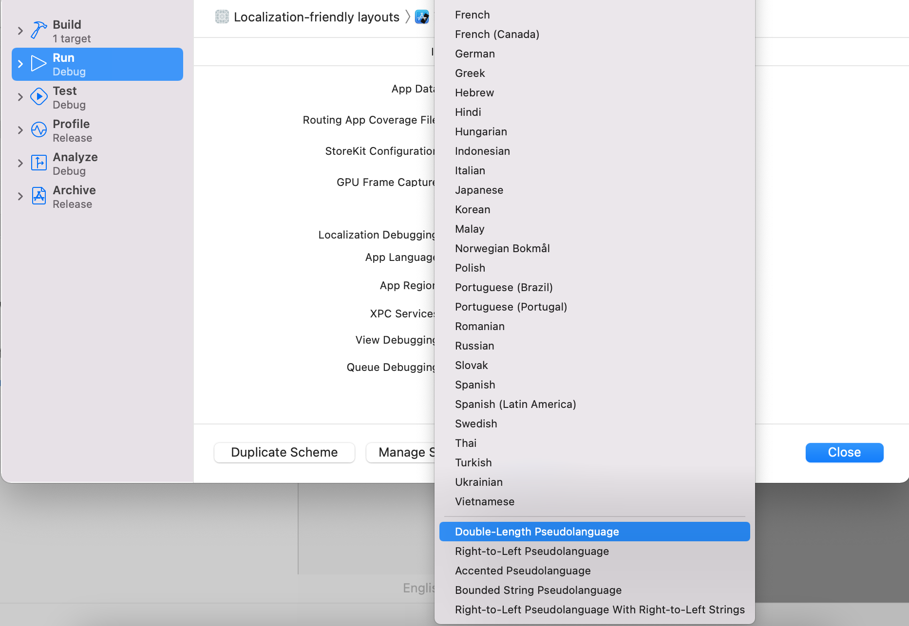
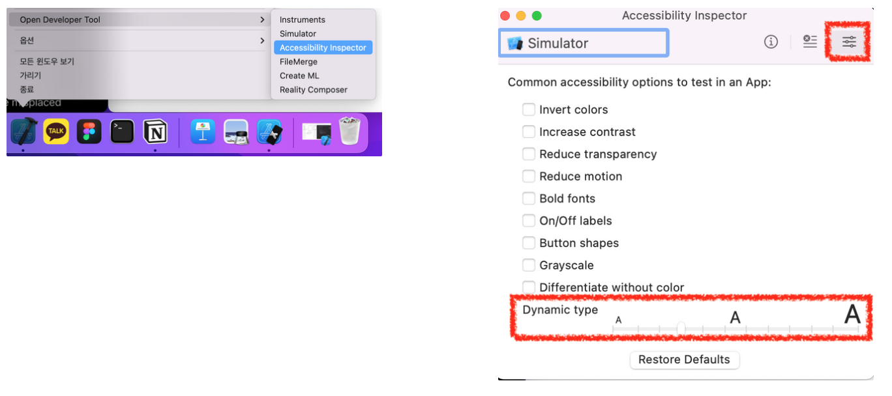
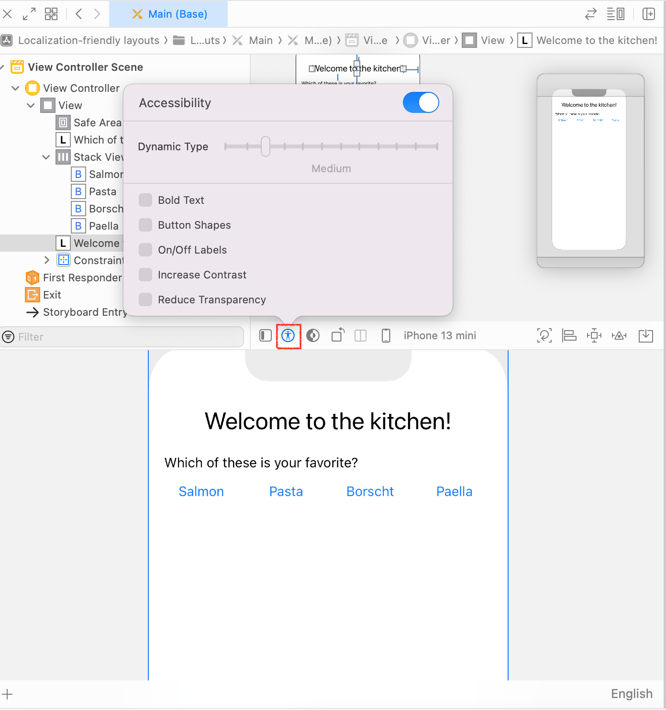
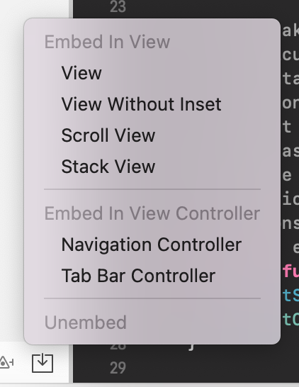

2022-03-17

---
WWDC20

Localization 적용된 UI만들기

[https://developer.apple.com/documentation/xcode/autosizing_views_for_localization_in_ios](https://developer.apple.com/documentation/xcode/autosizing_views_for_localization_in_ios)

- 고정된 width, frame 지양
- 두 object간 고정된 간격 지양(greaterthan, lessThan 등의 옵션 선택)
- 텍스트 여러줄
- 고정된 space에 너무 많은 control을 넣지마라

Xcode - preview 하단에 보면 아래와 같이 language를 선택할 수 있음. 이를 통해 컨텐츠를 변경하지 않더라도 상황에 따라 어떻게 보일지 테스트 할 수 있음.

Xcode - Localizer Hint

Xcode의 다양한 툴들

Accesibility

Autolayout fix-it

“Embed in”

읽어볼거리

[https://developer.apple.com/kr/localization/](https://developer.apple.com/kr/localization/)

[https://developer.apple.com/documentation/xcode/localization](https://developer.apple.com/documentation/xcode/localization)