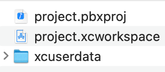
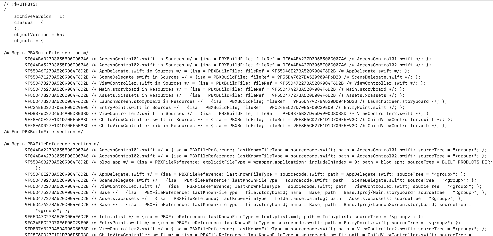

### 왜 공부하게 됐나
예전에 프로젝트할 때 발생했던 git merge conflict와 관련해서 정리를 했다.  
다른 개발자랑 함께 작업을 했었는데 동일한 xib나 swift 파일을 수정하지 않았는데도 merge conflict가 발생해서 의문이었다. 원인은 `project.pbxproj` 이었음.  
문제가 발생한 과정은 아래와 같다. 
- 서로 동일한 폴더에 파일을 추가함.
    - Cell이라는 폴더에 나는 A,B라는 파일을 추가하고 다른 개발자 분은 C,D라는 파일을 추가
- 다른 개발자 분이 브랜치에 push 진행
- 내가 pull을 진행. 이때 다른 개발자 분이 수정한 파일 및 해당 위치를 나도 수정하면서 conflict가 발생한다.  

두 파일 모두 필요했기 때문에 충돌이 발생하는 `project.pbxproj`를 열어 수정 후 commit, pull 진행하여 conflict 해결함.  
오늘은 `project.pbxproj`가 무슨 파일인지 공부해보겠음.

### pbxproj는 무슨 파일인가
(2022-04-26 추가)   
> 🔗 [Xcode and git: bridging the gap](https://thoughtbot.com/blog/xcode-and-git-bridging-the-gap)   
Xcode configuration bundle에서 가장 중요한 파일로 <u>모든 연결된 파일들과 파일들이 그룹핑된 정보, 연결된 프레임워크, 프로젝트의 빌드 설정에 대한 **참조를 유지, 관리하는 역할**</u>을 한다. 이런 이유로 버전 컨트롤에서 project.pbxproj를 제외시켜선 안된다.

우선 해당 파일이 어느 위치에 있는지를 알 필요가 있음. 
- Xcode에서 처음 프로젝트를 생성하면 `*.xcodeproj`라는 파일이 생성된다. 파일처럼 보이지만 사실 디렉토리임.
- 이걸 터미널에서 열거나 파일 우클릭 > 패키지 내용 보기를 선택하면 안에 있는 파일 목록을 볼 수 있다. 파일 목록은 아래와 같다. 이 안에 `project.pbxproj` 파일이 있음.  

- `project.pbxproj` 파일이 실제 설정 파일이다. 우클릭 후 텍스트 편집기로 열어보면 아래와 같은 텍스트들이 나온다. 텍스트 내부에 생성된 파일들의 reference를 저장하고 있음.

> 🔗  출처 : [iOS - Swift 프로젝트 개념](https://ios-development.tistory.com/406)  
<u>project.pbxproj는 사실 git을 사용할 경우 충돌이 일어나는 주요 파일 중 하나</u>임.  
① A파일, B파일 수정 후 merge -> A와 B파일의 reference가 모두 바뀐 경우 conflict 발생  
② conflict가 제대로 해결되지 못하면 project.pbxproj파일이 깨져서 프로젝트가 열리지 않는 문제 발생

- `xcuserdata`는 프로젝트의 개인 설정을 담은 디렉토리임. 

---
참고 사이트  
- [Xcode 프로젝트 파일](https://hcn1519.github.io/articles/2018-06/xcodeconfiguration)
- [iOS - Swift 프로젝트 개념](https://ios-development.tistory.com/406) 
