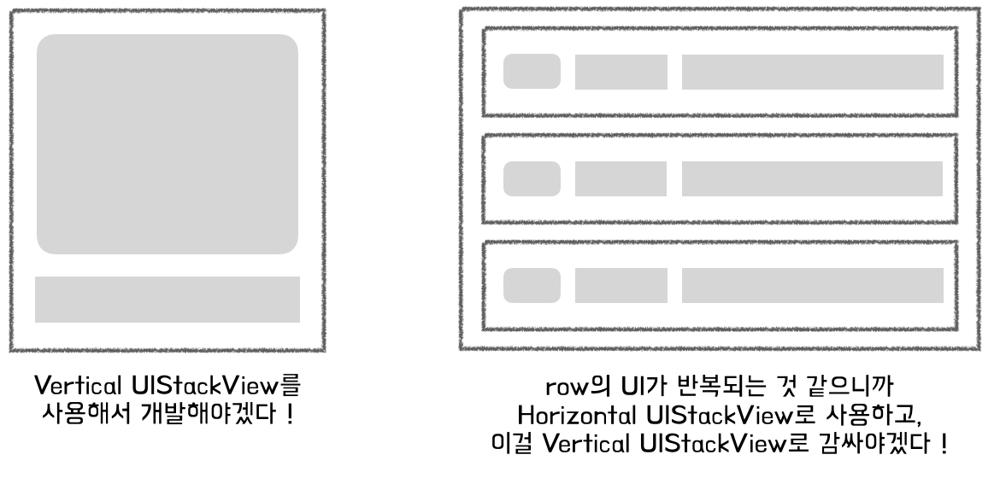
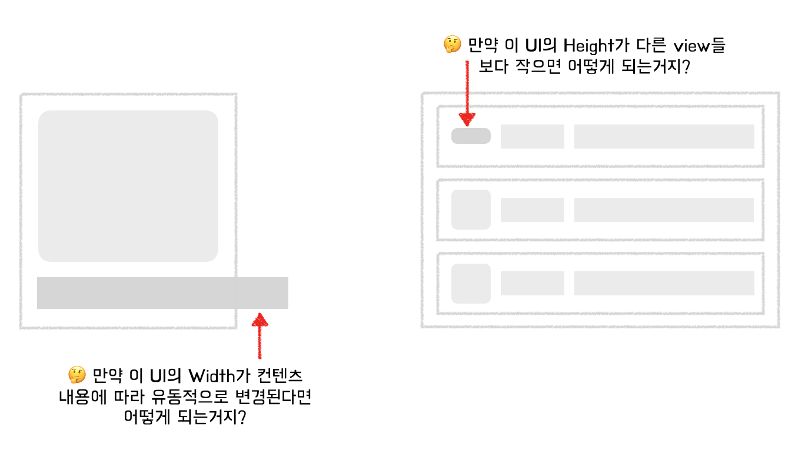

오늘은 UIStackView에 대해 조금 더 자세히 알아보려 한다.   
왜냐하면 오늘 UIStackView를 어떤 상황에서 쓰면 좋은지 또는 안좋은지에 대해 내가 잘 모르는 것 같다는 생각이 들었기 때문이다.   
아래와 같은 UI를 만들 때 항상 UIStackView를 제일 처음 생각하곤 했다.   
   

왜냐하면
- 안에 들어갈 UI 요소들의 레이아웃을 스택뷰가 알아서 잡아주기 때문에
- 왠지 반복에는 UIStackView의 사용이 적절해보일 것 같아서..?

별다른 이유가 없이 써왔고, UIStackView의 특징을 잘 몰라서 그런지 UIStackView를 활용해야겠다고 생각하고 시작했던 UI 개발들은 꽤나 오랜 시간이 걸렸다.   

그리고 이때마다 부딪혔던 문제상황은 아래와 같다.   
    
- 요약하자면 "단일 스택뷰를 이루고 있는 뷰들의 높이 또는 넓이가 서로 다르면 어떻게 되는거지?"가 주제이다.   

## UIStackView
- 열(column)이나 행(row)에 뷰들의 모음을 배치하기위한 간소화된 인터페이스
- [블로그](https://reasonable-repo.tistory.com/entry/Auto-layout-Constraint-based-layout-%EC%9D%80-%EC%84%9C%EB%A1%9C-%EB%8B%A4%EB%A5%B8-%EA%B2%83%EC%9D%BC%EA%B9%8C)에도 포스팅했다시피 복잡한 제약조건을 사용하지 않고도 디바이스의 방향이나 스크린 사이즈 등의 변화에 유동적으로 대응할 수 있다는 장점이 있다. 
- 이는 axis, distribution, alignment, spacing 등의 속성들을 통해 이루어진다.

### UIStackView의 동작과정
- 스택뷰는 자신이 가지고 있는 arranged view들의 사이즈와 위치를 잡을 때 Auto Layout을 사용한다.
- `axis`는 어떻게 활용되는가?
    - axis를 기반으로 가장자리에 첫번째와 마지막 arranged view(이하 정렬된 뷰)를 배치한다.   
    - 예를 들어 axis가 horizontal일 경우 정렬된 뷰의 첫번째 leading이 스택뷰의 leading에 고정되는 것이고, 정렬된 뷰의 마지막 trailing이 스택뷰의 trailing에 고정되는 것이다.   
    vertical일 경우 정렬된 뷰의 첫번째 top이 스택뷰의 top에, 정렬된 뷰의 마지막 bottom이 스택뷰의 bottom에 고정되는 것이다.
- `distribution`은 어떻게 활용되는가?

---
#### <b>📚 참고 사이트</b>
- [UIStackView, Apple Developer Doc](https://developer.apple.com/documentation/uikit/uistackview)