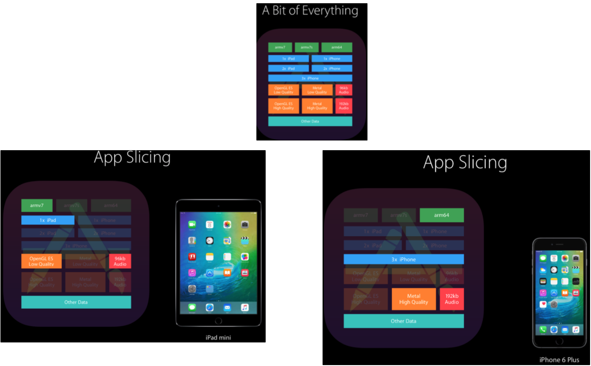

2022-03-02

---
# App Thining

— 👀 출처 : [https://ttuk-ttak.tistory.com/42](https://ttuk-ttak.tistory.com/42)

— 👀 출처 : [https://zeddios.tistory.com/655](https://zeddios.tistory.com/655)

앱이 디바이스에 설치될 때 최소한의 디스크 사용과 빠른 다운로드가 가능하도록 설치를 최적화하는 기술

slicing, bitcode, on-demand resource가 있다.

### slicing

slice = 조각내는 것

다양한 디바이스와 운영체제 버전에 대해 여러가지 app bundle 변형을 생성하고 전달하는 과정임.

예를 들어 프로젝트 → Build Settings → Architectures → Architectures를 보면 Standard Architectures (arm64, armv7) 이 설정된 것을 볼 수 있음.

디바이스별로 아키텍처는 딱 하나잖아? 근데 우리는 두개를 선택해. 그럼 Xcode나 앱스토어에서 다운받으려는 디바이스의 아키텍처에 맞게 이걸 조각내서 생성하고 다운받을 수 있게 하는거임.

앱 안에 여러 아키텍처에 대한 지원, 화면 사이즈에 대응하기 위한 다양한 크기의 asset, 오디오, OpenGL 지원 등등 여러가지 지원 항목들이 들어감.

app store connect에 업로드된 앱을 앱스토어가 디바이스의 특정에 맞게 다양한 버전으로 조각을 생성함. 사용자가 다운받으면 사용자의 디바이스에 가장 알맞은 조각을 다운받음

### bitcode

비트코드란 기계언어로 번역되기 이전 단계의 중간표현(intermediated representation)을 말함. 비트코드를 활성화해서 업로드를 하면 app store에서 앱을 다시 컴파일하여 앱 바이너리를 생성함. 비트코드를 제공하려면 앱 번들의 모든 앱과 프레임워크에서 비트코드가 포함되어 있어야 한다고 함.

> 출처 : [https://www.verimatrix.com/blog/ios-bitcode-and-app-security/](https://www.verimatrix.com/blog/ios-bitcode-and-app-security/)

According to [Apple](http://help.apple.com/xcode/mac/11.0/index.html?localePath=en.lproj#/devde46df08a), bitcode “allows the AppStore to compile your app optimized for the target devices and operating system versions, and may recompile it later to take advantage of specific hardware, software, or compiler changes.”
> 

**pros and cons**

pros; 컴파일러의 변화 혹은 컴파일된 앱이 실행될 OS의 아키텍처 변화에 유연하게 대응할 수 있다. 다른 아키텍처에 대한 최적화를 제거하여 다운로드 작게 만듬.

cons; 애플에서 비트코드를 다시 컴파일 하여 사용자에게 새로운 바이너리를 제공함. 이걸 애플서버에서 하는데 이때 Xcode(로컬)에서 생성된 dSYMs(디버그 심볼) 파일과 실제 사용자가 얻는 바이너리가 일치하지 않기 때문에 crash난 부분에 대해 제대로 파악할 수 없음.

### on-demand resource

주문형 리소스, 필요할 때 다운받는다. 예를 들어 사용자가 게임을 하는데 현재 레벨보다 상위레벨의 게임 맵은 필요하지 않음. 상위레벨에 도달했을 때 필요하면 다운받는것. 인앱구매도 이에 해당된다.